# 37 Analytical techniques

本章对应 CIE 9701 2025–2027 syllabus 的 **37.1 Thin-Layer Chromatography**、**37.2 Gas-Liquid Chromatography**、**37.3 Carbon-13 NMR Spectroscopy** 与 **37.4 Proton (¹H) NMR Spectroscopy**。题目部分对应专题题包 **8.1 Analytical Techniques (A Level Only)**；完整 Easy、Medium、Hard Structured Questions 放在本页底部。

## Learning objectives

学完本章后，你应该能够：

- describe the stationary and mobile phases in thin-layer chromatography and gas-liquid chromatography;
- calculate and interpret $R_f$ values and gas-chromatography retention times;
- use peak areas in gas chromatography to compare the relative amounts of components;
- identify equivalent carbon environments in carbon-13 NMR spectra;
- explain why TMS is used as the reference standard;
- interpret chemical shifts, integration and splitting in high-resolution proton NMR spectra;
- combine MS, IR, carbon-13 NMR and proton NMR evidence to identify an organic compound.

## 37.1 Thin-Layer Chromatography

::: {.study-card}
### Stationary phase, mobile phase and separation

Thin-layer chromatography (TLC) separates components because each component has a different balance between its attraction to two phases:

- the **stationary phase** is a thin layer of a solid adsorbent, usually silica, silicon dioxide ($\ce{SiO2}$), or alumina ($\ce{Al2O3}$);
- the **mobile phase** is the solvent, which moves up the plate by capillary action.

The sample is placed on a pencil baseline. The baseline must remain above the solvent level so that the spots dissolve into the rising solvent rather than directly into the solvent reservoir. A lid helps to prevent evaporation and allows the atmosphere in the chamber to become saturated with solvent vapour.

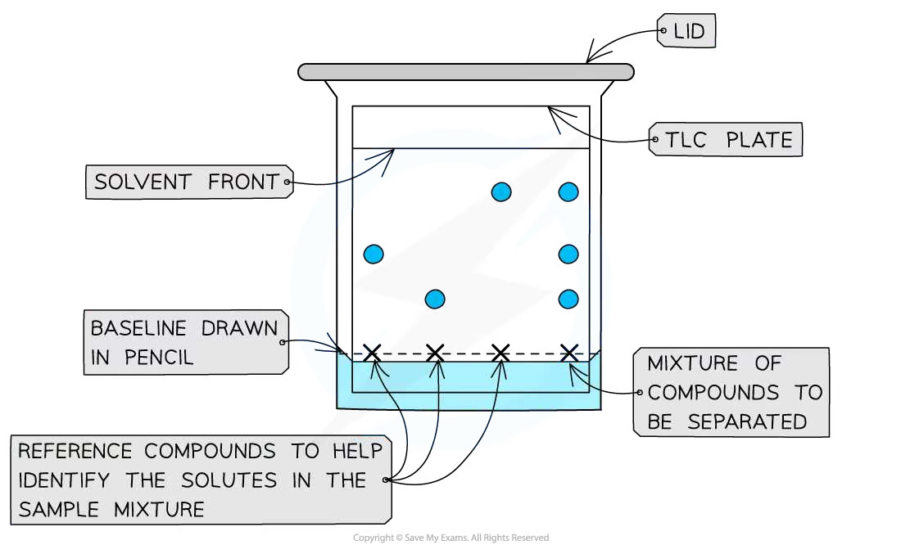{.concept-figure fig-alt="Thin-layer chromatography setup with a plate, solvent and pencil baseline"}

The distance travelled by a component depends mainly on its **solubility in the mobile phase** and its **retention by, or interaction with, the stationary phase**. A component that is more soluble in the solvent and less strongly adsorbed by silica travels further.
:::

::: {.study-card}
### Retention factor, $R_f$

For a particular solvent, temperature and stationary phase, the characteristic retention factor is

$$R_f=\frac{\text{distance travelled by component}}{\text{distance travelled by solvent front}}$$

Measure both distances from the baseline. The centre of a broad spot should be used; if the spot is large, measuring to its top and bottom and taking the mean gives a better estimate.

An $R_f$ value is between 0 and 1. A value close to 1 means that the component travelled almost as far as the solvent front: it has relatively high affinity for the mobile phase and relatively low affinity for the stationary phase. A value close to 0 indicates strong retention by the stationary phase.

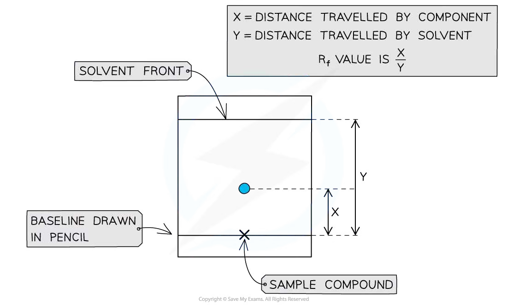{.concept-figure fig-alt="TLC retention factor calculation using component and solvent distances"}

To identify an unknown, run it beside known reference compounds under exactly the same conditions and compare the $R_f$ values. The result is not an absolute physical constant: changing the solvent, adsorbent, temperature or development distance can change the value.
:::

::: {.worked-example}
Worked example · Calculating and interpreting $R_f$

### Identifying a component by TLC

**A spot travels 4.8 cm from the pencil baseline while the solvent front travels 7.5 cm. Calculate the $R_f$ value. A reference compound has an $R_f$ value of 0.64 under the same conditions. State whether the unknown could be the reference compound.**

1. Use the TLC definition:

   $$R_f=\frac{\text{distance travelled by component}}{\text{distance travelled by solvent}}$$

2. Substitute the measured distances:

   $$R_f=\frac{4.8}{7.5}=0.64$$

3. The unknown has the same $R_f$ value as the reference compound. It **could** be the same compound, provided that the solvent, stationary phase and other experimental conditions were identical. An $R_f$ match alone is not definitive proof of identity.

:::

## 37.2 Gas-Liquid Chromatography

::: {.study-card}
### Phases and retention time

Gas-liquid chromatography (GLC), often called gas chromatography (GC), is used for gases, volatile liquids and solids that can be vaporised without decomposition. The sample is injected and vaporised before entering a column.

- The **mobile phase** is an inert carrier gas such as helium, nitrogen or argon.
- The **stationary phase** is a non-volatile liquid with a high boiling point, spread as a thin film on a solid support inside the column.

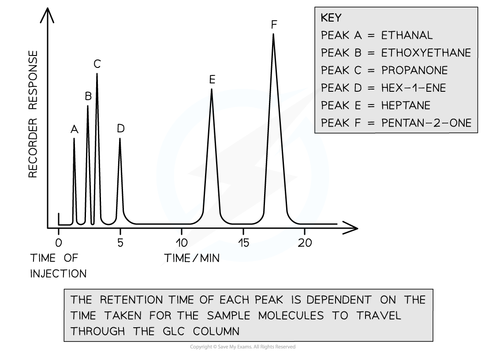{.concept-figure fig-alt="Gas-liquid chromatography column, carrier gas and detector"}

**Retention time is the time taken from injection of a component until it reaches the detector.** It depends on the attraction between the component and both phases, the polarity and volatility of the component, and its chemical structure. A component that interacts strongly with the stationary phase remains in the column for longer and has a longer retention time.
:::

::: {.study-card}
### Reading a chromatogram

A GC chromatogram shows detector response against time. Each peak represents a component of the mixture. The position of a peak gives its retention time and can help identify the component by comparison with standards. The relative area under a peak, or its relative height when the peaks have comparable shapes, gives the **relative amount or concentration** of that component.

For a polar stationary phase, a more polar component generally interacts more strongly with the stationary phase and therefore has a longer retention time. The carrier gas must be inert so that it does not react with the sample or stationary phase.

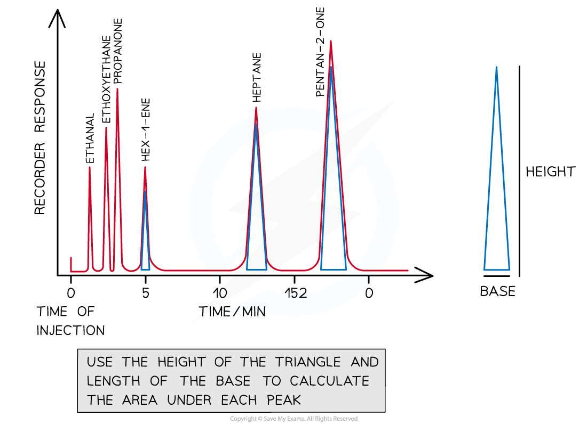{.concept-figure fig-alt="Gas chromatogram showing peak areas used to estimate relative composition"}
:::

::: {.worked-example}
Worked example · Interpreting a GC chromatogram

### Relative composition of a mixture

**A chromatogram has four peaks with areas 18, 32, 25 and 25 arbitrary units. The stationary phase is polar. Peak B has the longest retention time. Estimate the percentage of the mixture represented by peak C and state which component is most polar.**

1. Add the peak areas:

   $$18+32+25+25=100$$

2. Calculate the relative percentage for C:

   $$\%\text{ of C}=\frac{25}{100}\times100=25\%$$

3. Peak B has the longest retention time. With a polar stationary phase, this means B has the strongest interaction with the stationary phase and is the **most polar** of the components under these conditions.

4. The peak area gives relative amount, not necessarily an exact percentage unless the detector response factors for all components are assumed to be equal.

:::

## 37.3 Carbon-13 NMR Spectroscopy

::: {.study-card}
### Carbon environments and number of peaks

In broadband-decoupled carbon-13 NMR, each chemically different carbon environment produces one signal. Equivalent carbon atoms, often revealed by a plane or centre of symmetry, give one signal rather than separate signals.

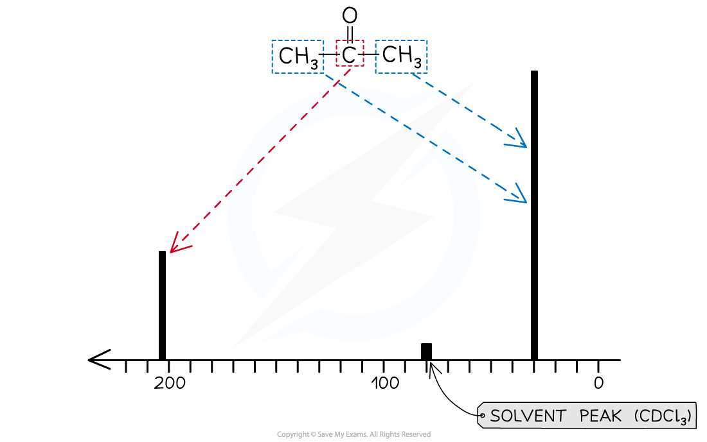{.concept-figure fig-alt="Examples of equivalent and non-equivalent carbon environments"}

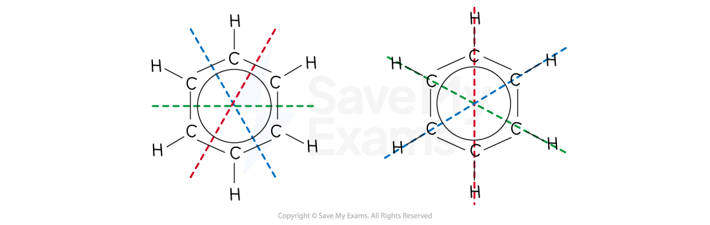{.concept-figure fig-alt="Carbon-13 NMR carbon environment assignments"}

To count signals, draw the displayed or skeletal structure, mark carbons related by symmetry, and then count the different environments. Do not count the number of carbon atoms directly: a molecule with ten carbon atoms can give fewer than ten peaks if some carbons are equivalent.
:::

::: {.study-card}
### Chemical-shift ranges

The chemical shift, $\delta$, is measured in parts per million (ppm) relative to TMS. The following approximate ranges are useful for CIE questions:

| Carbon environment | Approximate $\delta$ / ppm |
|---|---:|
| Saturated carbon away from strongly electron-withdrawing groups | 0–50 |
| Carbon attached to O, halogen or another electronegative environment | 50–70 |
| Alkene or aromatic carbon, $\ce{C=C}$ / arene | 110–160 |
| Carbonyl carbon in aldehydes or ketones | 190–220 |
| Carbonyl carbon in carboxylic acids, esters or amides | 160–185 |

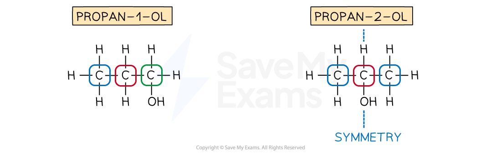{.concept-figure fig-alt="Approximate carbon-13 NMR chemical shift ranges"}

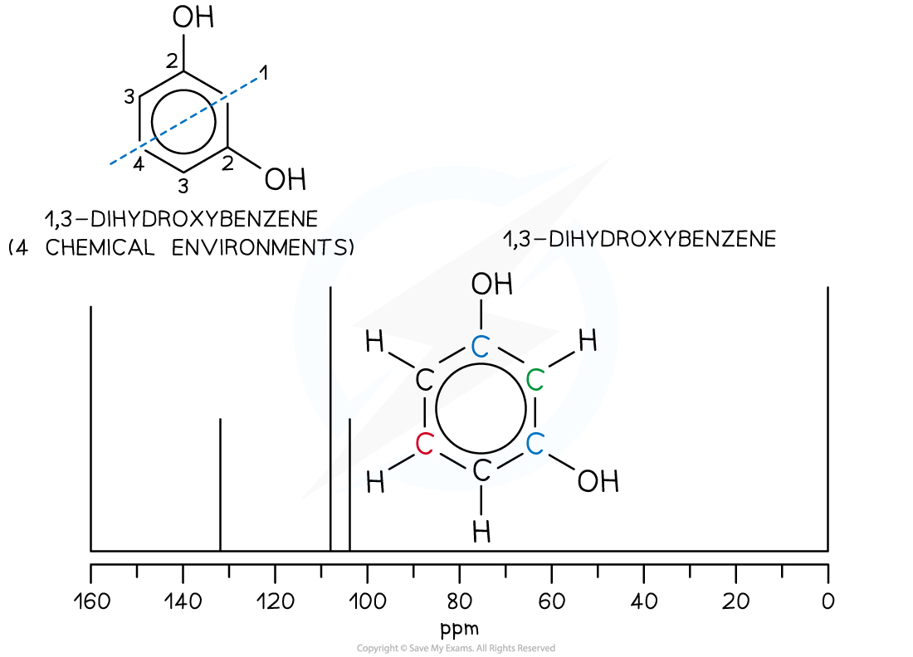{.concept-figure fig-alt="Carbon-13 NMR spectra and assignments for organic compounds"}

{.concept-figure fig-alt="Using molecular symmetry to count carbon-13 NMR environments"}
:::

::: {.worked-example}
Worked example · Counting carbon-13 signals

### Ethylbenzene

**Ethylbenzene, $\ce{C6H5CH2CH3}$, gives a carbon-13 NMR spectrum. Predict the number of signals and assign the approximate chemical-shift ranges of the ethyl carbons and the aromatic carbons.**

1. In a monosubstituted benzene ring, the two ortho carbons are equivalent, the two meta carbons are equivalent, and the ipso carbon is unique. The ring therefore gives **four** different carbon environments.
2. The two carbons in the ethyl group are different: the benzylic $\ce{CH2}$ carbon and the terminal $\ce{CH3}$ carbon give two further environments.
3. Total number of carbon-13 signals:

   $$4+2=6$$

4. The aromatic carbons are in the approximate $\delta=110$–$160$ ppm range. The benzylic $\ce{CH2}$ is typically around 20–40 ppm and the terminal $\ce{CH3}$ is in the saturated-carbon region, usually around 10–20 ppm.

:::

## 37.4 Proton (¹H) NMR Spectroscopy

::: {.study-card}
### TMS, chemical shift and integration

Tetramethylsilane, TMS, has the structural formula $\ce{Si(CH3)4}$. It is used as the reference standard because it is chemically inert, volatile, gives one sharp signal, and its signal is assigned $\delta=0$ ppm, away from most organic proton signals.

{.concept-figure fig-alt="Tetramethylsilane structural formula used in proton NMR"}

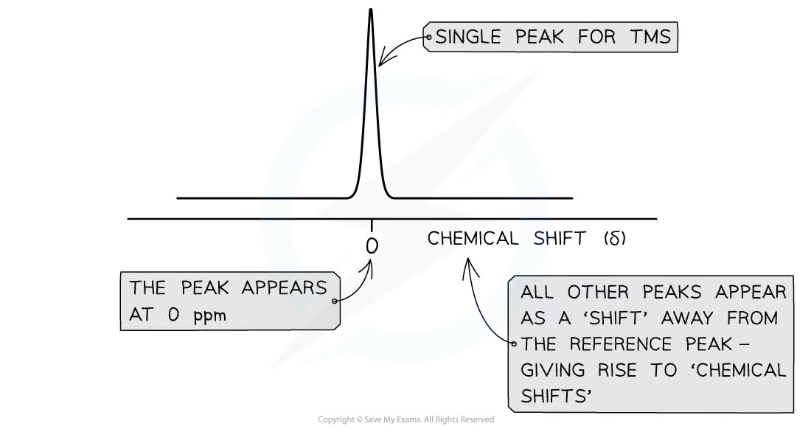{.concept-figure fig-alt="Tetramethylsilane with four equivalent methyl groups"}

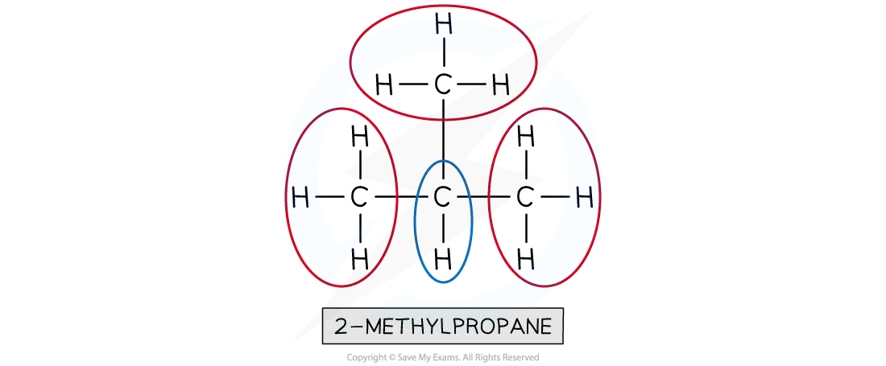{.concept-figure fig-alt="TMS at zero chemical shift in an NMR spectrum"}

The **number of signals** indicates the number of different proton environments. The **relative integration** of signals gives the relative number of protons in each environment. A deuterated solvent such as $\ce{CDCl3}$ is used because ordinary $\ce{CHCl3}$ would produce a proton signal that could interfere with the sample spectrum.
:::

::: {.study-card}
### Splitting and the $n+1$ rule

In a high-resolution proton NMR spectrum, a proton signal is split by adjacent, non-equivalent protons. If a proton has $n$ equivalent neighbouring protons, its signal is split into $n+1$ lines:

| Neighbouring protons, $n$ | Multiplet |
|---:|---|
| 0 | singlet |
| 1 | doublet |
| 2 | triplet |
| 3 | quartet |

{.concept-figure fig-alt="The n plus one rule for proton NMR splitting"}

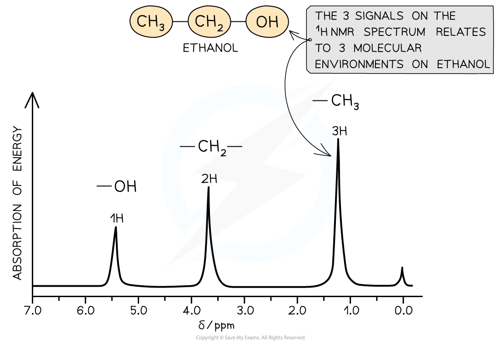{.concept-figure fig-alt="Proton NMR integration traces and relative proton numbers"}

Splitting is not normally observed between rapidly exchanging acidic protons such as many $\ce{O-H}$ protons. Always use the structure to identify neighbouring protons rather than assuming that identical functional groups must have identical splitting.
:::

::: {.study-card}
### Interpreting a proton NMR spectrum

Use a consistent sequence:

1. Count the signals to find the number of proton environments.
2. Use the integration ratio to assign the number of protons to each signal.
3. Use splitting to identify neighbouring proton groups.
4. Use chemical-shift ranges to identify environments next to oxygen, carbonyl groups, aromatic rings or other electron-withdrawing groups.
5. Check that every hydrogen in the proposed structure has been accounted for.

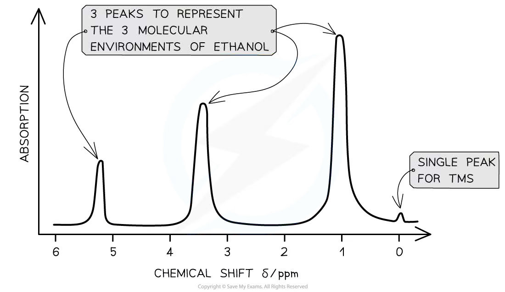{.concept-figure fig-alt="Annotated proton NMR spectrum"}

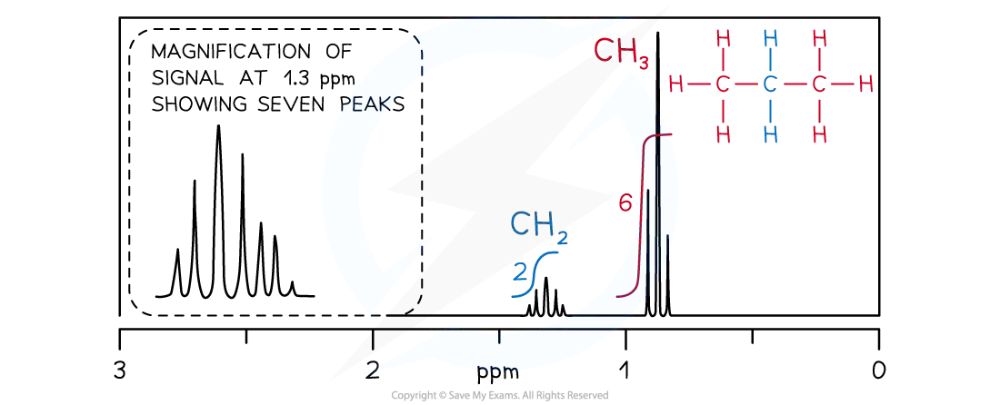{.concept-figure fig-alt="Example proton NMR spectrum with chemical shifts"}

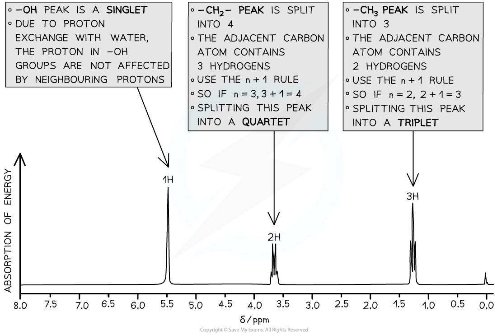{.concept-figure fig-alt="Step-by-step proton NMR interpretation"}

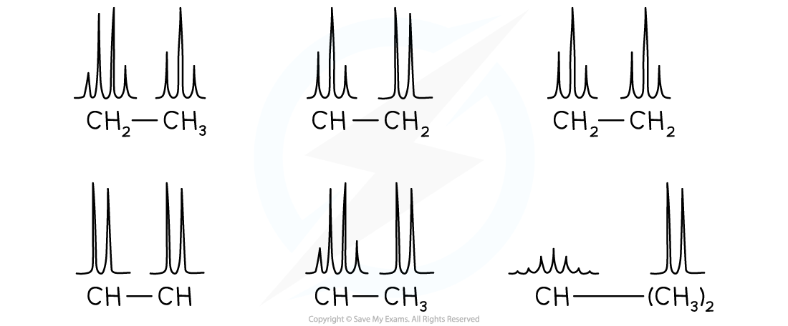{.concept-figure fig-alt="Proton NMR examples linked to organic structures"}
:::

::: {.worked-example}
Worked example · Using integration and splitting

### Identifying an ester from a proton NMR spectrum

**An ester has two proton NMR signals: a quartet integrating to four protons at about $\delta=4.1$ ppm and a triplet integrating to three protons at about $\delta=1.3$ ppm. Suggest the relevant structure and explain the splitting.**

1. A quartet and a triplet with an integration ratio of $4:3$ indicate an ethyl group, $\ce{-CH2CH3}$.
2. The quartet is from the $\ce{-OCH2-}$ group. Its chemical shift is relatively high because the $\ce{CH2}$ carbon is directly attached to oxygen. The two neighbouring protons on $\ce{CH3}$ give $n+1=2+1=3$ lines, so the $\ce{CH2}$ signal is a quartet.
3. The triplet is from the terminal $\ce{-CH3}$ group. It has two neighbouring protons on $\ce{CH2}$, so $n+1=2+1=3$ lines.
4. A structure consistent with these signals is ethyl ethanoate, $\ce{CH3COOCH2CH3}$, provided that the remaining methyl signal from the ethanoate group is also present in the complete spectrum.

:::

## Chapter checklist

- [ ] I can distinguish the stationary and mobile phases in TLC and GLC.
- [ ] I can calculate $R_f$ values and explain why they cannot exceed 1.
- [ ] I can use GC retention times and peak areas to interpret a mixture.
- [ ] I can count equivalent carbon environments and assign approximate carbon-13 shifts.
- [ ] I can explain the role of TMS and deuterated solvents in proton NMR.
- [ ] I can use proton NMR integration, splitting and chemical shift to test a proposed structure.
- [ ] I can combine analytical evidence from MS, IR and NMR to identify an unknown compound.

### Practice questions



### Original question PDFs

- [8.1 Analytical Techniques (A Level Only) – Easy](https://raw.githubusercontent.com/nanoxsj/CIE-Chemistry-Study/main/resources/original-papers/analytical-techniques/37.1-analytical-techniques-easy.pdf)
- [8.1 Analytical Techniques (A Level Only) – Medium](https://raw.githubusercontent.com/nanoxsj/CIE-Chemistry-Study/main/resources/original-papers/analytical-techniques/37.1-analytical-techniques-medium.pdf)
- [8.1 Analytical Techniques (A Level Only) – Hard](https://raw.githubusercontent.com/nanoxsj/CIE-Chemistry-Study/main/resources/original-papers/analytical-techniques/37.1-analytical-techniques-hard.pdf)
