### 4 States of matter - Multiple Choice: Easy

::: {.mc-question #states-choice-easy-q1 data-answer="C"}
### Question 1 · Giant covalent structure · 1.4 Choice Easy Q1

Original question page · 1.4 Choice Easy Q1

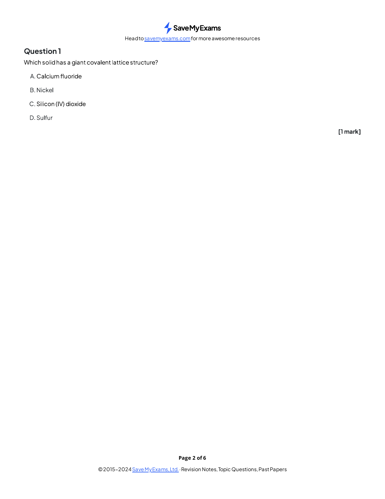{.question-figure fig-alt="Original question page 1.4 Choice Easy Q1"}

Which solid has a giant covalent lattice structure?

<button class="mc-choice" data-choice="A"><strong>A</strong>Calcium fluoride</button><button class="mc-choice" data-choice="B"><strong>B</strong>Nickel</button><button class="mc-choice" data-choice="C"><strong>C</strong>Silicon(IV) oxide</button><button class="mc-choice" data-choice="D"><strong>D</strong>Sulfur</button>

<button class="check-answer">Check answer</button>

Show explanation

<strong>C.</strong> $\ce{SiO2}$ contains a giant covalent network. Calcium fluoride is ionic, nickel is metallic and sulfur is simple molecular.

:::

::: {.mc-question #states-choice-easy-q2 data-answer="D"}
### Question 2 · Structure and melting point · 1.4 Choice Easy Q2

Original question page · 1.4 Choice Easy Q2

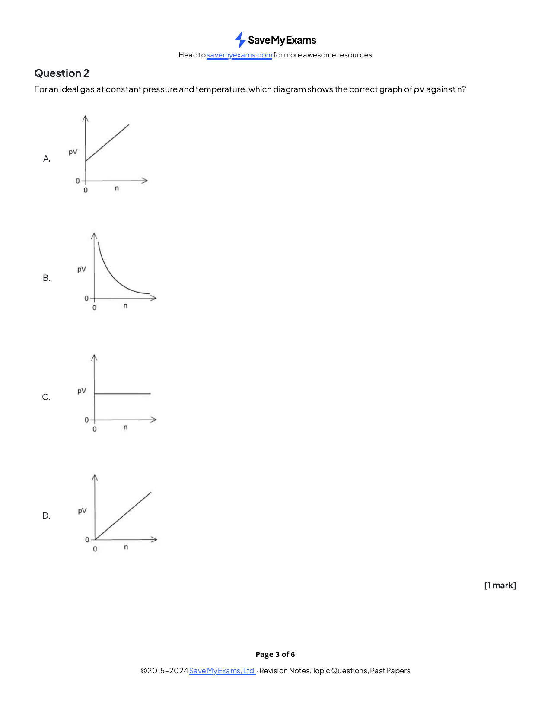{.question-figure fig-alt="Original question page 1.4 Choice Easy Q2"}

Which substance is expected to have the highest melting point?

<button class="mc-choice" data-choice="A"><strong>A</strong>Iodine</button><button class="mc-choice" data-choice="B"><strong>B</strong>Methane</button><button class="mc-choice" data-choice="C"><strong>C</strong>Sodium</button><button class="mc-choice" data-choice="D"><strong>D</strong>Diamond</button>

<button class="check-answer">Check answer</button>

Show explanation

<strong>D.</strong> Diamond has strong covalent bonds throughout a giant lattice.

:::

::: {.mc-question #states-choice-easy-q3 data-answer="A"}
### Question 3 · Ideal gas equation · 1.4 Choice Easy Q3

Original question page · 1.4 Choice Easy Q3

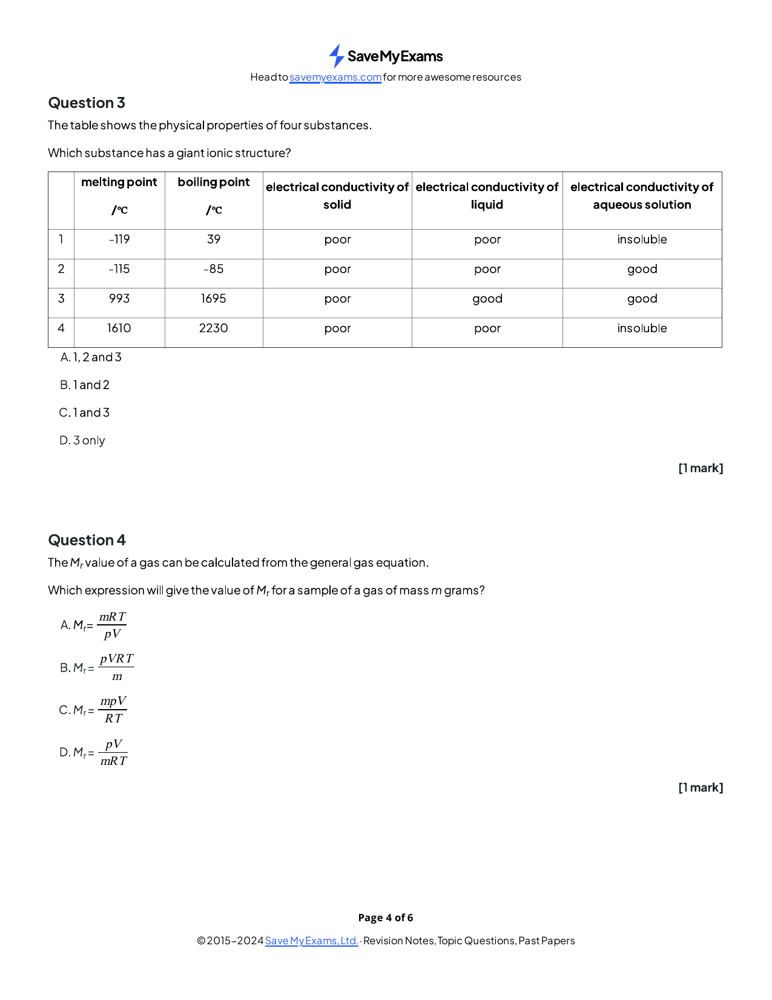{.question-figure fig-alt="Original question page 1.4 Choice Easy Q3"}

Which graph is consistent with an ideal gas at constant pressure and temperature when $pV$ is plotted against $n$?

<button class="mc-choice" data-choice="A"><strong>A</strong>A straight line through the origin</button><button class="mc-choice" data-choice="B"><strong>B</strong>A decreasing curve</button><button class="mc-choice" data-choice="C"><strong>C</strong>A horizontal line above the origin</button><button class="mc-choice" data-choice="D"><strong>D</strong>A straight line with a positive intercept</button>

<button class="check-answer">Check answer</button>

Show explanation

<strong>A.</strong> From $pV=nRT$, $pV$ is directly proportional to $n$ when $T$ is constant.

:::

::: {.mc-question #states-choice-easy-q4 data-answer="A"}
### Question 4 · Molar mass from $pV=nRT$ · 1.4 Choice Easy Q4

Original question page · 1.4 Choice Easy Q4

{.question-figure fig-alt="Original question page 1.4 Choice Easy Q4"}

Which expression gives the molar mass $M$ of a gas sample of mass $m$ grams?

<button class="mc-choice" data-choice="A"><strong>A</strong>$M=\frac{mRT}{pV}$</button><button class="mc-choice" data-choice="B"><strong>B</strong>$M=\frac{pV}{mRT}$</button><button class="mc-choice" data-choice="C"><strong>C</strong>$M=\frac{mpV}{RT}$</button><button class="mc-choice" data-choice="D"><strong>D</strong>$M=\frac{pV}{m}RT$</button>

<button class="check-answer">Check answer</button>

Show explanation

<strong>A.</strong> Substitute $n=m/M$ into $pV=nRT$ and rearrange.

:::

::: {.mc-question #states-choice-easy-q5 data-answer="B"}
### Question 5 · Ideal behaviour · 1.4 Choice Easy Q5

Original question page · 1.4 Choice Easy Q5

{.question-figure fig-alt="Original question page 1.4 Choice Easy Q5"}

Which gas behaves least like an ideal gas at room temperature?

<button class="mc-choice" data-choice="A"><strong>A</strong>Helium</button><button class="mc-choice" data-choice="B"><strong>B</strong>Ammonia</button><button class="mc-choice" data-choice="C"><strong>C</strong>Hydrogen</button><button class="mc-choice" data-choice="D"><strong>D</strong>Neon</button>

<button class="check-answer">Check answer</button>

Show explanation

<strong>B.</strong> Ammonia is polar and has relatively strong intermolecular attractions.

:::

::: {.mc-question #states-choice-easy-q6 data-answer="C"}
### Question 6 · Identifying structures · 1.4 Choice Easy Q6

Original question page · 1.4 Choice Easy Q6

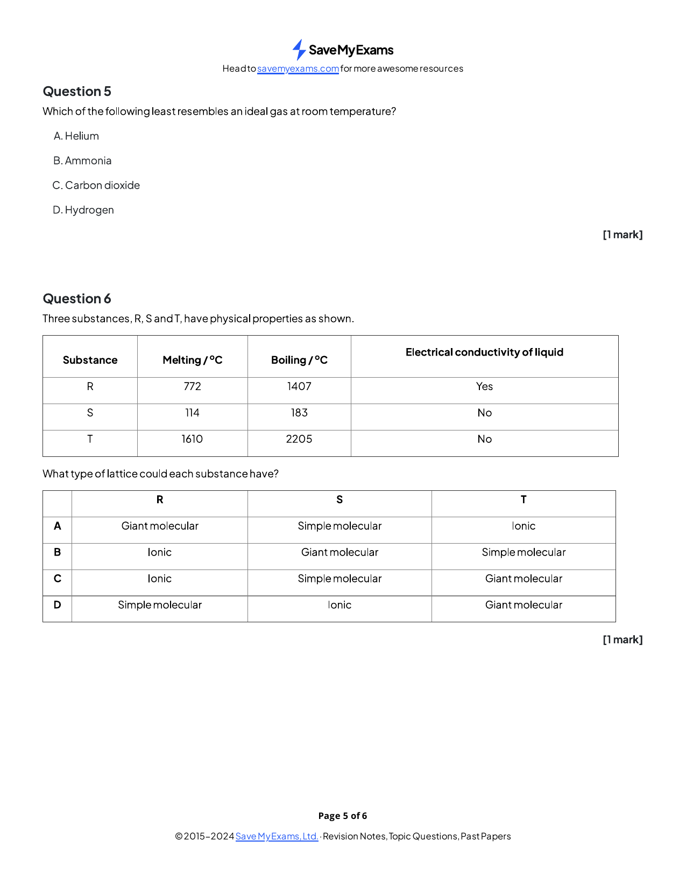{.question-figure fig-alt="Original question page 1.4 Choice Easy Q6"}

Substance R conducts when molten but not as a solid, S has a low boiling point and T has a high melting point but does not conduct. Which structures could R, S and T have?

<button class="mc-choice" data-choice="A"><strong>A</strong>Giant covalent; simple molecular; ionic</button><button class="mc-choice" data-choice="B"><strong>B</strong>Ionic; giant covalent; simple molecular</button><button class="mc-choice" data-choice="C"><strong>C</strong>Ionic; simple molecular; giant covalent</button><button class="mc-choice" data-choice="D"><strong>D</strong>Simple molecular; ionic; giant covalent</button>

<button class="check-answer">Check answer</button>

Show explanation

<strong>C.</strong> R is ionic, S is simple molecular and T is giant covalent such as diamond.

:::

::: {.mc-question #states-choice-easy-q7 data-answer="A"}
### Question 7 · Energy and state changes · 1.4 Choice Easy Q7

Original question page · 1.4 Choice Easy Q7

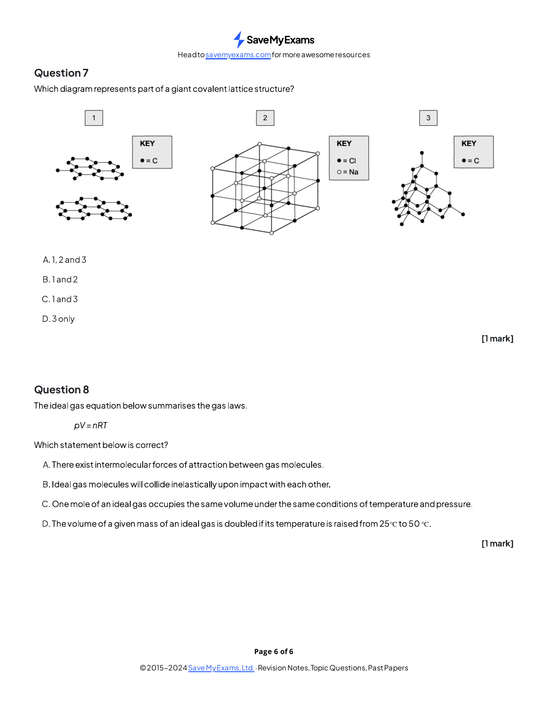{.question-figure fig-alt="Original question page 1.4 Choice Easy Q7"}

Which change is endothermic?

<button class="mc-choice" data-choice="A"><strong>A</strong>Sublimation of iodine</button><button class="mc-choice" data-choice="B"><strong>B</strong>Freezing of water</button><button class="mc-choice" data-choice="C"><strong>C</strong>Condensation of steam</button><button class="mc-choice" data-choice="D"><strong>D</strong>Formation of a crystal from a liquid</button>

<button class="check-answer">Check answer</button>

Show explanation

<strong>A.</strong> Sublimation requires energy to overcome attractions and separate particles.

:::

### 4 States of matter - Multiple Choice: Medium

::: {.mc-question #states-choice-medium-q1 data-answer="A"}
### Question 8 · Conditions for ideal behaviour · 1.4 Choice Medium Q1

Original question page · 1.4 Choice Medium Q1

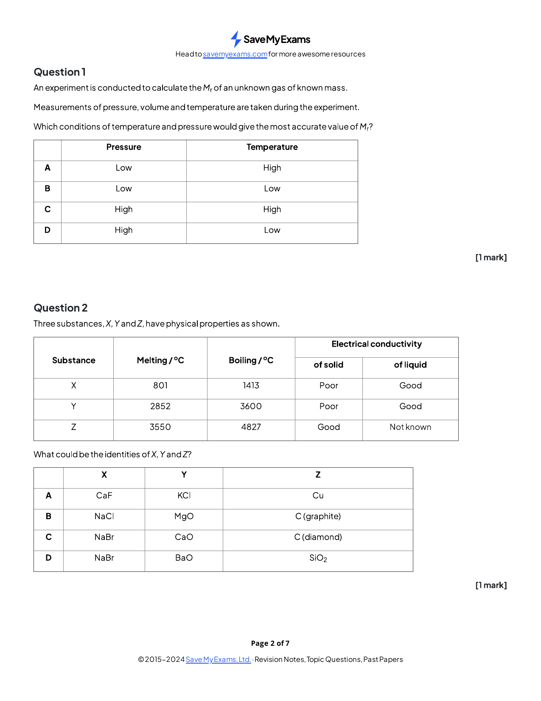{.question-figure fig-alt="Original question page 1.4 Choice Medium Q1"}

Under which conditions does a real gas behave most nearly ideally?

<button class="mc-choice" data-choice="A"><strong>A</strong>Low pressure and high temperature</button><button class="mc-choice" data-choice="B"><strong>B</strong>Low pressure and low temperature</button><button class="mc-choice" data-choice="C"><strong>C</strong>High pressure and high temperature</button><button class="mc-choice" data-choice="D"><strong>D</strong>High pressure and low temperature</button>

<button class="check-answer">Check answer</button>

Show explanation

<strong>A.</strong> Particles are far apart at low pressure and attractions matter less at high temperature.

:::

::: {.mc-question #states-choice-medium-q2 data-answer="B"}
### Question 9 · Identifying three structures · 1.4 Choice Medium Q2

Original question page · 1.4 Choice Medium Q2

{.question-figure fig-alt="Original question page 1.4 Choice Medium Q2"}

Which row correctly identifies X, Y and Z?

| Substance | Melting point / $^\circ\mathrm{C}$ | Boiling point / $^\circ\mathrm{C}$ | Solid conductivity | Liquid conductivity |
|---|---:|---:|---|---|
| X | 801 | 1413 | poor | good |
| Y | 2852 | 3600 | poor | good |
| Z | 3550 | 4827 | good | unknown |

<button class="mc-choice" data-choice="A"><strong>A</strong>X = $\ce{CaF2}$, Y = $\ce{KCl}$, Z = Cu</button><button class="mc-choice" data-choice="B"><strong>B</strong>X = $\ce{NaCl}$, Y = $\ce{MgO}$, Z = graphite</button><button class="mc-choice" data-choice="C"><strong>C</strong>X = $\ce{NaBr}$, Y = $\ce{CaO}$, Z = diamond</button><button class="mc-choice" data-choice="D"><strong>D</strong>X = $\ce{NaBr}$, Y = $\ce{BaO}$, Z = $\ce{SiO2}$</button>

<button class="check-answer">Check answer</button>

Show explanation

<strong>B.</strong> X and Y are ionic, with Y having the stronger lattice. Graphite has a high melting point and conducts through delocalised electrons.

:::

::: {.mc-question #states-choice-medium-q3 data-answer="B"}
### Question 10 · Pressure calculation · 1.4 Choice Medium Q3

Original question page · 1.4 Choice Medium Q3

{.question-figure fig-alt="Original question page 1.4 Choice Medium Q3"}

A $0.96\ \mathrm{g}$ sample of hydrogen occupies $7.0\times10^{-3}\ \mathrm{m^3}$ at $303\ \mathrm{K}$. What is its pressure? Use $R=8.314\ \mathrm{J\ mol^{-1}\ K^{-1}}$.

<button class="mc-choice" data-choice="A"><strong>A</strong>$172.7\ \mathrm{Pa}$</button><button class="mc-choice" data-choice="B"><strong>B</strong>$172.7\ \mathrm{kPa}$</button><button class="mc-choice" data-choice="C"><strong>C</strong>$345.5\ \mathrm{Pa}$</button><button class="mc-choice" data-choice="D"><strong>D</strong>$691.1\ \mathrm{kPa}$</button>

<button class="check-answer">Check answer</button>

Show explanation

<strong>B.</strong> $n=0.96/2.0=0.48\ \mathrm{mol}$ and $p=nRT/V=1.73\times10^5\ \mathrm{Pa}=172.7\ \mathrm{kPa}$.

:::

::: {.mc-question #states-choice-medium-q4 data-answer="B"}
### Question 11 · Mass of oxygen · 1.4 Choice Medium Q4

Original question page · 1.4 Choice Medium Q4

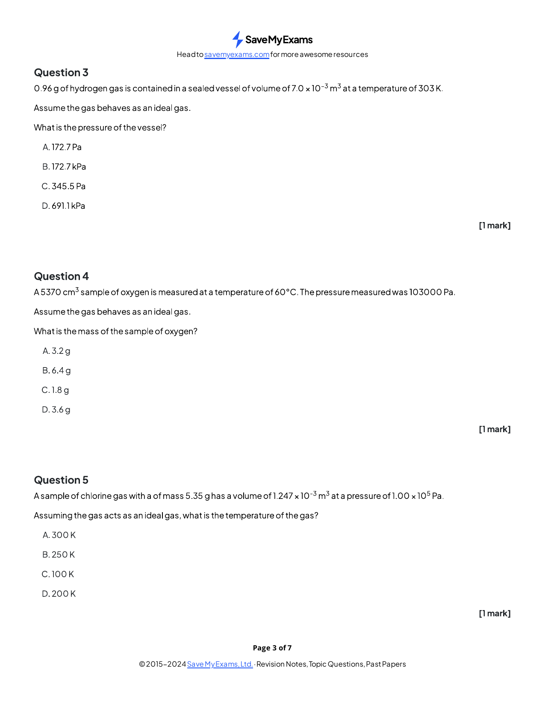{.question-figure fig-alt="Original question page 1.4 Choice Medium Q4"}

A $5370\ \mathrm{cm^3}$ sample of oxygen is at $60^\circ\mathrm{C}$ and $103000\ \mathrm{Pa}$. What is its mass?

<button class="mc-choice" data-choice="A"><strong>A</strong>$3.2\ \mathrm{g}$</button><button class="mc-choice" data-choice="B"><strong>B</strong>$6.4\ \mathrm{g}$</button><button class="mc-choice" data-choice="C"><strong>C</strong>$1.8\ \mathrm{g}$</button><button class="mc-choice" data-choice="D"><strong>D</strong>$3.6\ \mathrm{g}$</button>

<button class="check-answer">Check answer</button>

Show explanation

<strong>B.</strong> Use $T=333\ \mathrm{K}$ and $V=5.370\times10^{-3}\ \mathrm{m^3}$. The amount is about $0.200\ \mathrm{mol}$ and the mass is $0.200\times32.0=6.4\ \mathrm{g}$.

:::

::: {.mc-question #states-choice-medium-q5 data-answer="D"}
### Question 12 · Temperature calculation · 1.4 Choice Medium Q5

Original question page · 1.4 Choice Medium Q5

{.question-figure fig-alt="Original question page 1.4 Choice Medium Q5"}

A $5.35\ \mathrm{g}$ sample of chlorine gas occupies $1.247\times10^{-3}\ \mathrm{m^3}$ at $1.00\times10^5\ \mathrm{Pa}$. What is its temperature?

<button class="mc-choice" data-choice="A"><strong>A</strong>$300\ \mathrm{K}$</button><button class="mc-choice" data-choice="B"><strong>B</strong>$250\ \mathrm{K}$</button><button class="mc-choice" data-choice="C"><strong>C</strong>$100\ \mathrm{K}$</button><button class="mc-choice" data-choice="D"><strong>D</strong>$200\ \mathrm{K}$</button>

<button class="check-answer">Check answer</button>

Show explanation

<strong>D.</strong> $n=5.35/71.0=0.0754\ \mathrm{mol}$ and $T=pV/(nR)\approx200\ \mathrm{K}$.

:::

::: {.mc-question #states-choice-medium-q6 data-answer="A"}
### Question 13 · Boyle's law · 1.4 Choice Medium Q6

Original question page · 1.4 Choice Medium Q6

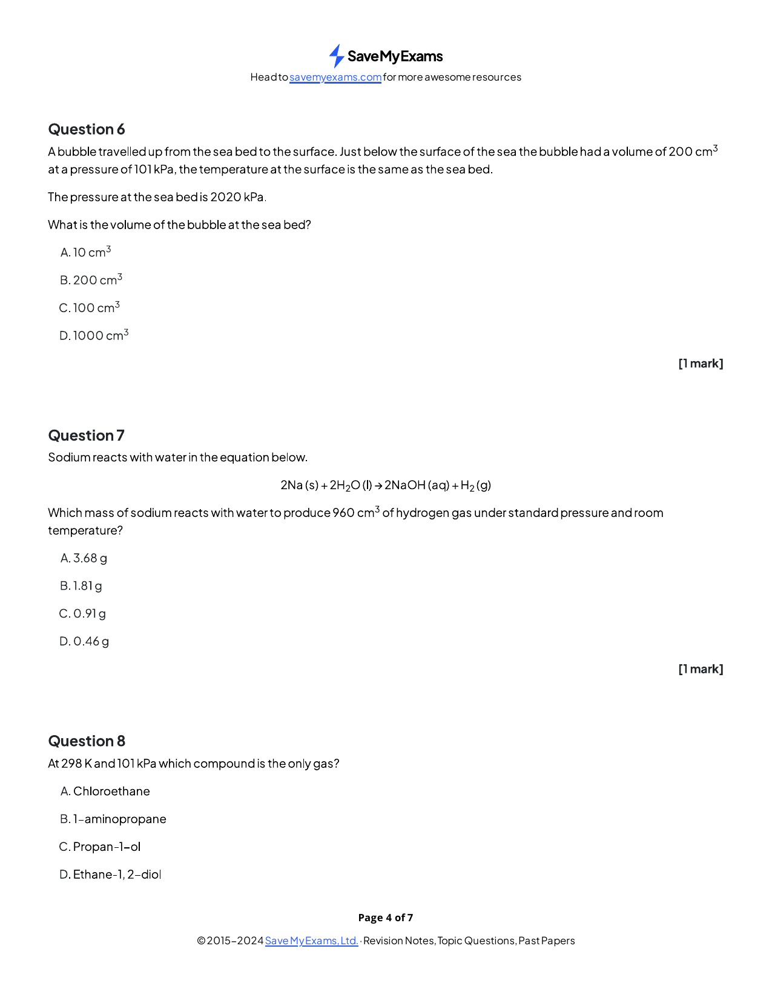{.question-figure fig-alt="Original question page 1.4 Choice Medium Q6"}

A bubble has volume $200\ \mathrm{cm^3}$ at a pressure of $101\ \mathrm{kPa}$. What is its volume at the sea bed where the pressure is $2020\ \mathrm{kPa}$? Temperature is constant.

<button class="mc-choice" data-choice="A"><strong>A</strong>$10\ \mathrm{cm^3}$</button><button class="mc-choice" data-choice="B"><strong>B</strong>$200\ \mathrm{cm^3}$</button><button class="mc-choice" data-choice="C"><strong>C</strong>$100\ \mathrm{cm^3}$</button><button class="mc-choice" data-choice="D"><strong>D</strong>$1000\ \mathrm{cm^3}$</button>

<button class="check-answer">Check answer</button>

Show explanation

<strong>A.</strong> $p_1V_1=p_2V_2$, so $V_2=101\times200/2020=10\ \mathrm{cm^3}$.

:::

::: {.mc-question #states-choice-medium-q7 data-answer="B"}
### Question 14 · Gas volume and reacting mass · 1.4 Choice Medium Q7

Original question page · 1.4 Choice Medium Q7

{.question-figure fig-alt="Original question page 1.4 Choice Medium Q7"}

$$\ce{2Na(s) + 2H2O(l) -> 2NaOH(aq) + H2(g)}$$

What mass of sodium reacts to produce $960\ \mathrm{cm^3}$ of hydrogen at RTP?

<button class="mc-choice" data-choice="A"><strong>A</strong>$3.68\ \mathrm{g}$</button><button class="mc-choice" data-choice="B"><strong>B</strong>$1.81\ \mathrm{g}$</button><button class="mc-choice" data-choice="C"><strong>C</strong>$0.91\ \mathrm{g}$</button><button class="mc-choice" data-choice="D"><strong>D</strong>$0.46\ \mathrm{g}$</button>

<button class="check-answer">Check answer</button>

Show explanation

<strong>B.</strong> $n(\ce{H2})=0.960/24.0=0.0400\ \mathrm{mol}$, so $n(\ce{Na})=0.0800\ \mathrm{mol}$ and mass $=0.0800\times23.0=1.84\ \mathrm{g}$.

:::

### 4 States of matter - Multiple Choice: Hard

::: {.mc-question #states-choice-hard-q1 data-answer="D"}
### Question 15 · Identifying an unknown gas · 1.4 Choice Hard Q1

Original question page · 1.4 Choice Hard Q1

{.question-figure fig-alt="Original question page 1.4 Choice Hard Q1"}

A $0.300\ \mathrm{dm^3}$ tube is filled with a gas at $27^\circ\mathrm{C}$ and $101\ \mathrm{kPa}$. The mass increases by $1.02\times10^{-3}\ \mathrm{kg}$. Which gas could it be?

<button class="mc-choice" data-choice="A"><strong>A</strong>Neon</button><button class="mc-choice" data-choice="B"><strong>B</strong>Helium</button><button class="mc-choice" data-choice="C"><strong>C</strong>Oxygen</button><button class="mc-choice" data-choice="D"><strong>D</strong>Krypton</button>

<button class="check-answer">Check answer</button>

Show explanation

<strong>D.</strong> $n=pV/RT\approx0.0122\ \mathrm{mol}$. With mass $1.02\ \mathrm{g}$, $M\approx83.6\ \mathrm{g\ mol^{-1}}$, close to krypton.

:::

::: {.mc-question #states-choice-hard-q2 data-answer="B"}
### Question 16 · Mass from ideal gas data · 1.4 Choice Hard Q2

Original question page · 1.4 Choice Hard Q2

{.question-figure fig-alt="Original question page 1.4 Choice Hard Q2"}

The volume of a methane sample is $5.25\ \mathrm{dm^3}$ at $50^\circ\mathrm{C}$ and $102\ \mathrm{kPa}$. What is its mass?

<button class="mc-choice" data-choice="A"><strong>A</strong>$0.0018\ \mathrm{g}$</button><button class="mc-choice" data-choice="B"><strong>B</strong>$3.20\ \mathrm{g}$</button><button class="mc-choice" data-choice="C"><strong>C</strong>$0.0032\ \mathrm{g}$</button><button class="mc-choice" data-choice="D"><strong>D</strong>$0.18\ \mathrm{g}$</button>

<button class="check-answer">Check answer</button>

Show explanation

<strong>B.</strong> $n=pV/RT\approx0.199\ \mathrm{mol}$; mass $=0.199\times16.0\approx3.20\ \mathrm{g}$.

:::

::: {.mc-question #states-choice-hard-q3 data-answer="C"}
### Question 17 · Metal oxide and gas volume · 1.4 Choice Hard Q3

Original question page · 1.4 Choice Hard Q3

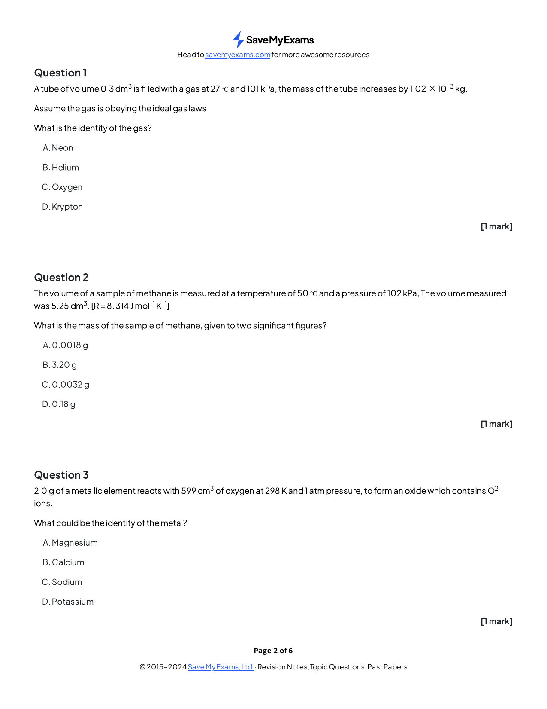{.question-figure fig-alt="Original question page 1.4 Choice Hard Q3"}

A $2.00\ \mathrm{g}$ metal reacts with $599\ \mathrm{cm^3}$ oxygen at $298\ \mathrm{K}$ and $1\ \mathrm{atm}$ to form an oxide containing $\ce{O^{2-}}$. Which metal could be used?

<button class="mc-choice" data-choice="A"><strong>A</strong>Magnesium</button><button class="mc-choice" data-choice="B"><strong>B</strong>Calcium</button><button class="mc-choice" data-choice="C"><strong>C</strong>Sodium</button><button class="mc-choice" data-choice="D"><strong>D</strong>Potassium</button>

<button class="check-answer">Check answer</button>

Show explanation

<strong>C.</strong> The oxygen amount is about $0.0245\ \mathrm{mol}$. The sodium-to-oxygen ratio is consistent with formation of $\ce{Na2O}$ from the given masses.

:::

::: {.mc-question #states-choice-hard-q4 data-answer="C"}
### Question 18 · Mass of ammonia · 1.4 Choice Hard Q4

Original question page · 1.4 Choice Hard Q4

{.question-figure fig-alt="Original question page 1.4 Choice Hard Q4"}

A sample of ammonia occupies $5.27\times10^{-5}\ \mathrm{m^3}$ at $60^\circ\mathrm{C}$ and $75\ \mathrm{kPa}$. What is its mass?

<button class="mc-choice" data-choice="A"><strong>A</strong>$2.4\times10^{-5}\ \mathrm{g}$</button><button class="mc-choice" data-choice="B"><strong>B</strong>$2.5\times10^{-4}\ \mathrm{g}$</button><button class="mc-choice" data-choice="C"><strong>C</strong>$2.4\times10^{-2}\ \mathrm{g}$</button><button class="mc-choice" data-choice="D"><strong>D</strong>$2.5\times10^{-1}\ \mathrm{g}$</button>

<button class="check-answer">Check answer</button>

Show explanation

<strong>C.</strong> $n=pV/RT\approx1.43\times10^{-3}\ \mathrm{mol}$ and mass $=n\times17.0\approx2.4\times10^{-2}\ \mathrm{g}$.

:::

::: {.mc-question #states-choice-hard-q5 data-answer="C"}
### Question 19 · Noble gas identification · 1.4 Choice Hard Q5

Original question page · 1.4 Choice Hard Q5

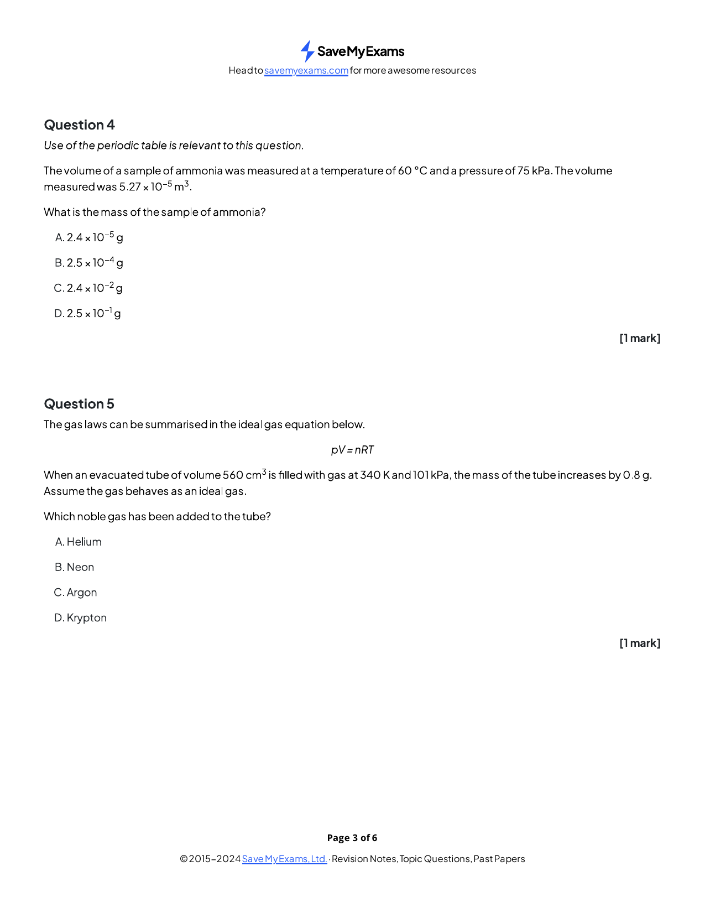{.question-figure fig-alt="Original question page 1.4 Choice Hard Q5"}

An unknown noble gas has mass $0.800\ \mathrm{g}$, volume $560\ \mathrm{cm^3}$, pressure $101\ \mathrm{kPa}$ and temperature $340\ \mathrm{K}$. Which gas is it?

<button class="mc-choice" data-choice="A"><strong>A</strong>Helium</button><button class="mc-choice" data-choice="B"><strong>B</strong>Neon</button><button class="mc-choice" data-choice="C"><strong>C</strong>Argon</button><button class="mc-choice" data-choice="D"><strong>D</strong>Krypton</button>

<button class="check-answer">Check answer</button>

Show explanation

<strong>C.</strong> $n=pV/RT\approx0.0200\ \mathrm{mol}$, so $M=0.800/0.0200\approx40.0\ \mathrm{g\ mol^{-1}}$, identifying argon.

:::

::: {.mc-question #states-choice-hard-q6 data-answer="A"}
### Question 20 · Real-gas deviation · 1.4 Choice Hard Q6

Original question page · 1.4 Choice Hard Q6

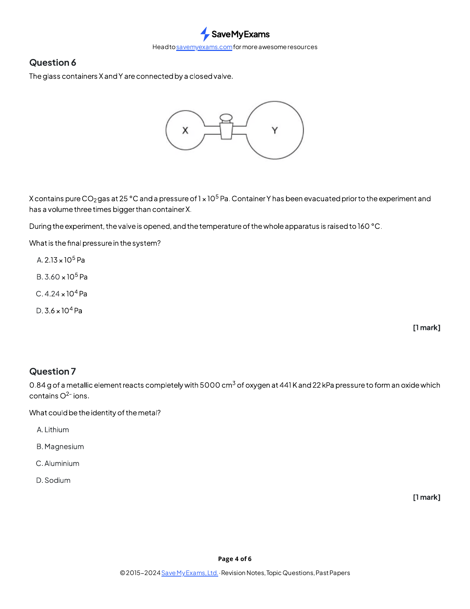{.question-figure fig-alt="Original question page 1.4 Choice Hard Q6"}

Under which conditions is a real gas most likely to show the greatest deviation from ideal behaviour?

<button class="mc-choice" data-choice="A"><strong>A</strong>High pressure and low temperature</button><button class="mc-choice" data-choice="B"><strong>B</strong>Low pressure and high temperature</button><button class="mc-choice" data-choice="C"><strong>C</strong>Low pressure and low temperature</button><button class="mc-choice" data-choice="D"><strong>D</strong>High pressure and high temperature</button>

<button class="check-answer">Check answer</button>

Show explanation

<strong>A.</strong> At high pressure particle volume matters; at low temperature attractions are more significant.

:::
