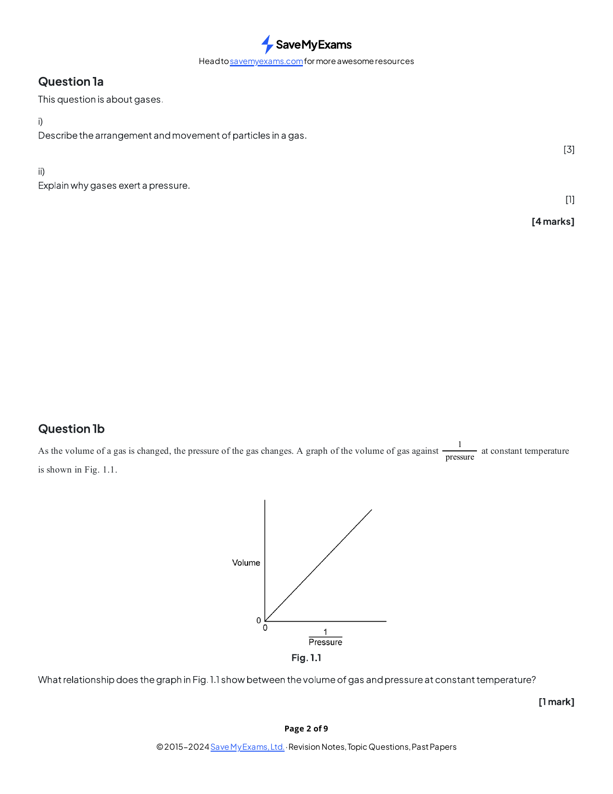
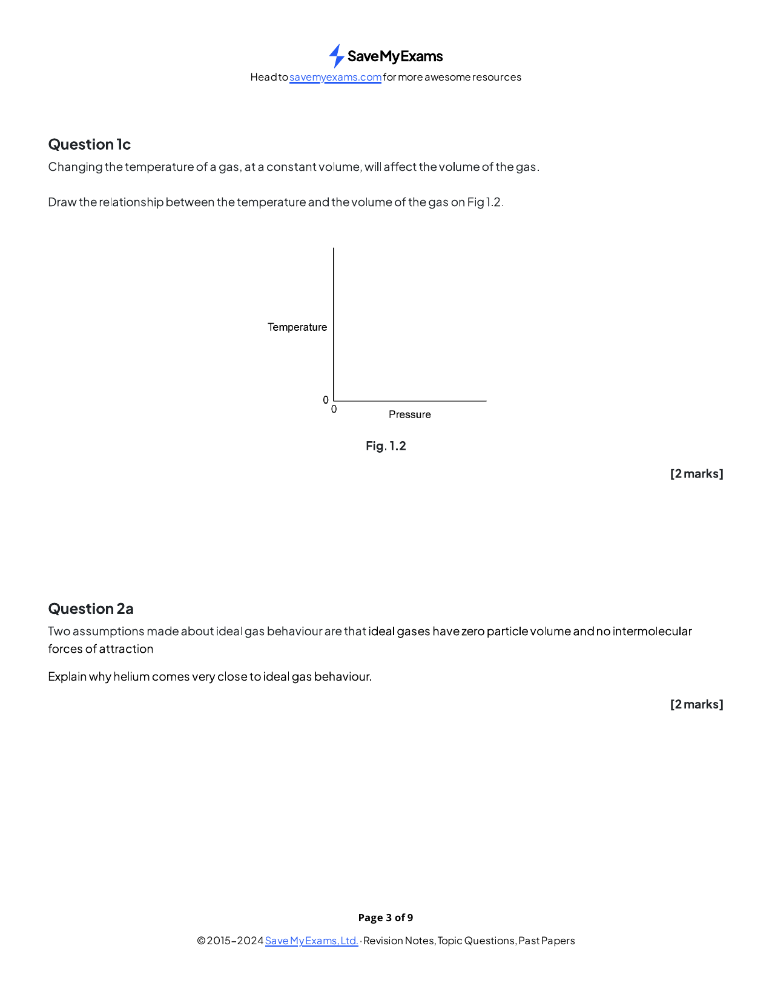
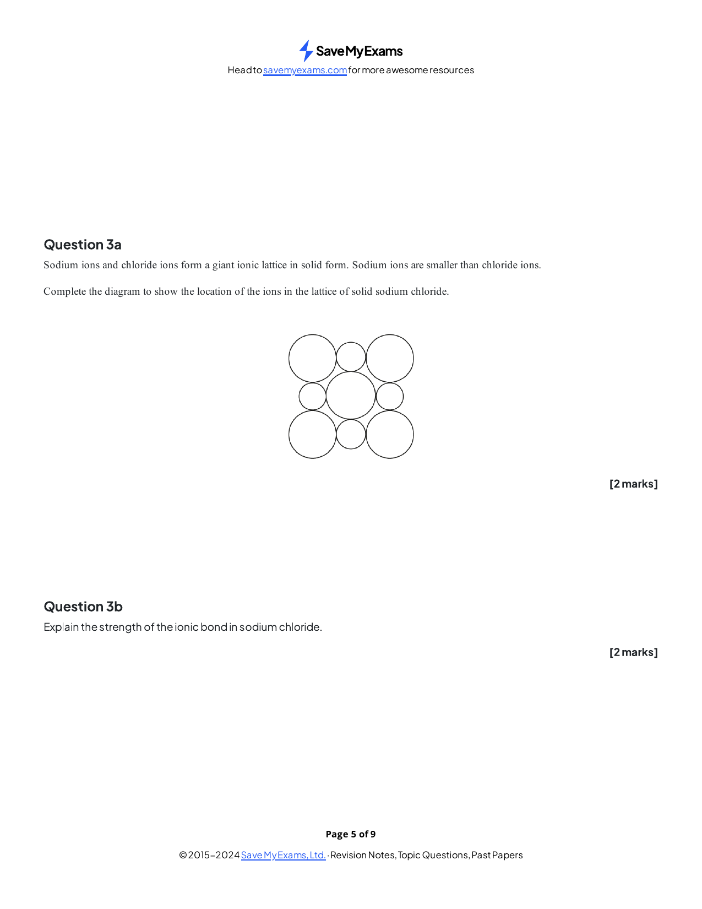
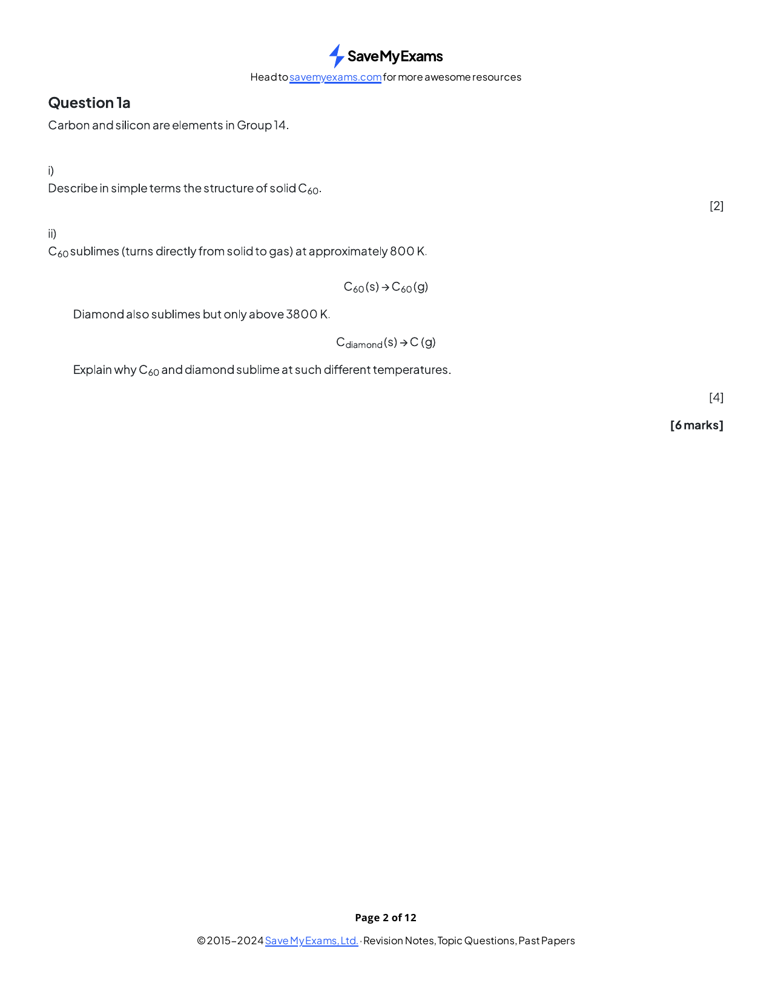
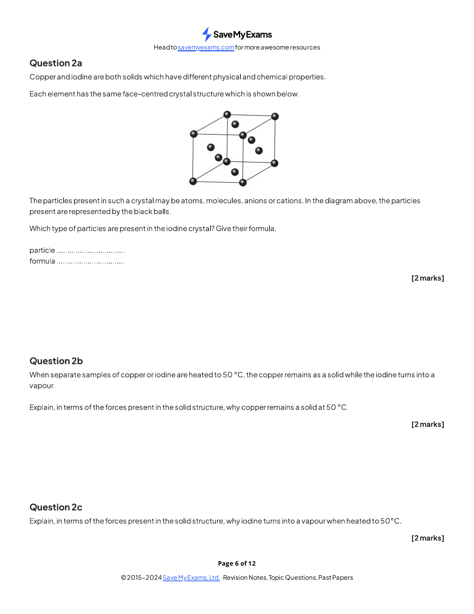
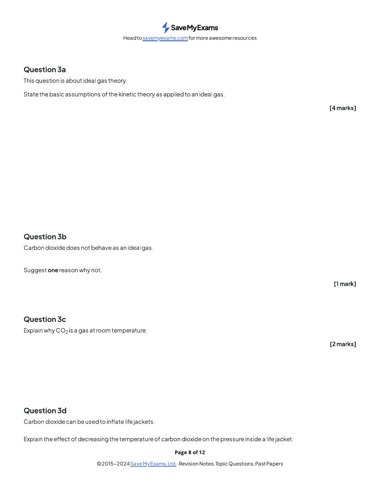
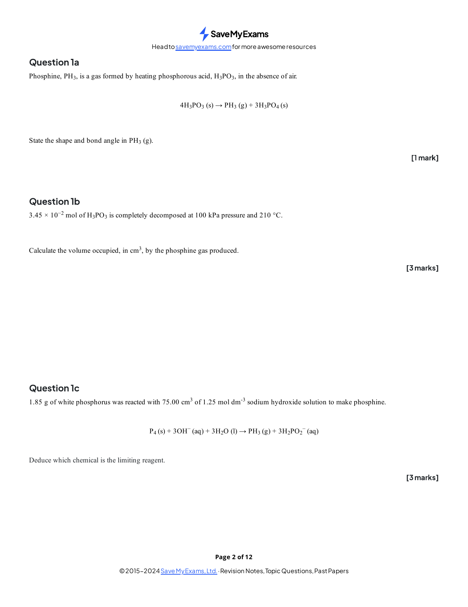
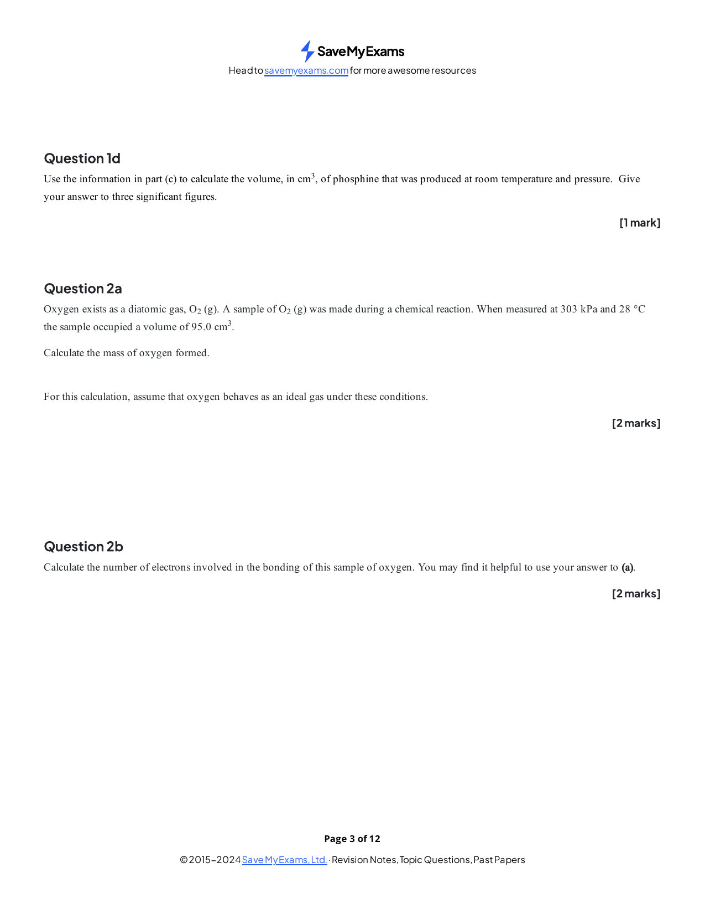
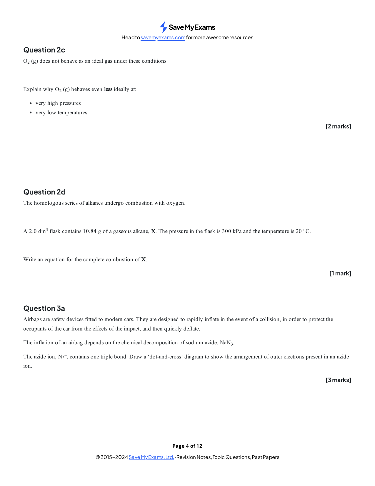
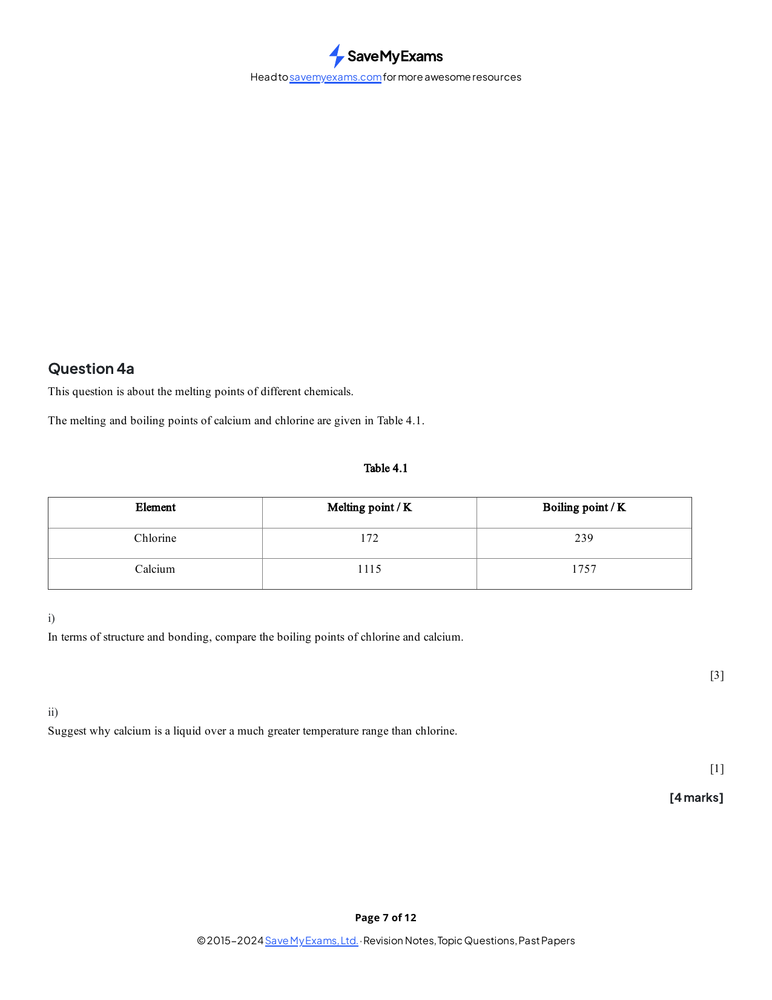

### 4 States of matter - Structured Questions: Easy

::: {.question-card}
### Example 1 · Particle model and gas pressure · 1.4 SQ Easy Q1

Original question page · 1.4 SQ Easy Q1

{.question-figure fig-alt="Original question page 1.4 SQ Easy Q1"}

**(a)** Describe the arrangement and movement of particles in a gas. `[3 marks]`

**(b)** Explain why a gas exerts pressure. `[1 mark]`

**(c)** State one difference between the movement of particles in a liquid and in a gas. `[1 mark]`

Show mark scheme / model answer
<ul><li><strong>(a)</strong> Particles are far apart, move rapidly and randomly in all directions, and collide elastically with each other and the container.</li><li><strong>(b)</strong> Pressure is caused by collisions of gas particles with the walls of the container.</li><li><strong>(c)</strong> Liquid particles are close together and can move past one another; gas particles are widely separated and move more freely.</li></ul>

:::

::: {.question-card}
### Example 2 · Gas laws · 1.4 SQ Easy Q2

Original question page · 1.4 SQ Easy Q2

{.question-figure fig-alt="Original question page 1.4 SQ Easy Q2"}

**(a)** State the relationship between volume and pressure for a fixed amount of gas at constant temperature. `[1 mark]`

**(b)** State the relationship between volume and absolute temperature at constant pressure. `[1 mark]`

**(c)** A gas occupies $250\ \mathrm{cm^3}$ at $100\ \mathrm{kPa}$. Calculate its volume at $250\ \mathrm{kPa}$ if temperature is constant. `[2 marks]`

Show mark scheme / model answer
<ul><li><strong>(a)</strong> $pV$ is constant, so pressure and volume are inversely proportional.</li><li><strong>(b)</strong> $V/T$ is constant, so volume is directly proportional to kelvin temperature.</li><li><strong>(c)</strong> $p_1V_1=p_2V_2$, so $V_2=(100\times250)/250=100\ \mathrm{cm^3}$.</li></ul>

:::

::: {.question-card}
### Example 3 · Ideal gas assumptions · 1.4 SQ Easy Q3

Original question page · 1.4 SQ Easy Q3

{.question-figure fig-alt="Original question page 1.4 SQ Easy Q3"}

**(a)** State the two assumptions about particles and intermolecular forces in the ideal gas model. `[2 marks]`

**(b)** Explain why helium behaves very nearly like an ideal gas. `[2 marks]`

**(c)** State the units required for $p$, $V$ and $T$ in $pV=nRT$. `[3 marks]`

Show mark scheme / model answer
<ul><li><strong>(a)</strong> Particle volume is negligible compared with the container volume; there are no intermolecular attractions.</li><li><strong>(b)</strong> Helium atoms are small and non-polar, so their volume and attractions are both very small.</li><li><strong>(c)</strong> $p$ in Pa, $V$ in $\mathrm{m^3}$ and $T$ in K.</li></ul>

:::

### 4 States of matter - Structured Questions: Medium

::: {.question-card}
### Example 4 · $\ce{C60}$ and diamond · 1.4 SQ Medium Q1

Original question page · 1.4 SQ Medium Q1

{.question-figure fig-alt="Original question page 1.4 SQ Medium Q1"}

**(a)** Describe the structure of solid $\ce{C60}$. `[2 marks]`

**(b)** Explain why $\ce{C60}$ sublimes at a much lower temperature than diamond. `[4 marks]`

**(c)** State the type of structure in diamond. `[1 mark]`

Show mark scheme / model answer
<ul><li><strong>(a)</strong> It consists of discrete $\ce{C60}$ molecules; each molecule contains covalent bonds, and weak intermolecular forces act between molecules.</li><li><strong>(b)</strong> Sublimation of $\ce{C60}$ overcomes intermolecular forces between molecules. Diamond has a giant covalent lattice, so covalent bonds throughout the structure must be broken and much more energy is required.</li><li><strong>(c)</strong> Giant covalent structure.</li></ul>

:::

::: {.question-card}
### Example 5 · Molar mass of a gas · 1.4 SQ Medium Q2

Original question page · 1.4 SQ Medium Q2

{.question-figure fig-alt="Original question page 1.4 SQ Medium Q2"}

A gas sample has mass $0.800\ \mathrm{g}$, volume $560\ \mathrm{cm^3}$, pressure $101\ \mathrm{kPa}$ and temperature $340\ \mathrm{K}$.

**(a)** Calculate the amount of gas. `[2 marks]`

**(b)** Calculate its molar mass and identify the gas if it is a noble gas. `[3 marks]`

Show mark scheme / model answer
<ul><li><strong>(a)</strong> $V=5.60\times10^{-4}\ \mathrm{m^3}$; $n=pV/RT=(101000\times5.60\times10^{-4})/(8.314\times340)=0.0200\ \mathrm{mol}$.</li><li><strong>(b)</strong> $M=m/n=0.800/0.0200=40.0\ \mathrm{g\ mol^{-1}}$, so the gas is argon.</li></ul>

:::

::: {.question-card}
### Example 6 · Gas volume and reaction stoichiometry · 1.4 SQ Medium Q3

Original question page · 1.4 SQ Medium Q3

{.question-figure fig-alt="Original question page 1.4 SQ Medium Q3"}

Sodium reacts with water:

$$\ce{2Na(s) + 2H2O(l) -> 2NaOH(aq) + H2(g)}$$

**(a)** Calculate the amount of hydrogen in $960\ \mathrm{cm^3}$ at RTP. `[1 mark]`

**(b)** Calculate the amount and mass of sodium required. `[3 marks]`

**(c)** Explain why the equation must be balanced before using mole ratios. `[1 mark]`

Show mark scheme / model answer
<ul><li><strong>(a)</strong> $n(\ce{H2})=0.960/24.0=0.0400\ \mathrm{mol}$.</li><li><strong>(b)</strong> The ratio is $2:1$, so $n(\ce{Na})=0.0800\ \mathrm{mol}$ and mass $=0.0800\times23.0=1.84\ \mathrm{g}$.</li><li><strong>(c)</strong> Coefficients in a balanced equation represent the conserved mole ratio of reacting particles.</li></ul>

:::

### 4 States of matter - Structured Questions: Hard

::: {.question-card}
### Example 7 · Phosphine and ideal-gas volume · 1.4 SQ Hard Q1

Original question page · 1.4 SQ Hard Q1

{.question-figure fig-alt="Original question page 1.4 SQ Hard Q1"}

Phosphine is formed by decomposition of phosphorous acid:

$$\ce{4H3PO3(s) -> PH3(g) + 3H3PO4(s)}$$

**(a)** State the shape and bond angle in $\ce{PH3}$. `[2 marks]`

**(b)** $3.45\times10^{-2}\ \mathrm{mol}$ of $\ce{H3PO3}$ decomposes completely at $100\ \mathrm{kPa}$ and $210^\circ\mathrm{C}$. Calculate the volume of $\ce{PH3}$ in $\mathrm{cm^3}$. `[3 marks]`

Show mark scheme / model answer
<ul><li><strong>(a)</strong> Trigonal pyramidal, with a bond angle of about $107^\circ$.</li><li><strong>(b)</strong> $n(\ce{PH3})=0.0345/4=0.008625\ \mathrm{mol}$; $T=483\ \mathrm{K}$; $V=nRT/p=0.000347\ \mathrm{m^3}=347\ \mathrm{cm^3}$.</li></ul>

:::

::: {.question-card}
### Example 8 · Oxygen mass and electrons · 1.4 SQ Hard Q2

Original question page · 1.4 SQ Hard Q2

{.question-figure fig-alt="Original question page 1.4 SQ Hard Q2"}

A sample of oxygen gas occupies $95.0\ \mathrm{cm^3}$ at $303\ \mathrm{kPa}$ and $28^\circ\mathrm{C}$.

**(a)** Calculate the mass of oxygen in the sample. `[3 marks]`

**(b)** Calculate the number of electrons in the sample. `[2 marks]`

Show mark scheme / model answer
<ul><li><strong>(a)</strong> $n=pV/RT=(303000\times9.50\times10^{-5})/(8.314\times301)=0.0115\ \mathrm{mol}$. Mass $=0.0115\times32.0=0.368\ \mathrm{g}$.</li><li><strong>(b)</strong> Each $\ce{O2}$ molecule has 16 electrons. Number of electrons $=0.0115\times6.02\times10^{23}\times16\approx1.11\times10^{23}$.</li></ul>

:::

::: {.question-card}
### Example 9 · Mixing gases in connected vessels · 1.4 SQ Hard Q3

Original question page · 1.4 SQ Hard Q3

{.question-figure fig-alt="Original question page 1.4 SQ Hard Q3"}

Vessel X contains pure $\ce{CO2}$ at $25^\circ\mathrm{C}$ and $1.00\times10^5\ \mathrm{Pa}$. Vessel Y has been evacuated and has a volume twice that of X. The valve is opened and the whole system is heated to $160^\circ\mathrm{C}$.

**(a)** Explain why the final volume is three times the volume of X. `[1 mark]`

**(b)** Calculate the final pressure. `[3 marks]`

**(c)** State one reason why real $\ce{CO2}$ may not obey the calculation exactly. `[1 mark]`

Show mark scheme / model answer
<ul><li><strong>(a)</strong> The gas occupies vessel X plus the evacuated vessel Y, whose volume is twice X.</li><li><strong>(b)</strong> Use $p_1V_1/T_1=p_2V_2/T_2$. With $V_2=3V_1$, $T_1=298\ \mathrm{K}$ and $T_2=433\ \mathrm{K}$, $p_2=1.00\times10^5\times(1/3)\times(433/298)=4.84\times10^4\ \mathrm{Pa}$.</li><li><strong>(c)</strong> $\ce{CO2}$ has intermolecular attractions and particles with non-negligible volume.</li></ul>

:::

::: {.question-card}
### Example 10 · Comparing ideal and real gases · 1.4 SQ Hard Q4

Original question page · 1.4 SQ Hard Q4

{.question-figure fig-alt="Original question page 1.4 SQ Hard Q4"}

**(a)** Explain why a real gas deviates from ideal behaviour at high pressure. `[2 marks]`

**(b)** Explain why a real gas deviates from ideal behaviour at low temperature. `[2 marks]`

**(c)** Compare helium and ammonia in terms of their expected ideal-gas behaviour. `[2 marks]`

**(d)** State how the assumptions of the ideal-gas model affect the meaning of $pV=nRT$. `[2 marks]`

Show mark scheme / model answer
<ul><li><strong>(a)</strong> Particles are close together, so their own volume is no longer negligible compared with the container volume.</li><li><strong>(b)</strong> Particles have lower kinetic energy and intermolecular attractions become significant.</li><li><strong>(c)</strong> Helium is small and non-polar and behaves more ideally. Ammonia is larger and polar and deviates more.</li><li><strong>(d)</strong> The equation assumes negligible particle volume and no intermolecular forces; real gases obey it only approximately under suitable conditions.</li></ul>

:::
