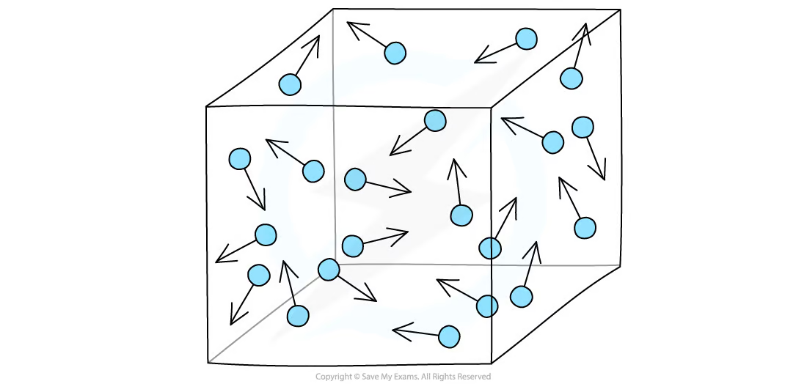
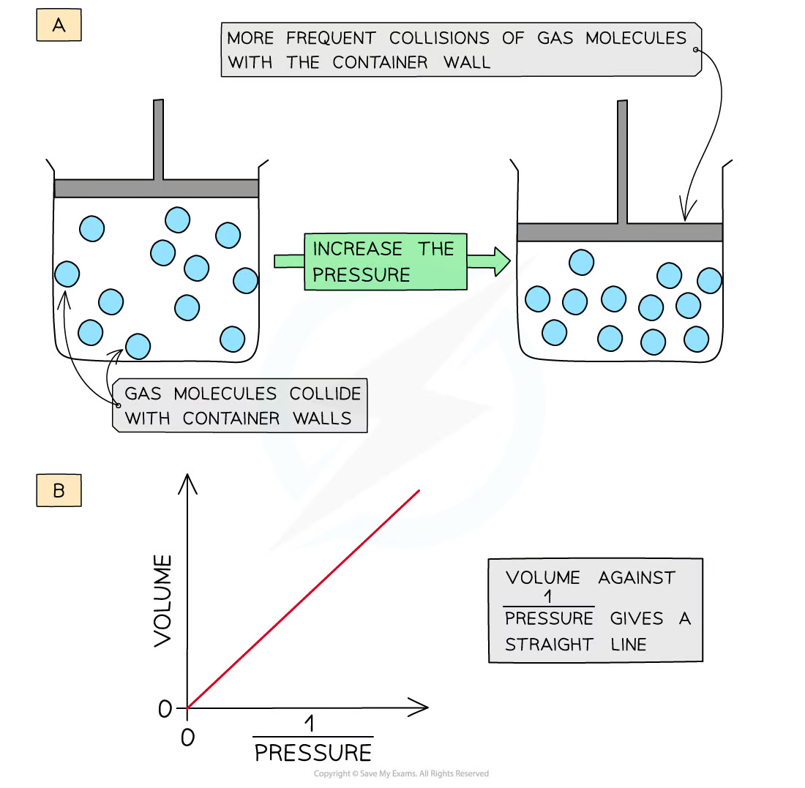
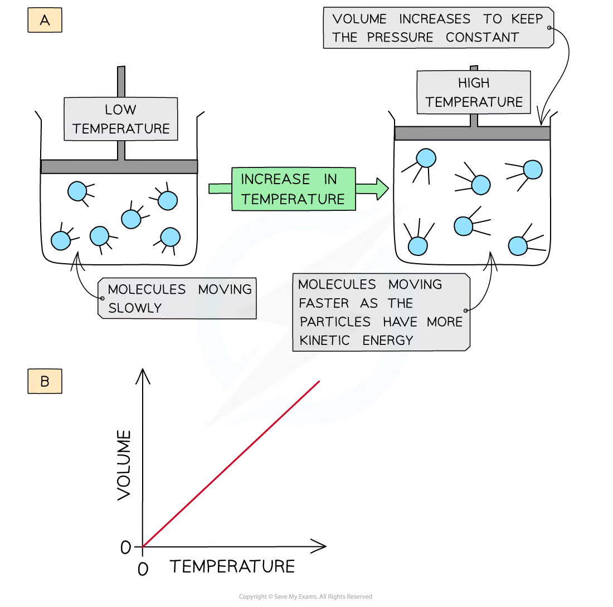
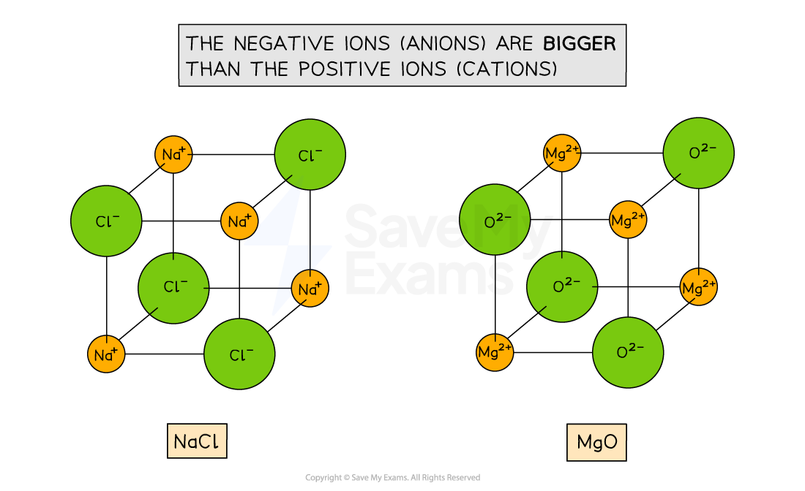
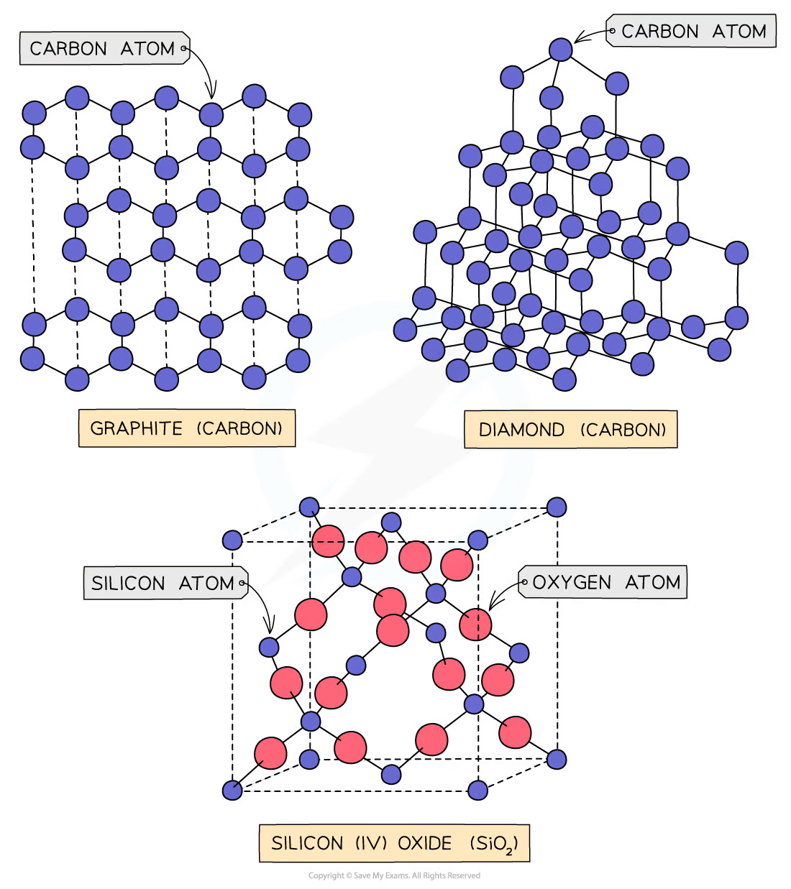
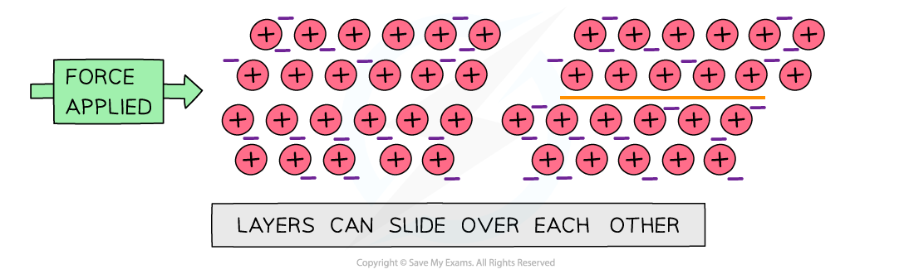

# 4 States of matter

本章对应 CIE 9701 AS Chemistry 的 **States of matter**。内容覆盖 solid structures、particle movement、changes of state、ideal gases、real gases、气体实验条件以及 $pV=nRT$ 的应用。

## Learning objectives

学完本章后，你应该能够：

- describe the arrangement and movement of particles in solids, liquids and gases;
- relate melting, boiling, sublimation and condensation to energy changes;
- distinguish simple molecular, giant covalent, ionic and metallic structures;
- explain why substances have different melting points, boiling points and electrical conductivity;
- use $pV=nRT$ to calculate pressure, volume, temperature, amount and molar mass;
- convert units correctly and use temperature in kelvin;
- state the assumptions of the ideal gas model;
- explain why real gases deviate from ideal behaviour at high pressure and low temperature.

## Key ideas

- Use kelvin, pascal and cubic metres in $pV=nRT$ when using $R=8.314\ \mathrm{J\ mol^{-1}\ K^{-1}}$.
- At constant temperature, pressure and volume are inversely related; use kelvin whenever a temperature appears in a gas-law relationship.
- Real-gas deviations have two causes: attractions between particles and the finite volume of particles.

## 4.1 The Gaseous State. Ideal - Real Gases - pV = nRT

### Particle model and changes of state

::: {.study-card}
### Solids, liquids and gases

In a solid, particles are closely packed in fixed positions and vibrate about those positions. In a liquid, particles remain close together but can move past one another. In a gas, particles are far apart and move rapidly in random directions.

The particle model links macroscopic properties to microscopic behaviour. Solids have a fixed shape and volume; liquids have a fixed volume but take the shape of their container; gases have neither a fixed shape nor a fixed volume and are easily compressed.
:::

| Change | Direction | Energy change | Particle description |
|---|---|---|---|
| melting | solid to liquid | endothermic | particles gain enough energy to move past one another |
| boiling / evaporation | liquid to gas | endothermic | particles separate widely |
| sublimation | solid to gas | endothermic | particles escape directly from the lattice |
| freezing | liquid to solid | exothermic | particles lose energy and become fixed in a lattice |
| condensation | gas to liquid | exothermic | particles lose energy and come closer together |

During a change of state, the temperature remains constant while energy is used to overcome attractions between particles. In a heating curve, a flat section therefore represents a change of state.

Evaporation occurs only at the liquid surface and can occur below the boiling point. Boiling occurs throughout the liquid when its vapour pressure equals the external pressure. Both processes are endothermic because intermolecular attractions are overcome.

{.note-figure fig-alt="Particles in a gas moving randomly"}

## 4.2 Bonding - Structure

### Structures and physical properties

::: {.study-card}
### Simple molecular structures

Simple molecular substances contain small molecules. Strong covalent bonds hold atoms together inside each molecule, but weak intermolecular forces act between molecules. Melting and boiling usually overcome intermolecular forces, so these substances often have low melting and boiling points.

They do not conduct electricity because they contain no mobile ions or delocalised electrons. Exceptions may occur when a substance reacts or ionises in solution.
:::

::: {.study-card}
### Giant structures

Giant ionic structures contain oppositely charged ions in a large lattice. They have high melting points and conduct when molten or dissolved because ions are mobile.

Giant covalent structures contain atoms joined by covalent bonds throughout the lattice. Diamond has a very high melting point and does not conduct electricity. Graphite has layers of carbon atoms and one delocalised electron per carbon, so it conducts along the layers.

Metallic structures contain positive ions and delocalised electrons. Metals conduct as solids and liquids, and layers can slide because metallic bonding is non-directional.
:::

### The ideal gas equation

::: {.formula-panel}
### $pV=nRT$

For an ideal gas:

$$pV=nRT$$

where $p$ is pressure in Pa, $V$ is volume in $\mathrm{m^3}$, $n$ is amount in mol, $R=8.314\ \mathrm{J\ mol^{-1}\ K^{-1}}$, and $T$ is temperature in K.

Useful rearrangements are:

$$p=\frac{nRT}{V}\qquad V=\frac{nRT}{p}\qquad n=\frac{pV}{RT}\qquad T=\frac{pV}{nR}$$

Always convert $^\circ\mathrm{C}$ to K using $T/\mathrm{K}=\theta/{}^\circ\mathrm{C}+273$ and convert $\mathrm{cm^3}$ to $\mathrm{m^3}$ by multiplying by $10^{-6}$.
:::

| Quantity supplied | SI conversion for $pV=nRT$ |
|---|---|
| pressure in kPa | multiply by $10^3$ to obtain Pa |
| pressure in atm | convert to Pa using the stated conversion/data booklet |
| volume in dm3 | multiply by $10^{-3}$ to obtain m3 |
| volume in cm3 | multiply by $10^{-6}$ to obtain m3 |
| temperature in °C | add 273 to obtain K |

::: {.worked-example}
Worked example · Gas pressure

### Calculating pressure

A sample contains $0.0200\ \mathrm{mol}$ of gas in $2.00\ \mathrm{dm^3}$ at $27^\circ\mathrm{C}$. Calculate the pressure.

$$T=27+273=300\ \mathrm{K},\qquad V=2.00\times10^{-3}\ \mathrm{m^3}$$

$$p=\frac{nRT}{V}=\frac{0.0200\times8.314\times300}{2.00\times10^{-3}}=2.49\times10^4\ \mathrm{Pa}$$
:::

{.note-figure fig-alt="Increasing pressure reduces gas volume at constant temperature"}

::: {.study-card}
### Molar mass of a gas

If the mass of a gas sample is $m$ grams, then $n=m/M$ and:

$$pV=\frac{m}{M}RT$$

Therefore:

$$M=\frac{mRT}{pV}$$

Use consistent SI units in the equation. The numerical answer for $M$ is in $\mathrm{g\ mol^{-1}}$ if $m$ is entered in grams.
:::

### Ideal and real gases

::: {.study-card}
### Assumptions of the ideal gas model

An ideal gas is assumed to have particles with negligible volume and no intermolecular forces. Particles move randomly, collisions are perfectly elastic and the average kinetic energy depends only on absolute temperature.

An ideal gas obeys $pV=nRT$ at all pressures and temperatures. Real gases approach ideal behaviour at low pressure and high temperature, when particles are far apart and attractions are less important.
:::

At high pressure, the volume occupied by real particles is no longer negligible. At low temperature, particles move more slowly and intermolecular attractions become important. Real gases then deviate from the ideal equation.

Attractions pull particles back from the container wall, giving a measured pressure lower than the ideal-gas prediction. Finite particle volume leaves less free space than assumed, tending to give a pressure higher than the ideal prediction. Deviations are greatest at low temperature and high pressure, close to liquefaction.

The gas that behaves most nearly ideally under ordinary conditions is a small, non-polar atom such as helium. Large polar molecules such as ammonia show greater deviation because they have stronger intermolecular attractions.

{.note-figure fig-alt="Increasing temperature increases gas volume at constant pressure"}

### Gas laws and experimental conditions

At constant temperature and amount:

$$pV=\text{constant}$$

so pressure and volume are inversely proportional. At constant pressure and amount:

$$\frac{V}{T}=\text{constant}$$

so volume is directly proportional to kelvin temperature. At constant volume and amount:

$$\frac{p}{T}=\text{constant}$$

so pressure is directly proportional to kelvin temperature.

{.note-figure fig-alt="Ionic lattices showing relative ion sizes in sodium chloride and magnesium oxide"}

{.note-figure fig-alt="Graphite, diamond and silicon dioxide giant covalent structures"}

{.note-figure fig-alt="Metallic layers and delocalised electrons"}

When determining a gas molar mass experimentally, a higher pressure generally gives a larger measured pressure signal, while a higher temperature reduces the effect of condensation and helps a gas remain gaseous. The most accurate conditions depend on the apparatus, but the data must always be substituted in SI units.

## Chapter checklist

- [ ] I can describe particle arrangement and movement in each state.
- [ ] I can explain state changes using energy and intermolecular attractions.
- [ ] I can identify simple molecular, ionic, metallic and giant covalent structures.
- [ ] I can use $pV=nRT$ and calculate gas molar mass.
- [ ] I can convert pressure, volume and temperature units correctly.
- [ ] I can state the ideal gas assumptions and explain deviations of real gases.
- [ ] I can explain why an observed pressure can be lower or higher than an ideal-gas prediction.

## Multiple choice questions



## Structured questions



## Original note PDFs

- [4.1 The Gaseous State. Ideal - Real Gases - pV = nRT](https://raw.githubusercontent.com/nanoxsj/CIE-Chemistry-Study/main/assets/notes/states-4-rebuilt/4.1_gaseous_state_ideal_real_gases.pdf)
- [4.2 Bonding - Structure](https://raw.githubusercontent.com/nanoxsj/CIE-Chemistry-Study/main/assets/notes/states-4-rebuilt/4.2_bonding_structure.pdf)

## Original question PDFs

- [1.4 States of Matter - Choice - Easy](https://raw.githubusercontent.com/nanoxsj/CIE-Chemistry-Study/main/assets/questions/original-source/1.4_states_of_matter_choice_easy.pdf)
- [1.4 States of Matter - Choice - Medium](https://raw.githubusercontent.com/nanoxsj/CIE-Chemistry-Study/main/assets/questions/original-source/1.4_states_of_matter_choice_medium.pdf)
- [1.4 States of Matter - Choice - Hard](https://raw.githubusercontent.com/nanoxsj/CIE-Chemistry-Study/main/assets/questions/original-source/1.4_states_of_matter_choice_hard.pdf)
- [1.4 States of Matter - Structured Questions - Easy](https://raw.githubusercontent.com/nanoxsj/CIE-Chemistry-Study/main/assets/questions/original-source/1.4_states_of_matter_sq_easy.pdf)
- [1.4 States of Matter - Structured Questions - Medium](https://raw.githubusercontent.com/nanoxsj/CIE-Chemistry-Study/main/assets/questions/original-source/1.4_states_of_matter_sq_medium.pdf)
- [1.4 States of Matter - Structured Questions - Hard](https://raw.githubusercontent.com/nanoxsj/CIE-Chemistry-Study/main/assets/questions/original-source/1.4_states_of_matter_sq_hard.pdf)
