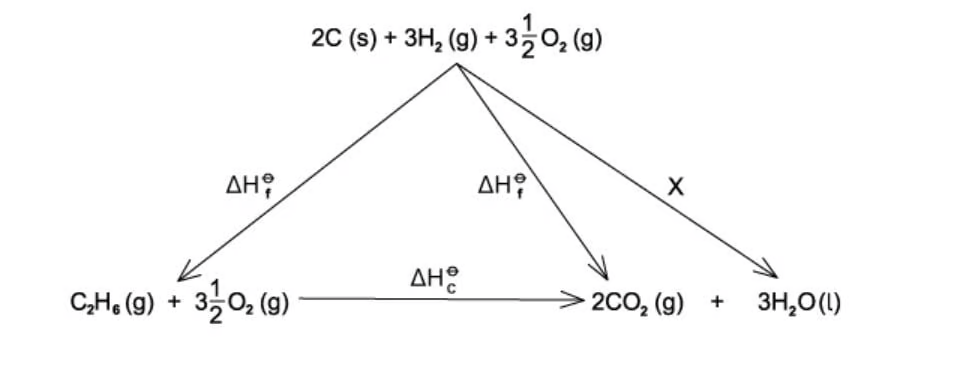
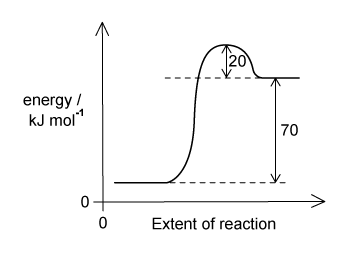
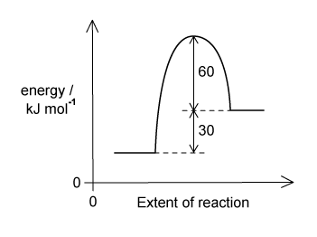
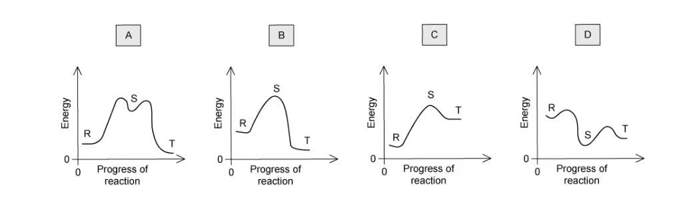

### 5 Chemical energetics - Multiple Choice: Easy

::: {.mc-question #energetics-choice-easy-q1 data-answer="A"}
### Question 1 · Relative strength of hydrogen bonds · 1.5 Choice Easy Q1

Which quantity gives the best indication of the relative strengths of the hydrogen bonds between water molecules in the liquid state?

<button class="mc-choice" data-choice="A"><strong>A</strong>Enthalpy changes of vaporisation</button><button class="mc-choice" data-choice="B"><strong>B</strong>Bond dissociation energies</button><button class="mc-choice" data-choice="C"><strong>C</strong>Enthalpy of formation</button><button class="mc-choice" data-choice="D"><strong>D</strong>Activation energy</button>

<button class="check-answer">Check answer</button>

Show explanation

<strong>A.</strong> Vaporisation overcomes intermolecular hydrogen bonds, so its enthalpy is related to their strength.

:::

::: {.mc-question #energetics-choice-easy-q2 data-answer="C"}
### Question 2 · Hess’ law cycle · 1.5 Choice Easy Q2

Enthalpy changes that are difficult to measure directly can often be determined using Hess’ law to construct an enthalpy cycle. Which enthalpy change is indicated by X in the enthalpy cycle shown?

The arrow for X forms $3\ \mathrm{mol}$ of $\ce{H2O(l)}$ from the elements.

{.question-figure fig-alt="Hess law cycle for 1.5 Choice Easy Q2"}

<button class="mc-choice" data-choice="A"><strong>A</strong>+$1\times$ enthalpy of formation of water</button><button class="mc-choice" data-choice="B"><strong>B</strong>−$1\times$ enthalpy of formation of water</button><button class="mc-choice" data-choice="C"><strong>C</strong>+$3\times$ enthalpy of formation of water</button><button class="mc-choice" data-choice="D"><strong>D</strong>−$3\times$ enthalpy of formation of water</button>

<button class="check-answer">Check answer</button>

Show explanation

<strong>C.</strong> The arrow is in the formation direction and produces three moles of water, so it represents $+3\Delta H_f^\ominus(\ce{H2O})$.

:::

::: {.mc-question #energetics-choice-easy-q3 data-answer="B"}
### Question 3 · Formation and combustion · 1.5 Choice Easy Q3

Which equation below can represent both an enthalpy change of formation and combustion?

<button class="mc-choice" data-choice="A"><strong>A</strong>$\ce{CH4(g) + 2O2(g) -> CO2(g) + 2H2O(l)}$</button><button class="mc-choice" data-choice="B"><strong>B</strong>$\ce{4Na(s) + O2(g) -> 2Na2O(s)}$</button><button class="mc-choice" data-choice="C"><strong>C</strong>$\ce{HCl(aq) + NaOH(aq) -> NaCl(aq) + H2O(l)}$</button><button class="mc-choice" data-choice="D"><strong>D</strong>$\ce{CO(g) + C(s) -> CO2(g)}$</button>

<button class="check-answer">Check answer</button>

Show explanation

<strong>B.</strong> Sodium and oxygen are elements in their standard states and sodium is reacting with oxygen to form its oxide.

:::

::: {.mc-question #energetics-choice-easy-q4 data-answer="C"}
### Question 4 · Activation energy from a pathway · 1.5 Choice Easy Q4

The reaction pathway for a reversible reaction is shown in the original question page. Which statement is correct?

{.question-figure fig-alt="Reaction pathway for 1.5 Choice Easy Q4"}

<button class="mc-choice" data-choice="A"><strong>A</strong>The activation energy of the reverse reaction is $+90\ \mathrm{kJ\ mol^{-1}}$.</button><button class="mc-choice" data-choice="B"><strong>B</strong>The activation energy of the forward reaction is $+20\ \mathrm{kJ\ mol^{-1}}$.</button><button class="mc-choice" data-choice="C"><strong>C</strong>The activation energy of the reverse reaction is $+20\ \mathrm{kJ\ mol^{-1}}$.</button><button class="mc-choice" data-choice="D"><strong>D</strong>The enthalpy change of the forward reaction is $-70\ \mathrm{kJ\ mol^{-1}}$.</button>

<button class="check-answer">Check answer</button>

Show explanation

<strong>C.</strong> The products are $70\ \mathrm{kJ\ mol^{-1}}$ above the reactants and the peak is another $20\ \mathrm{kJ\ mol^{-1}}$ above the products.

:::

::: {.mc-question #energetics-choice-easy-q5 data-answer="D"}
### Question 5 · Reaction profile statements · 1.5 Choice Easy Q5

The reaction pathway for a reversible reaction is shown in the original question page. Which statements are correct?

{.question-figure fig-alt="Reaction pathway for 1.5 Choice Easy Q5"}

1. The forward reaction is endothermic. 
2. The enthalpy change for the backward reaction is $-30\ \mathrm{kJ\ mol^{-1}}$. 
3. The activation energy for the forward reaction is $+90\ \mathrm{kJ\ mol^{-1}}$.

<button class="mc-choice" data-choice="A"><strong>A</strong>1 only</button><button class="mc-choice" data-choice="B"><strong>B</strong>1 and 2</button><button class="mc-choice" data-choice="C"><strong>C</strong>2 and 3</button><button class="mc-choice" data-choice="D"><strong>D</strong>1, 2 and 3</button>

<button class="check-answer">Check answer</button>

Show explanation

<strong>D.</strong> Products are $30\ \mathrm{kJ\ mol^{-1}}$ above reactants, the reverse change is $-30$, and the peak is $90\ \mathrm{kJ\ mol^{-1}}$ above reactants.

:::

::: {.mc-question #energetics-choice-easy-q6 data-answer="A"}
### Question 6 · Thermodynamic possibility and rate · 1.5 Choice Easy Q6

Which statement best describes why a reaction is said to be thermodynamically possible yet kinetically controlled?

<button class="mc-choice" data-choice="A"><strong>A</strong>The enthalpy of the reactants is higher than the products, and the reaction is very slow.</button><button class="mc-choice" data-choice="B"><strong>B</strong>The enthalpy of the reactants is lower than the products, and the reaction is fast.</button><button class="mc-choice" data-choice="C"><strong>C</strong>The enthalpy of the reactants is lower than the products, and the reaction is very slow.</button><button class="mc-choice" data-choice="D"><strong>D</strong>The reaction is exothermic and very fast.</button>

<button class="check-answer">Check answer</button>

Show explanation

<strong>A.</strong> A reaction is thermodynamically favourable when products have lower enthalpy, but it may still be slow because of a large activation energy.

:::

::: {.mc-question #energetics-choice-easy-q7 data-answer="D"}
### Question 7 · Heat transferred in calorimetry · 1.5 Choice Easy Q7

A student carried out an experiment to determine the enthalpy change for combustion of ethanol. The water temperature rose from $21^\circ\mathrm{C}$ to $54^\circ\mathrm{C}$. The mass of the beaker plus water was $150.00\ \mathrm{g}$ and the mass of the empty beaker was $50.0\ \mathrm{g}$. The specific heat capacity of water is $4.18\ \mathrm{J\ g^{-1}\ ^\circ C^{-1}}$. How much heat energy went into the water?

<button class="mc-choice" data-choice="A"><strong>A</strong>$6897\ \mathrm{J}$</button><button class="mc-choice" data-choice="B"><strong>B</strong>$20691\ \mathrm{J}$</button><button class="mc-choice" data-choice="C"><strong>C</strong>$22572\ \mathrm{J}$</button><button class="mc-choice" data-choice="D"><strong>D</strong>$13794\ \mathrm{J}$</button>

<button class="check-answer">Check answer</button>

Show explanation

<strong>D.</strong> $q=mc\Delta T=(100)(4.18)(33)=13794\ \mathrm{J}$.

:::

### 5 Chemical energetics - Multiple Choice: Medium

::: {.mc-question #energetics-choice-medium-q1 data-answer="D"}
### Question 8 · Molar enthalpy of neutralisation · 1.5 Choice Medium Q1

A student mixed $30.0\ \mathrm{cm^3}$ of $0.0250\ \mathrm{mol\ dm^{-3}}$ potassium hydroxide solution with $30.0\ \mathrm{cm^3}$ of $0.0250\ \mathrm{mol\ dm^{-3}}$ nitric acid. The temperature rose by $0.50^\circ\mathrm{C}$. The final mixture had a specific heat capacity of $4.20\ \mathrm{J\ cm^{-3}\ K^{-1}}$. What is the molar enthalpy change for the reaction?

<button class="mc-choice" data-choice="A"><strong>A</strong>$-0.126\ \mathrm{kJ\ mol^{-1}}$</button><button class="mc-choice" data-choice="B"><strong>B</strong>$-84\ \mathrm{kJ\ mol^{-1}}$</button><button class="mc-choice" data-choice="C"><strong>C</strong>$+168\ \mathrm{kJ\ mol^{-1}}$</button><button class="mc-choice" data-choice="D"><strong>D</strong>$-168\ \mathrm{kJ\ mol^{-1}}$</button>

<button class="check-answer">Check answer</button>

Show explanation

<strong>D.</strong> $q=60(4.20)(0.50)=126\ \mathrm{J}$ and $n=0.0300(0.0250)=7.50\times10^{-4}\ \mathrm{mol}$, so $\Delta H=-168\ \mathrm{kJ\ mol^{-1}}$.

:::

::: {.mc-question #energetics-choice-medium-q2 data-answer="B"}
### Question 9 · Formation enthalpy from combustion data · 1.5 Choice Medium Q2

Propanol has molecular formula $\ce{C3H6O}$. The enthalpy change of combustion of hydrogen is $-286\ \mathrm{kJ\ mol^{-1}}$, of carbon is $-394\ \mathrm{kJ\ mol^{-1}}$, and of propanol is $-1816\ \mathrm{kJ\ mol^{-1}}$. Calculate the enthalpy change for formation of propanol.

<button class="mc-choice" data-choice="A"><strong>A</strong>$-3856\ \mathrm{kJ\ mol^{-1}}$</button><button class="mc-choice" data-choice="B"><strong>B</strong>$-224\ \mathrm{kJ\ mol^{-1}}$</button><button class="mc-choice" data-choice="C"><strong>C</strong>$+1154\ \mathrm{kJ\ mol^{-1}}$</button><button class="mc-choice" data-choice="D"><strong>D</strong>$-2478\ \mathrm{kJ\ mol^{-1}}$</button>

<button class="check-answer">Check answer</button>

Show explanation

<strong>B.</strong> $\Delta H_f=3(-394)+3(-286)-(-1816)=-224\ \mathrm{kJ\ mol^{-1}}$.

:::

::: {.mc-question #energetics-choice-medium-q3 data-answer="B"}
### Question 10 · Neutralisation calculation · 1.5 Choice Medium Q3

An experiment used $75\ \mathrm{cm^3}$ of $3.00\ \mathrm{mol\ dm^{-3}}$ hydrochloric acid and $75\ \mathrm{cm^3}$ of $3.00\ \mathrm{mol\ dm^{-3}}$ potassium hydroxide. The temperature rose by $14^\circ\mathrm{C}$ and the specific heat capacity was $4.20\ \mathrm{J\ g^{-1}\ K^{-1}}$. Which calculation is correct for the molar enthalpy change?

<button class="mc-choice" data-choice="A"><strong>A</strong>$-\dfrac{75\times4.2\times14}{0.150\times6.0}\ \mathrm{J\ mol^{-1}}$</button><button class="mc-choice" data-choice="B"><strong>B</strong>$-\dfrac{150\times4.2\times14}{0.075\times3.0}\ \mathrm{J\ mol^{-1}}$</button><button class="mc-choice" data-choice="C"><strong>C</strong>$-\dfrac{150\times4.2\times14}{75.0\times3.0}\ \mathrm{J\ mol^{-1}}$</button><button class="mc-choice" data-choice="D"><strong>D</strong>$-\dfrac{75\times4.2\times17}{0.075\times6.0}\ \mathrm{J\ mol^{-1}}$</button>

<button class="check-answer">Check answer</button>

Show explanation

<strong>B.</strong> Use the total volume for $q$ and $0.075\times3.00$ moles of water formed.

:::

::: {.mc-question #energetics-choice-medium-q4 data-answer="C"}
### Question 11 · Enthalpy from formation data · 1.5 Choice Medium Q4

For the reaction $\ce{4NH3(g) + 5O2(g) -> 4NO(g) + 6H2O(g)}$, the standard enthalpies of formation are $-51.3$, $+92.2$ and $-239.6\ \mathrm{kJ\ mol^{-1}}$ for $\ce{NH3(g)}$, $\ce{NO(g)}$ and $\ce{H2O(g)}$, respectively. What is $\Delta H_f^\ominus$ for this reaction?

<button class="mc-choice" data-choice="A"><strong>A</strong>$+863.6\ \mathrm{kJ\ mol^{-1}}$</button><button class="mc-choice" data-choice="B"><strong>B</strong>$-1601.2\ \mathrm{kJ\ mol^{-1}}$</button><button class="mc-choice" data-choice="C"><strong>C</strong>$-863.6\ \mathrm{kJ\ mol^{-1}}$</button><button class="mc-choice" data-choice="D"><strong>D</strong>$-1274.0\ \mathrm{kJ\ mol^{-1}}$</button>

<button class="check-answer">Check answer</button>

Show explanation

<strong>C.</strong> $\Delta H=[4(92.2)+6(-239.6)]-[4(-51.3)]=-863.6\ \mathrm{kJ\ mol^{-1}}$.

:::

::: {.mc-question #energetics-choice-medium-q5 data-answer="C"}
### Question 12 · Bond energy of N–F · 1.5 Choice Medium Q5

The standard enthalpy change for $\ce{2N(g) + 6F(g) -> 2NF3(g)}$ is $-1776\ \mathrm{kJ}$. What is the bond energy of the N–F bond?

<button class="mc-choice" data-choice="A"><strong>A</strong>$-592\ \mathrm{kJ\ mol^{-1}}$</button><button class="mc-choice" data-choice="B"><strong>B</strong>$+592\ \mathrm{kJ\ mol^{-1}}$</button><button class="mc-choice" data-choice="C"><strong>C</strong>$+296\ \mathrm{kJ\ mol^{-1}}$</button><button class="mc-choice" data-choice="D"><strong>D</strong>$-296\ \mathrm{kJ\ mol^{-1}}$</button>

<button class="check-answer">Check answer</button>

Show explanation

<strong>C.</strong> Six N–F bonds form, so $6E=-(-1776)$ and $E=296\ \mathrm{kJ\ mol^{-1}}$.

:::

::: {.mc-question #energetics-choice-medium-q6 data-answer="B"}
### Question 13 · Bond enthalpies and combustion · 1.5 Choice Medium Q6

The complete combustion of ethyne, $\ce{C2H2}$, is shown in the original question page. Using the average bond enthalpies in that table, what is the enthalpy change of combustion?

<button class="mc-choice" data-choice="A"><strong>A</strong>$+1307.5\ \mathrm{kJ\ mol^{-1}}$</button><button class="mc-choice" data-choice="B"><strong>B</strong>$-1307.5\ \mathrm{kJ\ mol^{-1}}$</button><button class="mc-choice" data-choice="C"><strong>C</strong>$+1390\ \mathrm{kJ\ mol^{-1}}$</button><button class="mc-choice" data-choice="D"><strong>D</strong>$-1390\ \mathrm{kJ\ mol^{-1}}$</button>

<button class="check-answer">Check answer</button>

Show explanation

<strong>B.</strong> $\Delta H=2872.5-4180=-1307.5\ \mathrm{kJ\ mol^{-1}}$.

:::

::: {.mc-question #energetics-choice-medium-q7 data-answer="A"}
### Question 14 · Two-step reaction profile · 1.5 Choice Medium Q7

Compound R changes into compound T through isolable compound S. The reaction $R\to S$ has positive $\Delta H$ and $S\to T$ has negative $\Delta H$. Which reaction profile fits these data?

{.question-figure fig-alt="Reaction profiles A B C and D for 1.5 Choice Medium Q7"}

<button class="mc-choice" data-choice="A"><strong>A</strong>Profile A in the original question page</button><button class="mc-choice" data-choice="B"><strong>B</strong>Profile B in the original question page</button><button class="mc-choice" data-choice="C"><strong>C</strong>Profile C in the original question page</button><button class="mc-choice" data-choice="D"><strong>D</strong>Profile D in the original question page</button>

<button class="check-answer">Check answer</button>

Show explanation

<strong>A.</strong> S must be higher in energy than R, while T must be lower than S.

:::

### 5 Chemical energetics - Multiple Choice: Hard

::: {.mc-question #energetics-choice-hard-q1 data-answer="B"}
### Question 15 · Decomposition of phosphorus pentachloride · 1.5 Choice Hard Q1

In the gas phase, $\ce{PCl5}$ decomposes into $\ce{PCl3}$ and $\ce{Cl2}$. The P–Cl bond energy is $328\ \mathrm{kJ\ mol^{-1}}$ and the Cl–Cl bond energy is $241\ \mathrm{kJ\ mol^{-1}}$. What is the enthalpy change?

<button class="mc-choice" data-choice="A"><strong>A</strong>$-415\ \mathrm{kJ\ mol^{-1}}$</button><button class="mc-choice" data-choice="B"><strong>B</strong>$+415\ \mathrm{kJ\ mol^{-1}}$</button><button class="mc-choice" data-choice="C"><strong>C</strong>$+95\ \mathrm{kJ\ mol^{-1}}$</button><button class="mc-choice" data-choice="D"><strong>D</strong>$-95\ \mathrm{kJ\ mol^{-1}}$</button>

<button class="check-answer">Check answer</button>

Show explanation

<strong>B.</strong> Two P–Cl bonds are broken and one Cl–Cl bond is formed: $2(328)-241=+415\ \mathrm{kJ\ mol^{-1}}$.

:::

::: {.mc-question #energetics-choice-hard-q2 data-answer="D"}
### Question 16 · Sulfur oxide formation · 1.5 Choice Hard Q2

Given $\Delta H_f^\ominus(\ce{SO2})=-297\ \mathrm{kJ\ mol^{-1}}$ and $\Delta H_f^\ominus(\ce{SO3})=-395\ \mathrm{kJ\ mol^{-1}}$, what is $\Delta H_r^\ominus$ for $\ce{2SO2(g) + O2(g) -> 2SO3(g)}$?

<button class="mc-choice" data-choice="A"><strong>A</strong>$+98\ \mathrm{kJ\ mol^{-1}}$</button><button class="mc-choice" data-choice="B"><strong>B</strong>$-98\ \mathrm{kJ\ mol^{-1}}$</button><button class="mc-choice" data-choice="C"><strong>C</strong>$+196\ \mathrm{kJ\ mol^{-1}}$</button><button class="mc-choice" data-choice="D"><strong>D</strong>$-196\ \mathrm{kJ\ mol^{-1}}$</button>

<button class="check-answer">Check answer</button>

Show explanation

<strong>D.</strong> $\Delta H=2(-395)-2(-297)=-196\ \mathrm{kJ\ mol^{-1}}$.

:::

::: {.mc-question #energetics-choice-hard-q3 data-answer="C"}
### Question 17 · Calorimetry with incomplete heat transfer · 1.5 Choice Hard Q3

In a calorimetric experiment, $2.50\ \mathrm{g}$ of fuel is burned. Thirty percent of the energy released is absorbed by $500\ \mathrm{g}$ of water, whose temperature rises from $25^\circ\mathrm{C}$ to $68^\circ\mathrm{C}$. The specific heat capacity of water is $4.2\ \mathrm{J\ g^{-1}\ K^{-1}}$. What is the total energy released per gram of fuel?

<button class="mc-choice" data-choice="A"><strong>A</strong>$25284\ \mathrm{J}$</button><button class="mc-choice" data-choice="B"><strong>B</strong>$63210\ \mathrm{J}$</button><button class="mc-choice" data-choice="C"><strong>C</strong>$120400\ \mathrm{J}$</button><button class="mc-choice" data-choice="D"><strong>D</strong>$301000\ \mathrm{J}$</button>

<button class="check-answer">Check answer</button>

Show explanation

<strong>C.</strong> Water absorbs $500(4.2)(43)=90300\ \mathrm{J}$, which is $30\%$ of the total. Thus total per gram is $90300/(0.30\times2.50)=120400\ \mathrm{J\ g^{-1}}$.

:::

::: {.mc-question #energetics-choice-hard-q5 data-answer="C"}
### Question 18 · Average C–C bond enthalpy · 1.5 Choice Hard Q5

The enthalpy change of formation of cyclobutane is $+75.1\ \mathrm{kJ\ mol^{-1}}$, the enthalpy change of atomisation of graphite is $+712\ \mathrm{kJ\ mol^{-1}}$, the C–H bond enthalpy is $390\ \mathrm{kJ\ mol^{-1}}$ and the H–H bond enthalpy is $429\ \mathrm{kJ\ mol^{-1}}$. What is the average C–C bond enthalpy in cyclobutane?

<button class="mc-choice" data-choice="A"><strong>A</strong>$236\ \mathrm{kJ\ mol^{-1}}$</button><button class="mc-choice" data-choice="B"><strong>B</strong>$315\ \mathrm{kJ\ mol^{-1}}$</button><button class="mc-choice" data-choice="C"><strong>C</strong>$342\ \mathrm{kJ\ mol^{-1}}$</button><button class="mc-choice" data-choice="D"><strong>D</strong>$700\ \mathrm{kJ\ mol^{-1}}$</button>

<button class="check-answer">Check answer</button>

Show explanation

<strong>C.</strong> Using the atomisation cycle, $75.1=4(712)+4(429)-8(390)-4E$, giving $E\approx342\ \mathrm{kJ\ mol^{-1}}$.

:::

::: {.mc-question #energetics-choice-hard-q6 data-answer="A"}
### Question 19 · Ordering bond-energy changes · 1.5 Choice Hard Q6

The bond energies are Br–Br $194$, Cl–Cl $247$, C–H $412$ and C–Cl $338\ \mathrm{kJ\ mol^{-1}}$. The reactions are: W, $\ce{Br2 -> 2Br}$; X, $\ce{2Cl -> Cl2}$; Y, $\ce{CH3 + Cl -> CH3Cl}$; Z, $\ce{CH4 -> CH3 + H}$. What is the order of enthalpy changes from most negative to most positive?

<button class="mc-choice" data-choice="A"><strong>A</strong>Y → Z → W → X</button><button class="mc-choice" data-choice="B"><strong>B</strong>Z → W → X → Y</button><button class="mc-choice" data-choice="C"><strong>C</strong>Y → X → W → Z</button><button class="mc-choice" data-choice="D"><strong>D</strong>X → Y → Z → W</button>

<button class="check-answer">Check answer</button>

Show explanation

<strong>A.</strong> Y forms C–Cl and is most negative; W, X and Z require respectively $194$, $247$ and $412\ \mathrm{kJ\ mol^{-1}}$.

:::

::: {.mc-question #energetics-choice-hard-q7 data-answer="B"}
### Question 20 · Formation enthalpy from combustion data · 1.5 Choice Hard Q7

A student calculated the standard enthalpy change of formation of propane using standard enthalpies of combustion of propane ($-2220\ \mathrm{kJ\ mol^{-1}}$) and hydrogen ($-286\ \mathrm{kJ\ mol^{-1}}$), but used an incorrect value for combustion of carbon. The final answer was $-158\ \mathrm{kJ\ mol^{-1}}$. What value did the student use for combustion of carbon?

<button class="mc-choice" data-choice="A"><strong>A</strong>$-1234\ \mathrm{kJ\ mol^{-1}}$</button><button class="mc-choice" data-choice="B"><strong>B</strong>$-411.3\ \mathrm{kJ\ mol^{-1}}$</button><button class="mc-choice" data-choice="C"><strong>C</strong>$-2084\ \mathrm{kJ\ mol^{-1}}$</button><button class="mc-choice" data-choice="D"><strong>D</strong>$-694.7\ \mathrm{kJ\ mol^{-1}}$</button>

<button class="check-answer">Check answer</button>

Show explanation

<strong>B.</strong> From $-158=3x+4(-286)-(-2220)$, $x=-411.3\ \mathrm{kJ\ mol^{-1}}$.

:::
