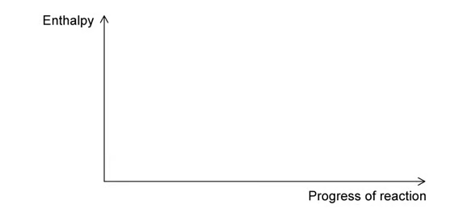
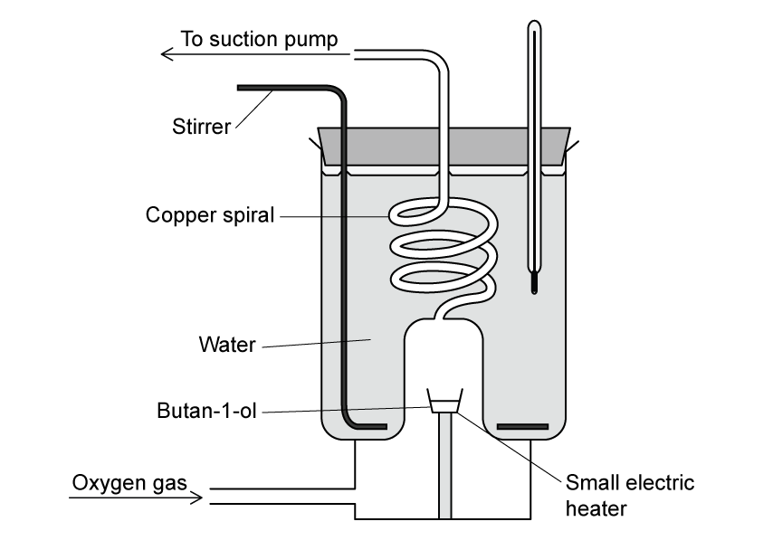
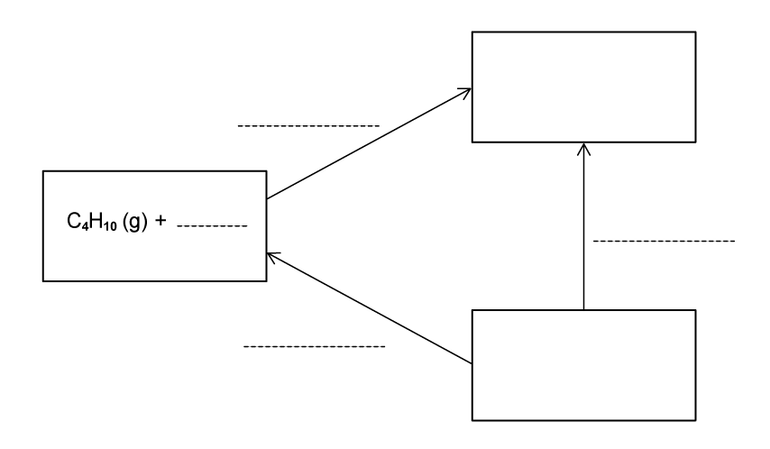
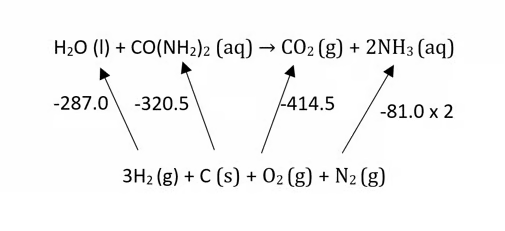
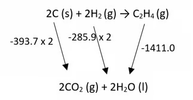

### 5 Chemical energetics - Structured Questions: Easy

::: {.question-card}
### Example 1 · Standard enthalpy definitions · 1.5 SQ Easy Q1

Standard enthalpy changes include enthalpy of formation, enthalpy of combustion and enthalpy of neutralisation.

**(a)(i)** Define enthalpy of formation. `[1 mark]`

**(a)(ii)** Write an equation that represents the enthalpy of formation of ammonia, $\ce{NH3}$. `[1 mark]`

**(b)** State what is meant by standard conditions in enthalpy measurements. `[1 mark]`

**(c)** Which of the following equation(s) can represent the enthalpy of neutralisation? Explain your answer. `[2 marks]`

- **A** $\ce{H2SO4(aq) + 2NaOH(aq) -> Na2SO4(aq) + 2H2O(l)}$
- **B** $\ce{H2SO4(aq) + Na2CO3(aq) -> Na2SO4(aq) + H2O(l) + CO2(g)}$
- **C** $\ce{HCl(aq) + NaOH(aq) -> NaCl(aq) + H2O(l)}$

Show mark scheme / model answer
<ul><li><strong>(a)(i)</strong> The enthalpy change when one mole of a compound is formed from its elements in their standard states under standard conditions.</li><li><strong>(a)(ii)</strong> $\frac12\ce{N2(g)}+\frac32\ce{H2(g)}\ce{->} \ce{NH3(g)}$.</li><li><strong>(b)</strong> $298\ \mathrm{K}$ and $101\ \mathrm{kPa}$.</li><li><strong>(c)</strong> B and C. Each forms one mole of water from an acid and a base; A forms two moles.</li></ul>

:::

::: {.question-card}
### Example 2 · Enthalpy of reaction and transition state · 1.5 SQ Easy Q2

Freon 21 has formula $\ce{CHCl2F}$. It is produced by:

$$\ce{CHCl3(g) + HF(g) -> CHCl2F(g) + HCl(g)}$$

The enthalpies of formation are: $\ce{CHCl3(g)}$, $-103.2$; $\ce{CHCl2F(g)}$, $-284.1$; $\ce{HF(g)}$, $-273.3$; and $\ce{HCl(g)}$, $-92.3\ \mathrm{kJ\ mol^{-1}}$.

{.question-figure fig-alt="Blank reaction pathway diagram for 1.5 SQ Easy Q2"}

**(a)** Calculate $\Delta H_r$. `[2 marks]`

**(b)** Using Fig. 2.1, draw a labelled reaction pathway diagram for part (a) and include the activation energy. `[2 marks]`

**(c)** Explain what is meant by the transition state. `[1 mark]`

Show mark scheme / model answer
<ul><li><strong>(a)</strong> $\Delta H_r=[-284.1+(-92.3)]-[-103.2+(-273.3)]=+0.1\ \mathrm{kJ\ mol^{-1}}$.</li><li><strong>(b)</strong> Draw reactants and products at almost the same energy level because $\Delta H$ is close to zero; show a peak and label the energy from reactants to the peak as $E_a$.</li><li><strong>(c)</strong> The transition state is the short-lived, highest-energy arrangement in which bonds are partly broken and partly formed. It cannot be isolated.</li></ul>

:::

::: {.question-card}
### Example 3 · Bond enthalpy calculations · 1.5 SQ Easy Q3

**(a)** Define average bond enthalpy. `[2 marks]`

**(b)** Give the formula for calculating the standard enthalpy change of reaction using bond energies. `[1 mark]`

**(c)** Use the data in the original question page to calculate the enthalpy change for:

$$\ce{CH2=CH2(g) + H2O(g) -> CH3CH2OH(l)}$$

`[3 marks]`

**(d)** Use the data in Table 3.2 to calculate the enthalpy change for the reaction of ethane and bromine to form 1,2-dibromoethane and hydrogen bromide. `[4 marks]`

Show mark scheme / model answer
<ul><li><strong>(a)</strong> The energy required to break one mole of a particular bond in gaseous molecules, averaged over similar compounds.</li><li><strong>(b)</strong> $\Delta H_r=\sum E(\text{bonds broken})-\sum E(\text{bonds formed})$.</li><li><strong>(c)</strong> Bonds broken $=614+4(414)+2(463)=3196\ \mathrm{kJ\ mol^{-1}}$; bonds formed $=346+5(414)+358+463=3237\ \mathrm{kJ\ mol^{-1}}$; $\Delta H_r=-41\ \mathrm{kJ\ mol^{-1}}$.</li><li><strong>(d)</strong> $\ce{CH3CH3 + 2Br2 -> CH2BrCH2Br + 2HBr}$; broken $=346+6(414)+2(193)=3216$; formed $=346+4(414)+2(285)+2(366)=3304$; $\Delta H_r=-88\ \mathrm{kJ\ mol^{-1}}$.</li></ul>

:::

### 5 Chemical energetics - Structured Questions: Medium

::: {.question-card}
### Example 4 · Propane chlorination and bond energies · 1.5 SQ Medium Q1

Propane reacts with chlorine:

$$\ce{C3H8(g) + Cl2(g) -> C3H7Cl(g) + HCl(g)}$$

The bond energies are C–H $410$, C–Cl $340$, Cl–Cl $242$ and H–Cl $431\ \mathrm{kJ\ mol^{-1}}$.

**(a)(i)** Use bond energies to calculate the enthalpy change. Include a sign. `[3 marks]`

**(a)(ii)** State the conditions needed for this reaction to occur. `[1 mark]`

**(b)** Construct a labelled reaction pathway diagram including the activation energy. `[3 marks]`

**(c)** Ethane and chlorine also react under the same conditions. State and explain the difference in enthalpy change for the two reactions. `[2 marks]`

**(d)** Propane reacts with bromine in a similar reaction. Suggest, with a reason, whether the sum of the bonds broken would be larger or smaller than for propane and chlorine. `[2 marks]`

Show mark scheme / model answer
<ul><li><strong>(a)(i)</strong> Broken: $410+242=+652$; formed: $340+431=-771$; $\Delta H=-119\ \mathrm{kJ\ mol^{-1}}$.</li><li><strong>(a)(ii)</strong> UV light or sunlight.</li><li><strong>(b)</strong> Exothermic profile with products below reactants; label the upward energy gap to the peak as $E_a$ and the downward gap as $\Delta H_r$.</li><li><strong>(c)</strong> Little or no difference: the same types and numbers of bonds are broken and formed.</li><li><strong>(d)</strong> Smaller; Br–Br is weaker than Cl–Cl because bromine atoms are larger and the bond is longer.</li></ul>

:::

::: {.question-card}
### Example 5 · Butan-1-ol combustion calorimetry · 1.5 SQ Medium Q2

The apparatus in Fig. 2.1 is used to determine the enthalpy of combustion of butan-1-ol, $\ce{C4H9OH}$, with $M_r=74.12\ \mathrm{g\ mol^{-1}}$.

{.question-figure fig-alt="Calorimetry apparatus for 1.5 SQ Medium Q2"}

**(a)(i)** Write an equation for the enthalpy of combustion of butan-1-ol. `[2 marks]`

**(a)(ii)** Suggest the purpose of the copper spiral and small electric heater. `[2 marks]`

**(b)** The volume of water is $875\ \mathrm{cm^3}$, its temperature rises from $22.5^\circ\mathrm{C}$ to $25.0^\circ\mathrm{C}$, and $2.20\ \mathrm{g}$ of butan-1-ol is burned. Use $c=4.18\ \mathrm{J\ g^{-1}\ K^{-1}}$ to calculate $q$ to two significant figures. `[2 marks]`

**(c)** Determine the enthalpy of combustion of butan-1-ol. `[3 marks]`

**(d)** The standard value is $-332.42\ \mathrm{kJ\ mol^{-1}}$. Calculate the percentage error and suggest one source of error. `[2 marks]`

Show mark scheme / model answer
<ul><li><strong>(a)(i)</strong> $\ce{C4H9OH(l) + 6O2(g) -> 4CO2(g) + 5H2O(l)}$.</li><li><strong>(a)(ii)</strong> The copper spiral transfers heat from hot gases to the water; the heater ignites or vaporises the alcohol.</li><li><strong>(b)</strong> $q=mc\Delta T=875(4.18)(2.5)=9143.75\ \mathrm{J}=9.1\ \mathrm{kJ}$.</li><li><strong>(c)</strong> $n=2.20/74.12=0.02968\ \mathrm{mol}$; $\Delta H=-9.14375/0.02968=-308\ \mathrm{kJ\ mol^{-1}}$.</li><li><strong>(d)</strong> Percentage error $=(332.42-308)/332.42\times100=7.3\%$; heat loss, incomplete combustion or incomplete heat transfer.</li></ul>

:::

::: {.question-card}
### Example 6 · Hess’ law cycle for butane · 1.5 SQ Medium Q3

Complete the Hess’ law energy cycle relating butane to enthalpies of formation and combustion. Include the relevant species in the two empty boxes, label each enthalpy change and complete the arrows.

{.question-figure fig-alt="Hess law cycle for 1.5 SQ Medium Q3"}

For the formation-data route, use $\Delta H_f^\ominus(\ce{CO2(g)})=-393.5$, $\Delta H_f^\ominus(\ce{H2O(g)})=-242$ and $\Delta H_f^\ominus(\ce{C4H10(g)})=-125\ \mathrm{kJ\ mol^{-1}}$.

**(a)** Complete the cycle. `[4 marks]`

**(b)** Calculate $\Delta H_c^\ominus$ for butane using the formation data. `[1 mark]`

**(c)** Use the bond-energy data C–C $348$, C–H $410$, C=O $743$, H–O $463$, O=O $495\ \mathrm{kJ\ mol^{-1}}$ to calculate $\Delta H_c$. `[1 mark]`

**(d)** Suggest, with a reason, which value is likely to be more accurate. `[2 marks]`

Show mark scheme / model answer
<ul><li><strong>(a)</strong> The common combustion products are $\ce{4CO2(g)+5H2O(g)}$. The formation and combustion arrows must have correct coefficients and directions.</li><li><strong>(b)</strong> $\Delta H_c=4(-393.5)+5(-242)-(-125)=-2659\ \mathrm{kJ\ mol^{-1}}$.</li><li><strong>(c)</strong> $\Delta H=\{3(348)+10(410)+6.5(495)\}-\{8(743)+10(463)\}=-2212.5\ \mathrm{kJ\ mol^{-1}}$.</li><li><strong>(d)</strong> The formation-data value is more accurate because it uses enthalpies for the actual substances; bond enthalpies are average values.</li></ul>

:::

::: {.question-card}
### Example 7 · Nitrogen oxides and N=O bond enthalpy · 1.5 SQ Medium Q4

Two common oxides of nitrogen are nitrogen monoxide, $\ce{NO}$, and nitrogen dioxide, $\ce{NO2}$.

**(a)(i)** Complete the oxidation numbers of nitrogen in $\ce{NO}$ and $\ce{NO2}$. `[1 mark]`

**(a)(ii)** Write equations for formation of $\ce{NO2}$ by reaction of $\ce{N2}$ with $\ce{O2}$ and by reaction of $\ce{NO}$ with $\ce{O2}$. `[2 marks]`

**(b)** The reaction between $\ce{N2}$ and $\ce{O2}$ has $\Delta H_r=+497\ \mathrm{kJ\ mol^{-1}}$. The N–O bond in $\ce{NO2}$ is a double covalent bond. Use N≡N $941$ and O=O $495\ \mathrm{kJ\ mol^{-1}}$ to calculate the N=O bond enthalpy. `[3 marks]`

**(c)** The boiling points of carbon dioxide and nitrogen dioxide are $-78.5^\circ\mathrm{C}$ and $21^\circ\mathrm{C}$, respectively. Suggest a reason for the difference. `[2 marks]`

**(d)** Write an equation for the enthalpy of formation of $\ce{NO}$. `[1 mark]`

Show mark scheme / model answer
<ul><li><strong>(a)</strong> N is +2 in $\ce{NO}$ and +4 in $\ce{NO2}$. Suitable equations include $\ce{N2+2O2->2NO2}$ and $\ce{2NO+O2->2NO2}$.</li><li><strong>(b)</strong> $+497=941+2(495)-4E$, so $E=358.5\ \mathrm{kJ\ mol^{-1}}$.</li><li><strong>(c)</strong> $\ce{NO2}$ has stronger intermolecular forces than $\ce{CO2}$, so more energy is needed to separate its molecules.</li><li><strong>(d)</strong> $\frac12\ce{N2(g)}+\frac12\ce{O2(g)}\ce{->}\ce{NO(g)}$.</li></ul>

:::

### 5 Chemical energetics - Structured Questions: Hard

::: {.question-card}
### Example 8 · Hydrolysis and combustion of urea · 1.5 SQ Hard Q1

Urea, $\ce{CO(NH2)2}$, is hydrolysed with water to form ammonia and carbon dioxide. The standard enthalpies of formation are $\ce{H2O(l)}=-287.0$, $\ce{CO(NH2)2(aq)}=-320.5$, $\ce{CO2(g)}=-414.5$ and $\ce{NH3(aq)}=-81.0\ \mathrm{kJ\ mol^{-1}}$.

{.question-figure fig-alt="Formation enthalpy cycle for 1.5 SQ Hard Q1"}

**(a)(i)** Write an equation for the hydrolysis reaction. `[1 mark]`

**(a)(ii)** Construct a simple energy cycle for the hydrolysis. `[2 marks]`

**(b)** Use the data to calculate the standard enthalpy change for hydrolysis. `[1 mark]`

**(c)** Calculate the enthalpy of combustion of urea for:

$$\ce{2CO(NH2)2(s) + 3O2(g) -> 2CO2(g) + 2N2(g) + 4H2O(l)}$$

`[1 mark]`

Show mark scheme / model answer
<ul><li><strong>(a)</strong> $\ce{H2O(l)+CO(NH2)2(aq)->CO2(g)+2NH3(aq)}$. In the cycle, connect both sides to the elements using formation enthalpies; the arrows from elements to compounds point upwards in the displayed cycle.</li><li><strong>(b)</strong> $\Delta H_r=-(-287.0)-(-320.5)+(-414.5)+2(-81.0)=+31.0\ \mathrm{kJ\ mol^{-1}}$.</li><li><strong>(c)</strong> $\Delta H_c=[2(-414.5)+4(-287.0)]-[2(-320.5)]=-1336\ \mathrm{kJ\ mol^{-1}}$.</li></ul>

:::

::: {.question-card}
### Example 9 · Ammonium chloride calorimetry · 1.5 SQ Hard Q2

The enthalpy change of solution for ammonium chloride is measured using calorimetry. $12.04\ \mathrm{g}$ of $\ce{NH4Cl}$ is dissolved in $125.0\ \mathrm{cm^3}$ of water at $19.5^\circ\mathrm{C}$. The enthalpy of solution is $+15.1\ \mathrm{kJ\ mol^{-1}}$.

**(a)** Determine the energy change, in J, when the ammonium chloride dissolves. `[2 marks]`

**(b)** Use your answer to determine the change in temperature. `[1 mark]`

**(c)** Determine the final temperature of the solution. `[1 mark]`

Show mark scheme / model answer
<ul><li><strong>(a)</strong> $n=12.04/53.5=0.225\ \mathrm{mol}$; $q=0.225(15.1\times10^3)=3397.5\ \mathrm{J}$.</li><li><strong>(b)</strong> $\Delta T=q/(mc)=3397.5/[125.0(4.18)]=+6.5^\circ\mathrm{C}$.</li><li><strong>(c)</strong> The dissolution is endothermic, so the temperature falls: $19.5-6.5=13.0^\circ\mathrm{C}$.</li></ul>

:::

::: {.question-card}
### Example 10 · Hydrogenation and polymerisation of propene · 1.5 SQ Hard Q3

Use the following bond enthalpies: H–H $435$, C–H $413$, C–C $347$ and C=C $619\ \mathrm{kJ\ mol^{-1}}$.

{.question-figure fig-alt="Combustion data cycle for 1.5 SQ Hard Q3"}

**(a)** Determine the enthalpy of hydrogenation of propene. `[3 marks]`

**(b)** Suggest, with a reason, whether polymerisation of propene is exothermic or endothermic. `[2 marks]`

**(c)** Use the combustion data in the original question page to calculate the standard enthalpy of formation of ethene at $298\ \mathrm{K}$. `[2 marks]`

Show mark scheme / model answer
<ul><li><strong>(a)</strong> $\ce{CH3CH=CH2 + H2 -> CH3CH2CH3}$; $\Delta H=619+435-347-2(413)=-119\ \mathrm{kJ\ mol^{-1}}$.</li><li><strong>(b)</strong> One C=C bond is broken and two C–C bonds form. Since $619&lt;2(347)=694$, there is a net energy output and polymerisation is exothermic.</li><li><strong>(c)</strong> $\Delta H_f^\ominus=2(-393.7)+2(-285.9)-(-1411.0)=+51.8\ \mathrm{kJ\ mol^{-1}}$.</li></ul>

:::
