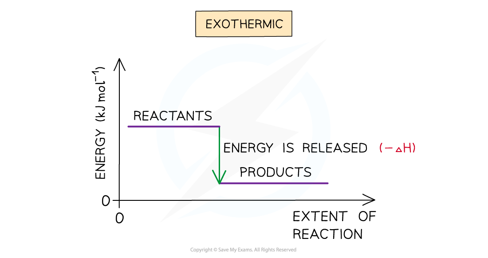
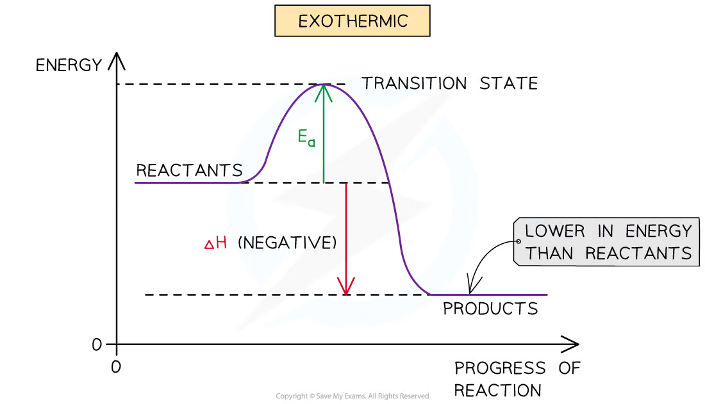
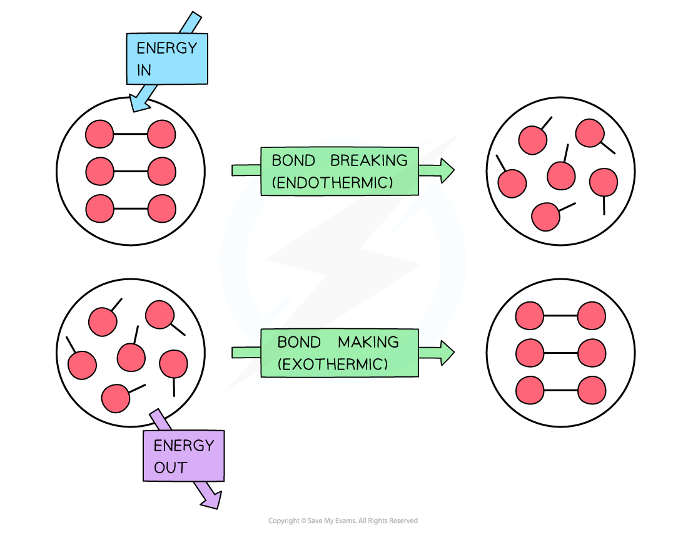
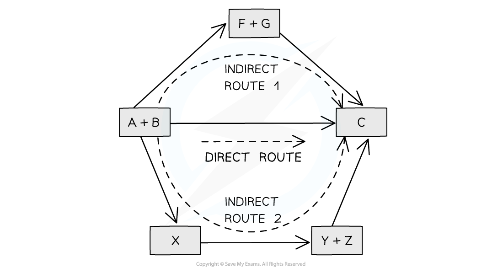

# 5 Chemical energetics

本章对应 CIE 9701 AS Chemistry 的 **Chemical energetics**。重点是用能量变化描述反应，处理量热实验、键焓以及 Hess’ law 能量循环。

## Learning objectives

学完本章后，你应该能够：

- define standard enthalpy changes of formation, combustion and neutralisation;
- identify exothermic and endothermic reactions from data and reaction profiles;
- use $q=mc\Delta T$ and $ΔH=q/n$ in calorimetry;
- define average bond enthalpy and calculate $ΔH$ from bonds broken and formed;
- use standard enthalpies of formation and combustion in Hess’ law cycles;
- label activation energy and enthalpy change on a reaction pathway diagram;
- explain why experimental enthalpy values differ from standard values.

## Key ideas

- Enthalpy change is a change in the chemical energy of the system; its sign is opposite to the temperature change of the surroundings in a simple calorimeter.
- Standard state means the most stable physical state at 298 K and 100 kPa (or the pressure specified by the syllabus/data); state symbols matter in enthalpy equations.
- Hess cycles are sign-and-coefficient exercises: reverse an equation, reverse ΔH; multiply an equation, multiply ΔH.

## 5.1 Enthalpy Change, ΔH

::: {.study-card}
### Exothermic and endothermic changes

An **exothermic** reaction transfers energy from the reacting system to the surroundings. The surroundings warm and $ΔH$ is negative. Combustion and most strong acid–alkali neutralisations are exothermic.

An **endothermic** reaction takes in energy from the surroundings. The surroundings cool and $ΔH$ is positive. Bond breaking is endothermic; bond making is exothermic.
:::

{.note-figure fig-alt="Energy level diagram for an exothermic reaction"}

{.note-figure fig-alt="Reaction profile showing activation energy and enthalpy change"}

::: {.formula-panel}
### Reaction profiles

On an energy profile, the vertical difference between reactants and products is the enthalpy change:

$$ΔH=H_{\text{products}}-H_{\text{reactants}}$$

The activation energy is the energy difference from the reactants to the transition state. For the reverse reaction it is measured from the products to the same maximum. A catalyst lowers the activation energy but does not change $ΔH$.
:::

::: {.study-card}
### Standard enthalpy changes

The standard enthalpy change of formation, $ΔH_f^\ominus$, is the enthalpy change when **one mole of a compound** is formed from its elements in their standard states under standard conditions.

The standard enthalpy change of combustion, $ΔH_c^\ominus$, is the enthalpy change when one mole of a substance is completely burned in excess oxygen under standard conditions.

The standard enthalpy change of neutralisation, $ΔH_{neut}^\ominus$, is the enthalpy change when one mole of water is formed by reaction between an acid and an alkali under standard conditions. Standard conditions here are $298\ \mathrm{K}$ and $101\ \mathrm{kPa}$.
:::

Elements in their standard states have $ΔH_f^\ominus=0$, for example C(graphite), H2(g) and O2(g). Do not use an allotrope or an incorrect state: diamond is not the standard state of carbon, and H2O(l) and H2O(g) have different enthalpies of formation.

### Calorimetry

The heat transferred to a solution is approximated by:

$$q=mc\Delta T$$

where $q$ is in J, $m$ is the mass of solution in g, $c$ is the specific heat capacity in $\mathrm{J\ g^{-1}\ K^{-1}}$, and $\Delta T$ is the temperature change. For dilute aqueous solutions, $1\ \mathrm{cm^3}$ is usually taken as $1\ \mathrm{g}$.

For a reaction involving $n$ moles:

$$\Delta H=\frac{q}{n}$$

If the temperature rises, the reaction is exothermic and the enthalpy change is negative. If the temperature falls, the reaction is endothermic and the enthalpy change is positive.

::: {.worked-example}
Worked example · Neutralisation

### Calculating a molar enthalpy change

Mix $30.0\ \mathrm{cm^3}$ of $0.0250\ \mathrm{mol\ dm^{-3}}$ potassium hydroxide with the same volume and concentration of nitric acid. The temperature rises by $0.50\ ^\circ\mathrm{C}$ and $c=4.20\ \mathrm{J\ cm^{-3}\ K^{-1}}$.

$$q=(60.0)(4.20)(0.50)=126\ \mathrm{J}$$

$$n(\ce{H2O})=0.0300\times0.0250=7.50\times10^{-4}\ \mathrm{mol}$$

The solution warmed, so:

$$\Delta H=-\frac{126}{7.50\times10^{-4}}=-168\ \mathrm{kJ\ mol^{-1}}$$
:::

Experimental values are often less exothermic than standard values because heat is lost to the surroundings, combustion may be incomplete, some heat warms the apparatus, and the reactants may not be in their standard states. Insulation, a lid, stirring, a copper spiral and complete combustion reduce these errors.

In calculations, the solution gains $q=mcΔT$; the reacting system loses the same magnitude of energy in an exothermic reaction. Divide by the moles of the species named in the definition, such as moles of water formed for neutralisation or moles of fuel burned for combustion.

### Bond enthalpy

The **average bond enthalpy** is the energy needed to break one mole of a particular type of bond in gaseous molecules, averaged over a range of compounds. It is positive because bond breaking requires energy.

{.note-figure fig-alt="Bond breaking absorbs energy and bond making releases energy"}

Use:

$$\Delta H_r^\ominus=\sum E(\text{bonds broken})-\sum E(\text{bonds formed})$$

Count every bond in the balanced equation. The answer is an estimate because average bond enthalpies are used; the exact bond strength depends on the molecule.

Write the balanced equation and draw/display the bonds before calculating. Break all bonds in the reactants, form all bonds in the products, then use broken − formed. Bond enthalpy calculations are especially unreliable when a product is not gaseous, because average bond enthalpies refer to gaseous molecules.

## 5.2 Hess’s Law

Hess’ law states that the overall enthalpy change is independent of the route taken between the same initial and final states. Therefore, equations may be reversed and multiplied, provided their enthalpy changes are reversed and multiplied in the same way.

For formation data:

$$\Delta H_r^\ominus=\sum \Delta H_f^\ominus(\text{products})-\sum \Delta H_f^\ominus(\text{reactants})$$

For combustion data, construct a cycle in which both the reactants and products burn to the same final products, usually $\ce{CO2(g)}$ and $\ce{H2O(l)}$. Keep coefficients, state symbols and signs consistent.

Before calculating, mark the start and end of the required equation. Follow any alternative route with arrows: moving against an arrow reverses the sign of ΔH. This prevents the most common Hess-law error, which is combining correct numerical values with the wrong signs.

{.note-figure fig-alt="Direct and indirect routes between the same initial and final states"}

::: {.worked-example}
Worked example · Formation from combustion data

### Propanol

For $\ce{C3H6O}$, suppose $\Delta H_c^\ominus(\ce{H2})=-286$, $\Delta H_c^\ominus(\ce{C})=-394$ and $\Delta H_c^\ominus(\ce{C3H6O})=-1816\ \mathrm{kJ\ mol^{-1}}$.

The elements produce the same combustion products as propanol, so:

$$\Delta H_f^\ominus=3(-394)+3(-286)-(-1816)=-224\ \mathrm{kJ\ mol^{-1}}$$
:::

## Chapter checklist

- [ ] I can distinguish exothermic and endothermic reactions and read an energy profile.
- [ ] I can define formation, combustion and neutralisation enthalpies.
- [ ] I can use $q=mc\Delta T$ and calculate a molar enthalpy change.
- [ ] I can count bonds and use average bond enthalpies.
- [ ] I can construct and calculate a Hess’ law cycle.
- [ ] I can explain common errors in calorimetry experiments.
- [ ] I can identify the mole quantity required by an enthalpy definition and keep state symbols/signs consistent.

## Multiple choice questions



## Structured questions



## Original question PDFs

- [1.5 Chemical Energetics - Choice - Easy](../assets/questions/original-source/1.5_chemical_energetics_choice_easy.pdf)
- [1.5 Chemical Energetics - Choice - Medium](../assets/questions/original-source/1.5_chemical_energetics_choice_medium.pdf)
- [1.5 Chemical Energetics - Choice - Hard](../assets/questions/original-source/1.5_chemical_energetics_choice_hard.pdf)
- [1.5 Chemical Energetics - Structured Questions - Easy](../assets/questions/original-source/1.5_chemical_energetics_sq_easy.pdf)
- [1.5 Chemical Energetics - Structured Questions - Medium](../assets/questions/original-source/1.5_chemical_energetics_sq_medium.pdf)
- [1.5 Chemical Energetics - Structured Questions - Hard](../assets/questions/original-source/1.5_chemical_energetics_sq_hard.pdf)

## Original note PDFs

- [5.1 Enthalpy Change, ΔH](../assets/notes/energetics-5-rebuilt/5.1_enthalpy_change.pdf)
- [5.2 Hess’s Law](../assets/notes/energetics-5-rebuilt/5.2_hess_law.pdf)
