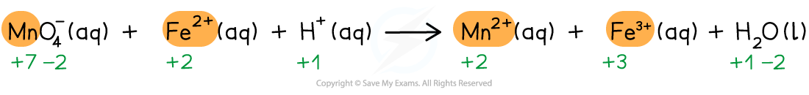
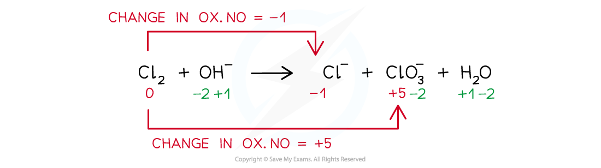
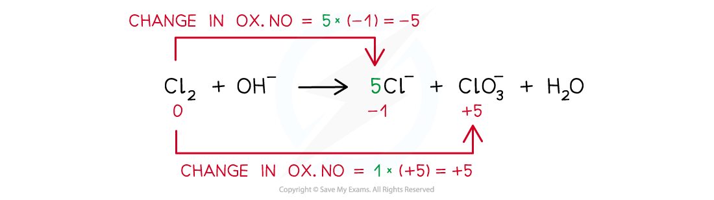
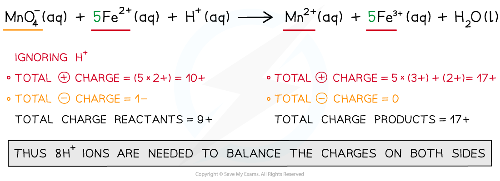
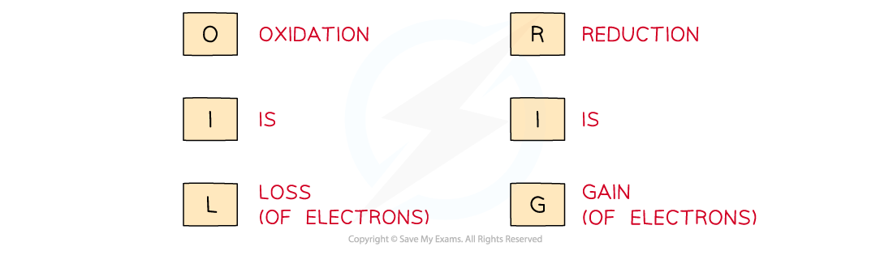
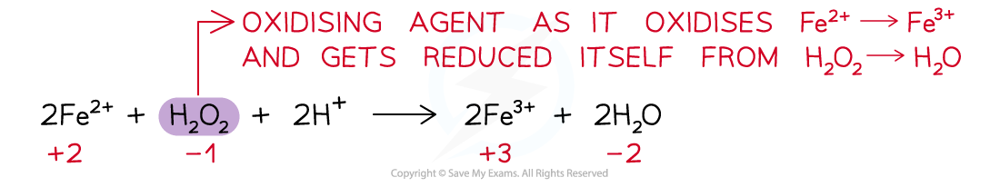

# 6 Electrochemistry

本章对应 CIE 9701 AS Chemistry 的 **Electrochemistry**，重点是用 oxidation numbers 和 electron transfer 判断并解释 redox reactions。

## Learning objectives

学完本章后，你应该能够：

- calculate oxidation numbers using the standard rules;
- identify oxidation, reduction, oxidising agents and reducing agents;
- recognise disproportionation reactions;
- balance redox equations using changes in oxidation number;
- explain halogen displacement and reactions with concentrated sulfuric acid;
- use ionic equations and half-equations to explain electron transfer.

## Key ideas

- Oxidation number tracks electron transfer; it is not always the same as ionic charge in a covalent molecule.
- Oxidation is an increase in oxidation number and reduction is a decrease; the oxidising agent is reduced and the reducing agent is oxidised.
- In every balanced redox equation, total electrons lost equal total electrons gained.

## 6.1 Redox Processes. Electron Transfer - Changes in Oxidation Number (Oxidation State)

::: {.study-card}
### Core rules

The oxidation number of an uncombined element is zero. The sum of oxidation numbers in a neutral compound is zero; in a polyatomic ion it equals the charge of the ion.

Useful rules are:

- a Group 1 metal is usually $+1$ and a Group 2 metal is usually $+2$;
- fluorine is always $-1$ in compounds;
- oxygen is usually $-2$, except in peroxides and compounds with fluorine;
- hydrogen is usually $+1$, but is $-1$ in metal hydrides;
- a simple ion has an oxidation number equal to its charge.
:::

::: {.worked-example}
Worked example - Sulfate ion

### Oxidation number of sulfur in $\ce{SO4^{2-}}$

The four oxygen atoms contribute $4(-2)=-8$. The ion has charge $-2$, so:

$$x-8=-2\qquad x=+6$$

Sulfur is therefore in oxidation state $+6$.
:::

## 6.2 Oxidation and reduction

Oxidation is loss of electrons and an increase in oxidation number. Reduction is gain of electrons and a decrease in oxidation number. Remember **OIL RIG**: oxidation is loss, reduction is gain.

The substance that is oxidised is the **reducing agent**, because it supplies electrons. The substance that is reduced is the **oxidising agent**, because it accepts electrons.

For example:

$$\ce{Mg(s) + Fe^{2+}(aq) -> Mg^{2+}(aq) + Fe(s)}$$

Magnesium changes from $0$ to $+2$, so it is oxidised and is the reducing agent. Iron changes from $+2$ to $0$, so $\ce{Fe^{2+}}$ is reduced and is the oxidising agent.

Use the wording in full in explanations: “Mg loses two electrons, so its oxidation number increases from 0 to +2; Mg is oxidised and is the reducing agent.” This earns more credit than naming oxidation alone.

{.note-figure fig-alt="Oxidation numbers labelled for manganese, iron, hydrogen and oxygen in a redox equation"}

## 6.3 Disproportionation

A disproportionation reaction is a redox reaction in which the same element in one reactant is both oxidised and reduced.

For chlorine in cold aqueous sodium hydroxide:

$$\ce{Cl2 + 2OH^- -> Cl^- + ClO^- + H2O}$$

Chlorine changes from $0$ to $-1$ in $\ce{Cl^-}$ and from $0$ to $+1$ in $\ce{ClO^-}$, so chlorine disproportionates.

For hot aqueous sodium hydroxide, chlorate(V) is formed instead:

$$\ce{3Cl2 + 6OH^- -> 5Cl^- + ClO3^- + 3H2O}$$

The chlorine oxidation numbers are $0$, $-1$ and $+5$.

Other common disproportionation examples include hydrogen peroxide: 2H2O2 → 2H2O + O2. Oxygen changes from −1 in H2O2 to −2 in water and 0 in oxygen gas.

{.note-figure fig-alt="Oxidation numbers for chlorine disproportionation in alkaline solution"}

{.note-figure fig-alt="Chlorine oxidation number changes from zero to minus one and plus five"}

{.note-figure fig-alt="Balancing chlorine disproportionation by equalising oxidation number changes"}

## 6.4 Balancing redox equations

Use the following sequence:

1. assign oxidation numbers to the changing elements;
2. identify the increase and decrease in oxidation number;
3. multiply species so that total increase equals total decrease;
4. balance the remaining atoms and then the charge using $\ce{H2O}$, $\ce{H+}$ or $\ce{OH^-}$ as appropriate;
5. check atoms and total charge on both sides.

For example, in acidic solution:

$$\ce{2MnO4^- + 5SO2 + 2H2O -> 2Mn^{2+} + 5SO4^{2-} + 4H+}$$

Manganese changes from $+7$ to $+2$ and sulfur changes from $+4$ to $+6$. The five-electron reduction of each manganese balances the two-electron oxidation of each sulfur.

For the half-equation method in acidic solution: balance atoms other than O and H, balance O with H2O, balance H with H+, then balance charge with electrons. Add the two half-equations, cancel electrons and any common species, then check both atoms and total charge. In alkaline solution, add OH− to both sides to remove H+ as water.

{.note-figure fig-alt="Balancing charge with hydrogen ions in a permanganate and iron redox reaction"}

## 6.5 Halogens and reducing power

The oxidising power of the halogens decreases down Group 17:

$$\ce{F2 > Cl2 > Br2 > I2}$$

Therefore chlorine can oxidise bromide and iodide ions, but iodine cannot oxidise bromide ions:

$$\ce{Cl2 + 2I^- -> 2Cl^- + I2}$$

The reducing power of the halide ions increases down the group:

$$\ce{F^- < Cl^- < Br^- < I^-}$$

Larger halide ions have more shielding and their outer electron is further from the nucleus, so it is easier to remove.

Concentrated sulfuric acid is both an acid and an oxidising agent. It reacts with chloride ions mainly as an acid, but bromide and iodide ions are strong enough reducing agents to reduce sulfuric acid to sulfur dioxide, sulfur or hydrogen sulfide.

For a halogen displacement, write the two half-equations to prove electron transfer. For Cl2 + 2I− → 2Cl− + I2, iodine ions lose electrons and are oxidised; chlorine gains electrons and is reduced. The colour change is brown/orange iodine in aqueous solution, or purple iodine in an organic solvent/vapour depending on conditions.

{.note-figure fig-alt="OIL RIG mnemonic for oxidation and reduction"}

{.note-figure fig-alt="Hydrogen peroxide acts as an oxidising agent and is reduced"}

## Chapter checklist

- [ ] I can calculate oxidation numbers in compounds and ions.
- [ ] I can distinguish oxidation from reduction using electrons and oxidation numbers.
- [ ] I can identify oxidising and reducing agents.
- [ ] I can recognise and explain disproportionation.
- [ ] I can balance redox equations and check charge.
- [ ] I can explain halogen displacement and halide reducing power.
- [ ] I can balance a redox equation by electrons as well as by oxidation-number changes.
- [ ] I can state the oxidation-number change, electron movement and agent for each redox species.

## Multiple choice questions



## Structured questions



## Original note PDFs

- [6.1 Redox Processes. Electron Transfer - Changes in Oxidation Number (Oxidation State)](https://raw.githubusercontent.com/nanoxsj/CIE-Chemistry-Study/main/assets/notes/electrochemistry-6-rebuilt/6.1_redox_processes_electron_transfer_oxidation_number.pdf)

## Original question PDFs

- [1.6 Electrochemistry - Choice - Easy](https://raw.githubusercontent.com/nanoxsj/CIE-Chemistry-Study/main/assets/questions/original-source/1.6_electrochemistry_choice_easy.pdf)
- [1.6 Electrochemistry - Choice - Medium](https://raw.githubusercontent.com/nanoxsj/CIE-Chemistry-Study/main/assets/questions/original-source/1.6_electrochemistry_choice_medium.pdf)
- [1.6 Electrochemistry - Choice - Hard](https://raw.githubusercontent.com/nanoxsj/CIE-Chemistry-Study/main/assets/questions/original-source/1.6_electrochemistry_choice_hard.pdf)
- [1.6 Electrochemistry - Structured Questions - Easy](https://raw.githubusercontent.com/nanoxsj/CIE-Chemistry-Study/main/assets/questions/original-source/1.6_electrochemistry_sq_easy.pdf)
- [1.6 Electrochemistry - Structured Questions - Medium](https://raw.githubusercontent.com/nanoxsj/CIE-Chemistry-Study/main/assets/questions/original-source/1.6_electrochemistry_sq_medium.pdf)
- [1.6 Electrochemistry - Structured Questions - Hard](https://raw.githubusercontent.com/nanoxsj/CIE-Chemistry-Study/main/assets/questions/original-source/1.6_electrochemistry_sq_hard.pdf)
