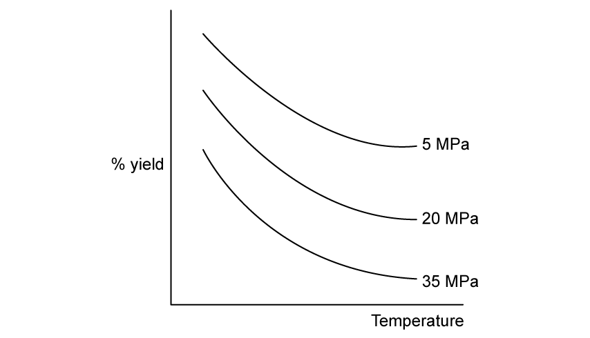
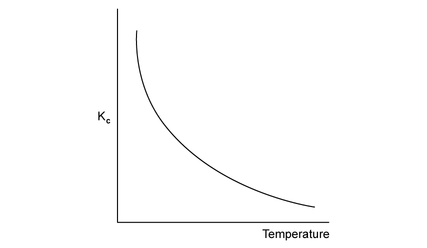
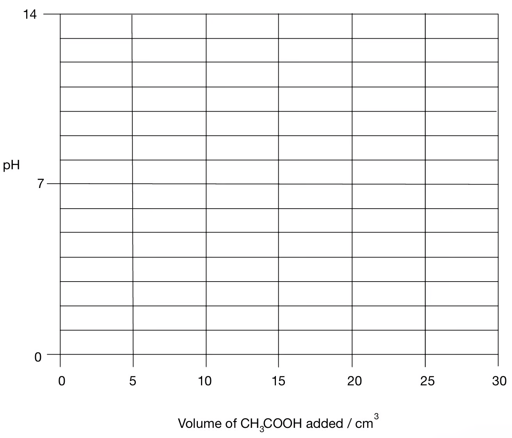

### 7 Equilibria - Structured Questions: Easy

::: {.question-card}
### Example 1 · Dynamic equilibrium · 1.7 SQ Easy Q1

**(a)** State what is meant by the term dynamic equilibrium. `[2 marks]`

**(b)** A general reaction exists in the following dynamic equilibrium:

$$\ce{3A + 2B <=> C2 + D}$$

Which part of the equation shows that this reaction is a dynamic equilibrium? `[1 mark]`

**(c)** The gases nitrogen dioxide and dinitrogen tetroxide exist in the following dynamic equilibrium:

$$\ce{2NO2(g) <=> N2O4(g)}$$

An increase in pressure shifts the equilibrium to the products and increases the yield of dinitrogen tetroxide. State why. `[1 mark]`

Show mark scheme / model answer
<ul><li><strong>(a)</strong> It is in a closed system and the forward and reverse reactions occur at equal rates, so concentrations remain constant.</li><li><strong>(b)</strong> The reversible double arrow, <code>&lt;=&gt;</code>.</li><li><strong>(c)</strong> The product side has fewer moles of gas (one rather than two), so higher pressure favours the products.</li></ul>

:::

::: {.question-card}
### Example 2 · Contact process temperature and pressure · 1.7 SQ Easy Q2

During the manufacture of sulfuric acid in the Contact process, sulfur dioxide is oxidised into sulfur trioxide:

$$\ce{2SO2(g) + O2(g) <=> 2SO3(g)}\qquad \Delta H=-197\ \mathrm{kJ\ mol^{-1}}$$

**(a)** State the effect on the rate of reaction when temperature increases. `[1 mark]`

**(b)** State, with a reason, the effect on the yield of sulfur trioxide when temperature increases. `[2 marks]`

**(c)** Describe and explain the effect of decreasing the pressure on the yield of sulfur trioxide. `[3 marks]`

Show mark scheme / model answer
<ul><li><strong>(a)</strong> The rate increases because particles have more kinetic energy and there are more successful collisions per second.</li><li><strong>(b)</strong> The yield decreases. The forward reaction is exothermic, so higher temperature shifts equilibrium to the left.</li><li><strong>(c)</strong> The yield decreases because lowering pressure favours the side with more gas molecules: three moles on the left versus two on the right.</li></ul>

:::

::: {.question-card}
### Example 3 · Haber process and Kc · 1.7 SQ Easy Q3

Ammonia is manufactured from nitrogen and hydrogen using the Haber process:

$$\ce{N2(g) + 3H2(g) <=> 2NH3(g)}$$

**(a)** State the effect that adding an iron catalyst would have on the position of equilibrium. `[1 mark]`

**(b)** Write the expression for Kc. `[1 mark]`

**(c)** At 450 °C, the equilibrium concentrations are [N2] = 17.4 mol dm−3, [H2] = 0.85 mol dm−3 and [NH3] = 1.25 mol dm−3. Calculate Kc to three significant figures. `[2 marks]`

Show mark scheme / model answer
<ul><li><strong>(a)</strong> No change. The catalyst makes equilibrium establish faster but does not change the equilibrium position or yield.</li><li><strong>(b)</strong> $K_c=[\ce{NH3}]^2/([\ce{N2}][\ce{H2}]^3)$.</li><li><strong>(c)</strong> $K_c=1.25^2/(17.4\times0.85^3)=0.146$ (three significant figures).</li></ul>

:::

### 7 Equilibria - Structured Questions: Medium

::: {.question-card}
### Example 4 · Ethanol and esterification · 1.7 SQ Medium Q1

Ethanol can be manufactured by the reversible reaction:

$$\ce{C2H4(g) + H2O(g) <=> C2H5OH(g)}\qquad \Delta H=-46\ \mathrm{kJ\ mol^{-1}}$$

The optimum pressure is between 60 and 70 atm.

**(a)** State and explain the effect, if any, that increasing the overall pressure has on the equilibrium yield of ethanol. `[3 marks]`

**(b)(i)** Use Le Chatelier's principle to suggest whether a high or low temperature should be used to produce the maximum yield of ethanol. `[2 marks]`

**(b)(ii)** State a problem that may occur from using this temperature. `[2 marks]`

Ethanol can also be used to manufacture ethyl ethanoate:

$$\ce{CH3CH2OH(l) + CH3COOH(l) <=> CH3COOCH2CH3(l) + H2O(l)}$$

**(c)** Give the expression for Kc. `[1 mark]`

**(d)** In a 250 cm3 vessel, the equilibrium amounts are 0.0375 mol ethanol, 0.0615 mol ethanoic acid, 0.0776 mol ester and 0.0834 mol water. Calculate Kc to two decimal places and deduce its units. `[4 marks]`

Show mark scheme / model answer
<ul><li><strong>(a)</strong> Yield increases: the product side has fewer gas moles (one versus two), so higher pressure shifts equilibrium right. Beyond the practical optimum, compression is costly.</li><li><strong>(b)</strong> Low temperature gives the greatest yield because the forward reaction is exothermic, but the rate becomes too slow.</li><li><strong>(c)</strong> $K_c=[\ce{CH3COOCH2CH3}][\ce{H2O}]/([\ce{CH3CH2OH}][\ce{CH3COOH}])$.</li><li><strong>(d)</strong> Using the amounts divided by the same volume, $K_c=(0.0776\times0.0834)/(0.0375\times0.0615)=2.81$. There are no units because the total concentration powers cancel.</li></ul>

:::

::: {.question-card}
### Example 5 · Haber process Kc · 1.7 SQ Medium Q2

Ammonia is manufactured from nitrogen and hydrogen:

$$\ce{N2(g) + 3H2(g) <=> 2NH3(g)}\qquad \Delta H=-91\ \mathrm{kJ\ mol^{-1}}$$

**(a)** Write an expression for Kc. `[1 mark]`

**(b)** A mixture contains 10.40 mol N2 and 22.50 mol H2 in 5.00 dm3. At equilibrium it contains 5.60 mol NH3. Calculate Kc to three significant figures and state its units. `[6 marks]`

**(c)** The mixture is heated to a higher temperature at constant pressure. Explain whether Kc becomes greater, smaller or stays the same. `[1 mark]`

**(d)** The pressure is increased at constant temperature. Explain whether Kc becomes greater, smaller or stays the same. `[1 mark]`

Show mark scheme / model answer
<ul><li><strong>(a)</strong> $K_c=[\ce{NH3}]^2/([\ce{N2}][\ce{H2}]^3)$.</li><li><strong>(b)</strong> At equilibrium: N2 = 9.00 mol, H2 = 18.30 mol, NH3 = 5.60 mol. Concentrations are 1.80, 3.66 and 1.12 mol dm−3; $K_c=1.12^2/(1.80\times3.66^3)=0.0512\ \mathrm{dm^6\ mol^{-2}}$.</li><li><strong>(c)</strong> Smaller, because the forward reaction is exothermic.</li><li><strong>(d)</strong> The same: Kc changes only with temperature.</li></ul>

:::

::: {.question-card}
### Example 6 · Hydrogen chloride and oxygen · 1.7 SQ Medium Q3

Hydrogen chloride reacts reversibly with oxygen at 400 °C in the presence of a copper(II) chloride catalyst, forming chlorine and water.

**(a)(i)** Write the equation and include state symbols. `[2 marks]`

**(a)(ii)** The reaction is repeated at the same temperature but at a lower pressure. State and explain the effect on the composition of the equilibrium mixture. `[4 marks]`

Initially 2.00 mol HCl and 0.600 mol O2 are mixed. At equilibrium 0.700 mol Cl2 and 0.700 mol H2O have formed. The total pressure is 1.15×105 Pa.

**(b)** Calculate the equilibrium amounts of HCl and O2, then calculate the partial pressure of each species. Write an expression for Kp and deduce its units. `[8 marks]`

**(c)** The reaction is repeated without a catalyst. State the effect on Kp. `[1 mark]`

Show mark scheme / model answer
<ul><li><strong>(a)</strong> $\ce{4HCl(g)+O2(g) <=> 2Cl2(g)+2H2O(g)}$. Lower pressure shifts left because the left has five moles of gas and the right has four; HCl and O2 increase while Cl2 and H2O decrease.</li><li><strong>(b)</strong> Extent = 0.350 mol, so HCl = 0.600 mol and O2 = 0.250 mol. Total = 2.25 mol. Partial pressures are approximately $3.07\times10^4$, $1.28\times10^4$, $3.58\times10^4$ and $3.58\times10^4$ Pa for HCl, O2, Cl2 and H2O respectively. $K_p=p(\ce{Cl2})^2p(\ce{H2O})^2/(p(\ce{HCl})^4p(\ce{O2}))$, with units Pa−1.</li><li><strong>(c)</strong> No effect; the catalyst changes rate only.</li></ul>

:::

::: {.question-card}
### Example 7 · Esterification titration · 1.7 SQ Medium Q4

Ethanoic acid reacts with methanol to form methyl ethanoate:

$$\ce{CH3COOH(l) + CH3OH(l) <=> CH3COOCH3(l) + H2O(l)}$$

**(a)** Write an expression for Kc, clearly stating the units. `[2 marks]`

**(b)** A student places 0.20 mol ethanoic acid, 0.20 mol methanol and 0.01 mol hydrogen chloride catalyst in a sealed flask at 25 °C. After ten days, all contents are titrated with 1.80 mol dm−3 KOH; 26.30 cm3 is used.

- Write the balanced equation for ethanoic acid and potassium hydroxide.
- Suggest a suitable indicator. `[2 marks]`

**(c)** Calculate the equilibrium amounts and hence Kc and its units. `[7 marks]`

Show mark scheme / model answer
<ul><li><strong>(a)</strong> $K_c=[\ce{CH3COOCH3}][\ce{H2O}]/([\ce{CH3COOH}][\ce{CH3OH}])$; no units.</li><li><strong>(b)</strong> $\ce{CH3COOH+KOH->CH3COOK+H2O}$; phenolphthalein is suitable for a weak acid–strong base titration.</li><li><strong>(c)</strong> Total KOH = 0.04734 mol; 0.0100 mol neutralises HCl, leaving 0.03734 mol for ethanoic acid. Equilibrium acid = methanol = 0.03734 mol; ester = water = 0.16266 mol. $K_c=(0.16266^2)/(0.03734^2)=18.98$, with no units.</li></ul>

:::

### 7 Equilibria - Structured Questions: Hard

::: {.question-card}
### Example 8 · Calculating concentrations and Kc · 1.7 SQ Hard Q1

The following dynamic equilibrium is reached at temperature T in a closed container:

$$\ce{3A(g) + 2B(g) <=> 2C(g)}\qquad \Delta H=-65\ \mathrm{kJ\ mol^{-1}}$$

Kc = 255 mol−1 dm3 when the equilibrium mixture contains 3.34 mol A and 4.28 mol C.

**(a)** Give the definition of dynamic equilibrium and write the expression for Kc. `[3 marks]`

**(b)** Calculate the concentration of B if the container volume is 8.00 dm3. `[4 marks]`

**(c)** State the effect on the concentration of B if temperature T is increased, giving a reason. `[2 marks]`

**(d)** Calculate the equilibrium constant for the reverse reaction $$\ce{2C(g) <=> 3A(g) + 2B(g)}$$. `[1 mark]`

Show mark scheme / model answer
<ul><li><strong>(a)</strong> Closed system; forward and reverse rates equal; concentrations constant. $K_c=[\ce{C}]^2/([\ce{A}]^3[\ce{B}]^2)$.</li><li><strong>(b)</strong> [A] = 0.4175 and [C] = 0.535 mol dm−3. From $255=0.535^2/(0.4175^3[\ce{B}]^2)$, [B] = 0.124 mol dm−3.</li><li><strong>(c)</strong> B increases because the forward reaction is exothermic and higher temperature shifts equilibrium left.</li><li><strong>(d)</strong> $K_{c,\,reverse}=1/255=0.00392$ (reciprocal units).</li></ul>

:::

::: {.question-card}
### Example 9 · Interpreting equilibrium graphs · 1.7 SQ Hard Q2

Use Fig. 2.1 in the original question, which shows the effect of pressure and temperature on the equilibrium yield of gaseous molecules.

{.question-figure fig-alt="Equilibrium yield graph for 1.7 SQ Hard Q2 Fig 2.1"}

{.question-figure fig-alt="Kc against temperature graph for 1.7 SQ Hard Q2 Fig 2.2"}

**(a)** Use the graph to explain whether the forward reaction is exothermic or endothermic. `[3 marks]`

**(b)** Use the graph to explain whether the forward reaction involves an increase or decrease in the number of moles of gas. `[3 marks]`

**(c)** Fig. 2.2 shows the relationship between temperature and Kc for a different equilibrium. Establish whether the forward reaction is exothermic or endothermic, justifying your answer. `[3 marks]`

**(d)** Explain why it is important for a chemist to know Kc at a given temperature. `[2 marks]`

Show mark scheme / model answer
<ul><li><strong>(a)</strong> The forward reaction is exothermic if the graph shows yield decreasing as temperature increases; lower temperature favours the exothermic direction.</li><li><strong>(b)</strong> Higher pressure increases yield, so the forward reaction involves fewer gas moles than the reverse reaction.</li><li><strong>(c)</strong> If Kc decreases as temperature increases, the forward reaction is exothermic; if Kc increases, it is endothermic.</li><li><strong>(d)</strong> Kc predicts the equilibrium composition/yield and helps select practical industrial conditions.</li></ul>

:::

::: {.question-card}
### Example 10 · Acid–base titration curves · 1.7 SQ Hard Q3

The indicator ranges are: methyl red 4.2–6.3, bromothymol blue 6.0–7.6, bromocresol green 3.8–5.4 and phenolphthalein 8.2–10.0.

{.question-figure fig-alt="Blank pH titration graph for 1.7 SQ Hard Q3"}

**(a)** Sketch the pH curve for titrating 10.0 cm3 of 0.200 mol dm−3 HCl with 0.200 mol dm−3 aqueous ammonia. `[2 marks]`

**(b)** Explain why methyl red is suitable for the first titration but phenolphthalein is not. `[2 marks]`

**(c)** Sketch the pH curve for titrating 25.0 cm3 of 0.200 mol dm−3 NaOH with 0.100 mol dm−3 ethanoic acid. `[3 marks]`

**(d)** Explain why phenolphthalein is suitable for the second titration but methyl red is not. `[2 marks]`

**(e)** Explain whether the other two indicators are suitable for either titration. `[4 marks]`

Show mark scheme / model answer
<ul><li><strong>(a)</strong> The curve starts at low pH, has an equivalence point at 10.0 cm3 below pH 7, and rises through the methyl-red range.</li><li><strong>(b)</strong> Methyl red changes colour in the steep section near the acidic equivalence point; phenolphthalein changes above the endpoint.</li><li><strong>(c)</strong> The equivalence point is at 50.0 cm3 acid and is above pH 7 because ethanoate hydrolysis makes the solution alkaline.</li><li><strong>(d)</strong> Phenolphthalein changes colour in the steep section near this basic equivalence point; methyl red changes too early.</li><li><strong>(e)</strong> Bromocresol green may suit the strong-acid/weak-base endpoint if its transition lies within the steep section; bromothymol blue is not suitable for that acidic endpoint. For the weak-acid/strong-base endpoint, phenolphthalein is the suitable choice; the lower-pH ranges are not.</li></ul>

:::
