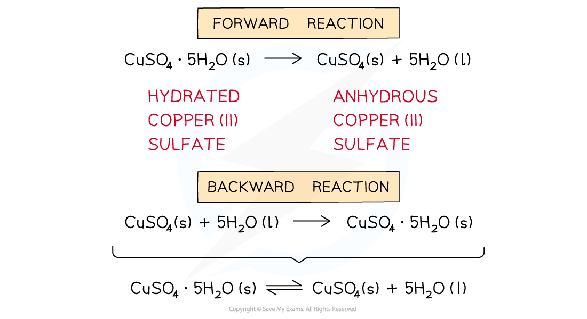
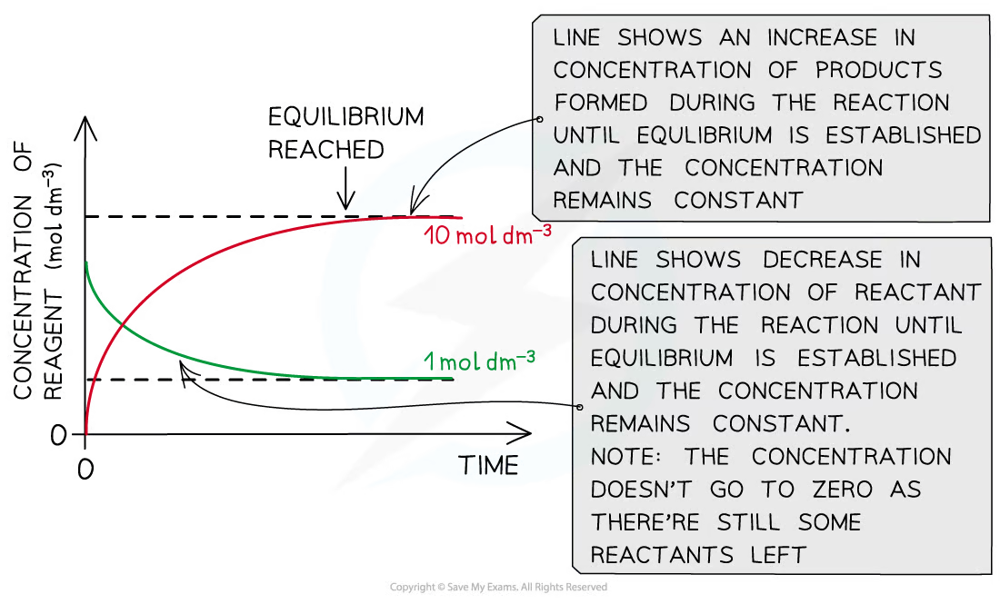
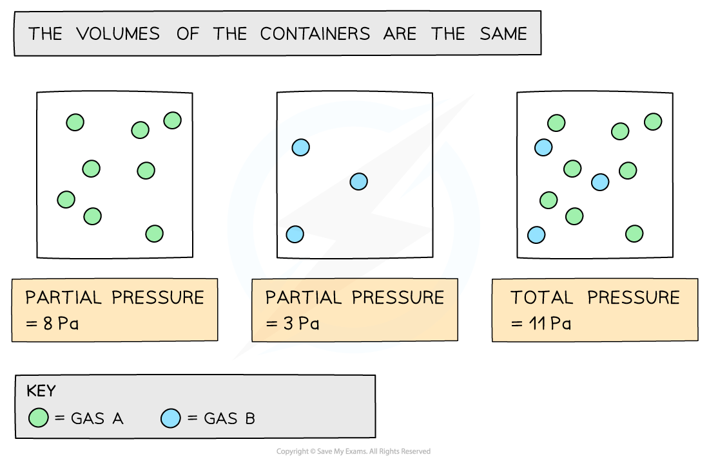
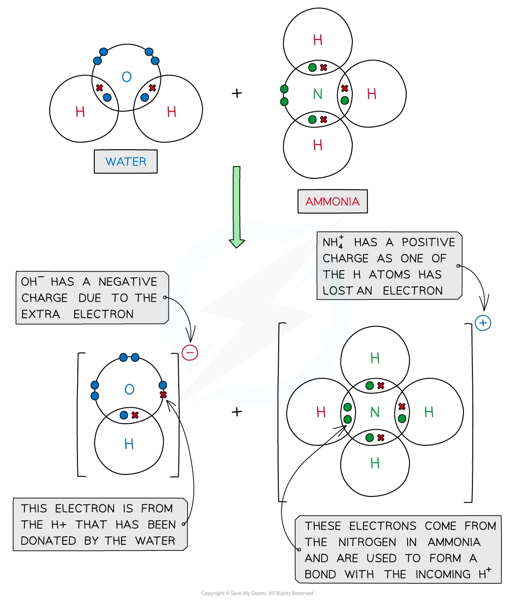
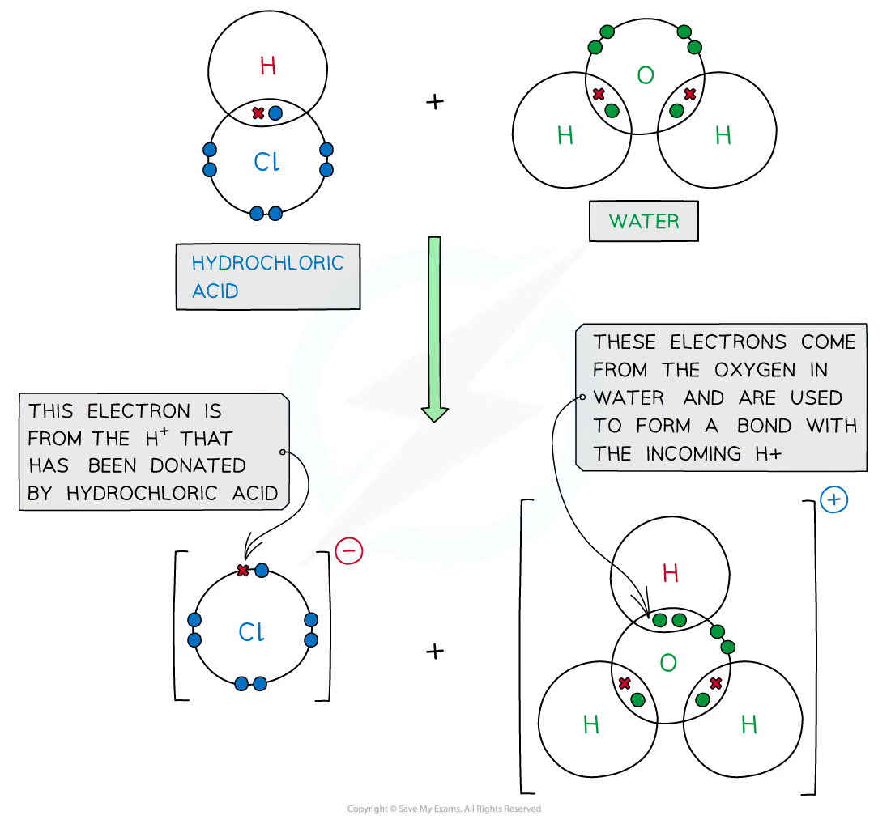
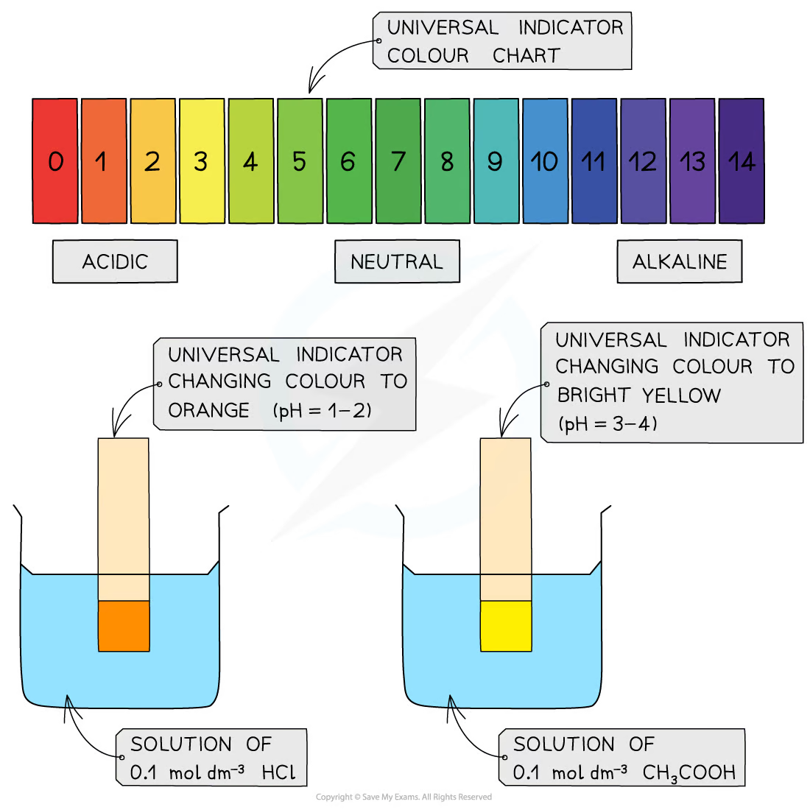

# 7 Equilibria

本章对应 CIE 9701 AS Chemistry 的 **Equilibria**，重点是判断动态平衡的变化、书写并计算 Kc/Kp，以及分析工业平衡和酸碱滴定。

## Learning objectives

学完本章后，你应该能够：

- define dynamic equilibrium in a closed system;
- use Le Chatelier's principle to predict changes in yield and composition;
- write Kc and Kp expressions, including correct powers and units;
- calculate equilibrium concentrations, partial pressures and equilibrium constants;
- explain compromise conditions in the Haber, Contact and ethanol processes;
- distinguish strong and weak acids/bases and select indicators for titrations.

## 7.1 Chemical Equilibria. Reversible Reactions - Dynamic Equilibrium

::: {.study-card}
### What dynamic equilibrium means

A dynamic equilibrium is established in a **closed system** when the forward and reverse reactions continue at equal rates. The concentrations of reactants and products then remain constant, although they do not have to be equal.

The reversible arrow, $\ce{<=>}$, shows that both directions are possible. Equilibrium is dynamic rather than static: particles continue to react in both directions.
:::

For example:

$$\ce{N2O4(g) <=> 2NO2(g)}$$

At equilibrium, the rate of decomposition of N2O4 equals the rate of formation of N2O4. A pressure change can alter the composition because the two sides contain different numbers of gas molecules.

Do not confuse three statements: at equilibrium the <strong>rates</strong> are equal; concentrations are <strong>constant</strong>; concentrations are not necessarily <strong>equal</strong>. A closed system is essential because a gas escaping or a reactant being continually removed prevents the reverse reaction from balancing the forward reaction.

{.note-figure fig-alt="Forward and backward reactions in a reversible equilibrium"}

{.note-figure fig-alt="Reactant and product concentrations become constant at equilibrium"}

### Le Chatelier's principle

If a system at equilibrium is disturbed, the position of equilibrium shifts to oppose the change.

::: {.study-card}
### Temperature

Treat heat as a reactant in an endothermic direction and as a product in an exothermic direction.

- Increasing temperature favours the endothermic direction.
- Decreasing temperature favours the exothermic direction.
- Only temperature changes the value of Kc or Kp.
:::

::: {.study-card}
### Pressure and volume

For gaseous equilibria, increasing pressure favours the side with fewer moles of gas. Decreasing pressure favours the side with more moles of gas. If both sides have the same total number of gas moles, pressure has no effect on the equilibrium composition.

At constant pressure, heating a gas mixture also causes thermal expansion. This volume change must be considered separately from the equilibrium shift.
:::

::: {.study-card}
### Concentration and catalysts

Adding a reactant shifts equilibrium towards products; removing a product also shifts equilibrium towards products. A catalyst lowers the activation energy of both directions by a similar amount. It reaches equilibrium faster but does not change the equilibrium position, yield or K value.
:::

For gases, an inert gas has no effect on the equilibrium composition at constant volume because the partial pressures of reacting gases do not change. At constant total pressure, adding inert gas increases volume and can favour the side with more gas molecules. State the condition before giving the conclusion.

### Equilibrium constants

For a general reaction:

$$\ce{aA + bB <=> cC + dD}$$

the concentration equilibrium constant is:

$$K_c=\frac{[\ce{C}]^c[\ce{D}]^d}{[\ce{A}]^a[\ce{B}]^b}$$

The powers are the stoichiometric coefficients. Pure solids and pure liquids are omitted because their effective concentrations are constant. For gaseous equilibria using partial pressures:

$$K_p=\frac{p(\ce{C})^c p(\ce{D})^d}{p(\ce{A})^a p(\ce{B})^b}$$

The numerical value and units of K depend on the balanced equation and the temperature. A large K indicates that products are favoured at equilibrium; a small K indicates that reactants are favoured. K alone does not describe the rate of a reaction.

When writing an expression, use equilibrium concentrations or partial pressures only; do not use initial concentrations. Include coefficients as powers, omit pure solids and liquids, and do not invert the expression. Units are found by collecting the concentration or pressure powers after the expression is written.

For gas mixtures, calculate a partial pressure using <strong>partial pressure = mole fraction × total pressure</strong>. The sum of all partial pressures must equal the total pressure.

{.note-figure fig-alt="Partial pressures add to the total pressure"}

::: {.worked-example}
Worked example - Haber process

### Calculating Kc

For:

$$\ce{N2(g) + 3H2(g) <=> 2NH3(g)}$$

if $[\ce{N2}]=1.80$, $[\ce{H2}]=3.66$ and $[\ce{NH3}]=1.12\ \mathrm{mol\ dm^{-3}}$:

$$K_c=\frac{1.12^2}{1.80\times3.66^3}=0.0512\ \mathrm{dm^6\ mol^{-2}}$$

The total concentration power in the numerator is 2 and in the denominator is 4, so the units are $\mathrm{dm^6\ mol^{-2}}$.
:::

### Industrial equilibria

::: {.study-card}
### Haber process

$$\ce{N2(g) + 3H2(g) <=> 2NH3(g)}\qquad \Delta H<0$$

High pressure favours ammonia because there are four gas moles on the left and two on the right. Low temperature favours yield because the forward reaction is exothermic, but the rate would be too slow. Industry uses a compromise temperature, high pressure, an iron catalyst, cooling/condensation of ammonia and recycling of unreacted gases.
:::

::: {.study-card}
### Contact process

The key equilibrium is:

$$\ce{2SO2(g) + O2(g) <=> 2SO3(g)}\qquad \Delta H<0$$

High pressure favours SO3, but the pressure gain is limited by cost. A compromise temperature gives an acceptable rate and yield. Vanadium(V) oxide is used as a catalyst. The SO3 is absorbed in concentrated sulfuric acid rather than directly in water.
:::

::: {.study-card}
### Ethanol and ester manufacture

For:

$$\ce{C2H4(g) + H2O(g) <=> C2H5OH(g)}\qquad \Delta H<0$$

high pressure and lower temperature favour ethanol, but a catalyst and a compromise temperature are needed for a practical rate. Esterification reactions are reversible liquid equilibria, so changing pressure has little effect; removing an ester or water can increase conversion.
:::

## 7.2 Brønsted–Lowry Theory of Acids - Bases

In the Brønsted–Lowry model, an acid donates a proton and a base accepts a proton. A strong acid or base is almost completely dissociated in water; a weak acid or base is only partially dissociated. Weak does not mean dilute.

Every proton-transfer reaction contains two conjugate acid-base pairs. When an acid donates H+, it becomes its conjugate base; when a base accepts H+, it becomes its conjugate acid. Water is amphoteric: it can donate a proton to a base or accept a proton from an acid.

{.note-figure fig-alt="Conjugate acid-base pairs formed by ammonia and water"}

{.note-figure fig-alt="Proton transfer between hydrochloric acid and water"}

{.note-figure fig-alt="Universal indicator colours across the pH scale"}

For a weak acid:

$$\ce{HA(aq) <=> H+(aq) + A-(aq)}$$

the position of equilibrium lies mainly to the left. In a titration, the indicator transition range must lie within the steep vertical part of the pH curve near the equivalence point. A strong acid–weak base equivalence point is below pH 7, while a weak acid–strong base equivalence point is above pH 7.

For a strong acid, use [H+] from the stated concentration after allowing for the number of protons released. For a strong base, obtain [OH−] first, then use pH + pOH = 14 at 25 °C. In an acid-base titration, write the balanced equation before using n = cV; convert cm3 to dm3.

::: {.worked-example}
Worked example - partial pressures

If the total pressure is 3.0 atm and the equilibrium partial pressures of A and B are both 0.50 atm, then:

$$p(\ce{C})=3.0-0.50-0.50=2.0\ \mathrm{atm}$$

Always use the sum of all partial pressures to check the total pressure.
:::

## Chapter checklist

- [ ] I can define dynamic equilibrium and explain why concentrations remain constant.
- [ ] I can predict the effect of temperature, pressure, concentration and catalysts.
- [ ] I can write Kc and Kp expressions from a balanced equation.
- [ ] I can calculate K values and their units.
- [ ] I can explain industrial compromise conditions.
- [ ] I can interpret acid–base titration curves and select an indicator.
- [ ] I can distinguish an equilibrium shift from a change in rate and from a change in K.
- [ ] I can identify conjugate acid-base pairs and use the correct concentration or partial pressure in a calculation.

## Multiple choice questions



## Structured questions



## Original question PDFs

- [1.7 Equilibria - Choice - Easy](../assets/questions/original-source/1.7_equilibria_choice_easy.pdf)
- [1.7 Equilibria - Choice - Medium](../assets/questions/original-source/1.7_equilibria_choice_medium.pdf)
- [1.7 Equilibria - Choice - Hard](../assets/questions/original-source/1.7_equilibria_choice_hard.pdf)
- [1.7 Equilibria - Structured Questions - Easy](../assets/questions/original-source/1.7_equilibria_sq_easy.pdf)
- [1.7 Equilibria - Structured Questions - Medium](../assets/questions/original-source/1.7_equilibria_sq_medium.pdf)
- [1.7 Equilibria - Structured Questions - Hard](../assets/questions/original-source/1.7_equilibria_sq_hard.pdf)

## Original note PDFs

- [7.1 Chemical Equilibria. Reversible Reactions - Dynamic Equilibrium](../assets/notes/equilibria-7-rebuilt/7.1_chemical_equilibria_dynamic_equilibrium.pdf)
- [7.2 Brønsted–Lowry Theory of Acids - Bases](../assets/notes/equilibria-7-rebuilt/7.2_bronsted_lowry_acids_bases.pdf)
