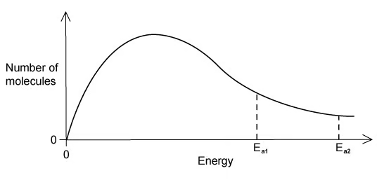
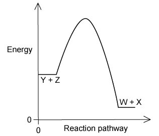
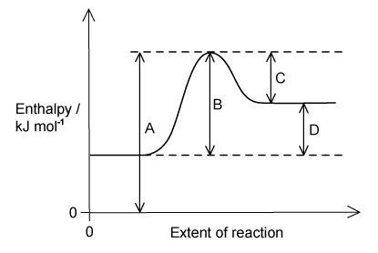
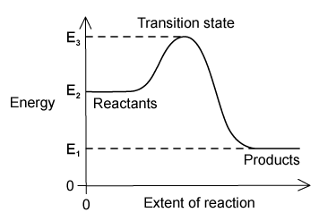
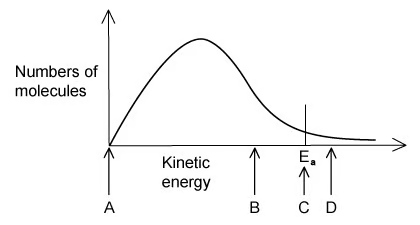
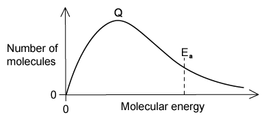
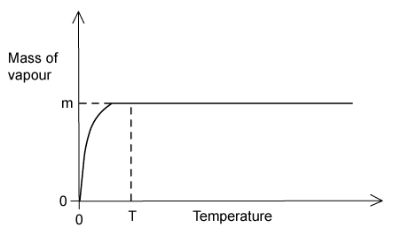
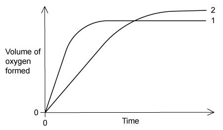

### 8 Reaction kinetics - Multiple Choice: Easy

::: {.mc-question #reaction-kinetics-choice-easy-q1 data-answer="A"}
### Question 1 · Activation energy · 1.8 Choice Easy Q1

Which of the following factors can affect the value of the activation energy of a reaction?

1. The presence of a catalyst 2. Changes in temperature 3. Changes in the concentration of the reactants

<button class="mc-choice" data-choice="A"><strong>A</strong>1 only</button><button class="mc-choice" data-choice="B"><strong>B</strong>1 and 2</button><button class="mc-choice" data-choice="C"><strong>C</strong>3 only</button><button class="mc-choice" data-choice="D"><strong>D</strong>1, 2 and 3</button>

<button class="check-answer">Check answer</button>

Show explanation

<strong>A.</strong> A catalyst provides an alternative pathway with a different, lower activation energy. Temperature and concentration change the rate but not Ea.

:::

::: {.mc-question #reaction-kinetics-choice-easy-q2 data-answer="B"}
### Question 2 · Catalysts and palladium ions · 1.8 Choice Easy Q2

Butadiene is oxidised to crotonaldehyde using a hot aqueous solution of palladium(II) ions, Pd2+(aq), which catalyse the reaction. Which statement about the action of Pd2+(aq) ions is <em>not</em> correct?

<button class="mc-choice" data-choice="A"><strong>A</strong>Pd2+(aq) lowers the activation energy.</button><button class="mc-choice" data-choice="B"><strong>B</strong>Pd2+(aq) increases the energy of the reacting molecules.</button><button class="mc-choice" data-choice="C"><strong>C</strong>The reaction proceeds by a different route when Pd2+(aq) is used.</button><button class="mc-choice" data-choice="D"><strong>D</strong>Changing the concentration of Pd2+(aq) affects the rate.</button>

<button class="check-answer">Check answer</button>

Show explanation

<strong>B.</strong> A catalyst does not increase the energy of reacting particles; it lowers Ea by providing an alternative pathway.

:::

::: {.mc-question #reaction-kinetics-choice-easy-q3 data-answer="B"}
### Question 3 · Maxwell-Boltzmann distribution and catalysts · 1.8 Choice Easy Q3

The original figure shows two activation energies, Ea1 and Ea2, on a Maxwell-Boltzmann distribution. One is for a catalysed reaction and the other for an uncatalysed reaction. When a catalyst is used, which pair is correct?

{.question-figure fig-alt="Maxwell-Boltzmann distribution with two activation energies"}

<button class="mc-choice" data-choice="A"><strong>A</strong>Ea1: uncatalysed, fewer effective collisions; Ea2: catalysed, more effective collisions</button><button class="mc-choice" data-choice="B"><strong>B</strong>Ea1: catalysed, more effective collisions; Ea2: uncatalysed, fewer effective collisions</button><button class="mc-choice" data-choice="C"><strong>C</strong>Ea1: uncatalysed, more effective collisions; Ea2: catalysed, fewer effective collisions</button><button class="mc-choice" data-choice="D"><strong>D</strong>Ea1: catalysed, fewer effective collisions; Ea2: uncatalysed, more effective collisions</button>

<button class="check-answer">Check answer</button>

Show explanation

<strong>B.</strong> The catalysed pathway has the lower activation energy, so a larger proportion of molecules can make effective collisions.

:::

::: {.mc-question #reaction-kinetics-choice-easy-q4 data-answer="B"}
### Question 4 · Temperature and forward/reverse rates · 1.8 Choice Easy Q4

For the Haber process, $$\ce{N2(g) + 3H2(g) <=> 2NH3(g)}\qquad \Delta H=-93\ \mathrm{kJ\ mol^{-1}}$$ what happens to the rate of the forward and reverse reactions when temperature is increased?

<button class="mc-choice" data-choice="A"><strong>A</strong>There is no effect on either rate.</button><button class="mc-choice" data-choice="B"><strong>B</strong>Both forward and reverse rates increase.</button><button class="mc-choice" data-choice="C"><strong>C</strong>Only the forward rate increases.</button><button class="mc-choice" data-choice="D"><strong>D</strong>Only the reverse rate increases.</button>

<button class="check-answer">Check answer</button>

Show explanation

<strong>B.</strong> Higher temperature increases the fraction of particles with energy at least Ea for both directions, so both rates increase.

:::

::: {.mc-question #reaction-kinetics-choice-easy-q5 data-answer="C"}
### Question 5 · Temperature and effective collisions · 1.8 Choice Easy Q5

Why does a mixture of hydrogen and bromine react faster at 500 K than at 400 K?

1. A higher proportion of effective collisions occurs at 500 K. 2. Hydrogen and bromine molecules collide more frequently at 500 K. 3. The activation energy is lower at 500 K.

<button class="mc-choice" data-choice="A"><strong>A</strong>1 only</button><button class="mc-choice" data-choice="B"><strong>B</strong>1 and 2</button><button class="mc-choice" data-choice="C"><strong>C</strong>3 only</button><button class="mc-choice" data-choice="D"><strong>D</strong>1, 2 and 3</button>

<button class="check-answer">Check answer</button>

Show explanation

<strong>C.</strong> The proportion of particles with energy above Ea increases and collisions are more frequent. Ea itself does not change with temperature.

:::

::: {.mc-question #reaction-kinetics-choice-easy-q6 data-answer="C"}
### Question 6 · Pressure and gaseous reaction rate · 1.8 Choice Easy Q6

When the pressure of a fixed mass of gaseous reactants is raised at constant temperature, the rate increases. Which statement explains this observation?

1. Raising pressure lowers Ea. 2. More molecules have energy greater than Ea at higher pressure. 3. More collisions occur per second when pressure increases.

<button class="mc-choice" data-choice="A"><strong>A</strong>1 only</button><button class="mc-choice" data-choice="B"><strong>B</strong>1 and 2</button><button class="mc-choice" data-choice="C"><strong>C</strong>3 only</button><button class="mc-choice" data-choice="D"><strong>D</strong>1, 2 and 3</button>

<button class="check-answer">Check answer</button>

Show explanation

<strong>C.</strong> Pressure changes the concentration and collision frequency, but not the energy distribution or Ea.

:::

::: {.mc-question #reaction-kinetics-choice-easy-q7 data-answer="D"}
### Question 7 · Temperature and reaction rate · 1.8 Choice Easy Q7

What is the main reason for the increase in reaction rate with increasing temperature?

<button class="mc-choice" data-choice="A"><strong>A</strong>The activation energy decreases.</button><button class="mc-choice" data-choice="B"><strong>B</strong>The activation energy increases.</button><button class="mc-choice" data-choice="C"><strong>C</strong>The molecules collide more frequently.</button><button class="mc-choice" data-choice="D"><strong>D</strong>More molecules have energy greater than the activation energy.</button>

<button class="check-answer">Check answer</button>

Show explanation

<strong>D.</strong> The key effect is the increased proportion of molecules with energy at least Ea, producing more effective collisions.

:::

::: {.mc-question #reaction-kinetics-choice-easy-q8 data-answer="D"}
### Question 8 · Activation energy of the reverse reaction · 1.8 Choice Easy Q8

The original reaction pathway diagram is for $$\ce{Z(g)+Y(g) <=> X(g)+W(g)}$$. What statement is true about the reverse reaction, $$\ce{W(g)+X(g) <=> Y(g)+Z(g)}$$?

{.question-figure fig-alt="Reaction pathway diagram for the forward reaction"}

<button class="mc-choice" data-choice="A"><strong>A</strong>It has a smaller activation energy and a negative ΔH.</button><button class="mc-choice" data-choice="B"><strong>B</strong>It has a smaller activation energy and a positive ΔH.</button><button class="mc-choice" data-choice="C"><strong>C</strong>It has a larger activation energy and a negative ΔH.</button><button class="mc-choice" data-choice="D"><strong>D</strong>It has a larger activation energy and a positive ΔH.</button>

<button class="check-answer">Check answer</button>

Show explanation

<strong>D.</strong> The reverse reaction starts at the product energy, so its activation energy is larger; the forward reaction is exothermic and the reverse is endothermic.

:::

::: {.mc-question #reaction-kinetics-choice-easy-q9 data-answer="C"}
### Question 9 · Temperature increase of 10 °C · 1.8 Choice Easy Q9

A student measures a reaction at 40 °C and 50 °C and observes that the rate roughly doubles. What explains this observation?

<button class="mc-choice" data-choice="A"><strong>A</strong>Raising the temperature by 10 °C doubles the average molecular velocity.</button><button class="mc-choice" data-choice="B"><strong>B</strong>Raising the temperature by 10 °C doubles the average kinetic energy of each molecule.</button><button class="mc-choice" data-choice="C"><strong>C</strong>Raising the temperature increases the number of molecules above a minimum energy.</button><button class="mc-choice" data-choice="D"><strong>D</strong>Raising the temperature doubles the number of collisions in a given time.</button>

<button class="check-answer">Check answer</button>

Show explanation

<strong>C.</strong> A small temperature increase can greatly increase the fraction of molecules with energy ≥ Ea; neither average speed nor collision frequency simply doubles.

:::

::: {.mc-question #reaction-kinetics-choice-easy-q10 data-answer="B"}
### Question 10 · How catalysts work · 1.8 Choice Easy Q10

Which statements correctly describe how a catalyst works?

1. A catalyst has no effect on the enthalpy change of the reaction. 2. A catalyst increases the rate of the reverse reaction. 3. A catalyst increases the average kinetic energy of the reacting particles.

<button class="mc-choice" data-choice="A"><strong>A</strong>1 only</button><button class="mc-choice" data-choice="B"><strong>B</strong>1 and 2</button><button class="mc-choice" data-choice="C"><strong>C</strong>3 only</button><button class="mc-choice" data-choice="D"><strong>D</strong>1, 2 and 3</button>

<button class="check-answer">Check answer</button>

Show explanation

<strong>B.</strong> A catalyst does not change ΔH and speeds both forward and reverse reactions. It does not increase particle kinetic energy.

:::

### 8 Reaction kinetics - Multiple Choice: Medium

::: {.mc-question #reaction-kinetics-choice-medium-q1 data-answer="A"}
### Question 11 · Boltzmann distribution peak · 1.8 Choice Medium Q1

The original Boltzmann distribution graph has a point X at the most probable energy. If temperature is increased, what happens to X?

{.question-figure fig-alt="Boltzmann distribution graph showing point X"}

<button class="mc-choice" data-choice="A"><strong>A</strong>Fewer molecules possess the most probable energy, so X shifts to the right.</button><button class="mc-choice" data-choice="B"><strong>B</strong>Fewer molecules possess the most probable energy, so X shifts to the left.</button><button class="mc-choice" data-choice="C"><strong>C</strong>More molecules possess the most probable energy, so X shifts to the left.</button><button class="mc-choice" data-choice="D"><strong>D</strong>X stays in the same position but the area under the curve increases.</button>

<button class="check-answer">Check answer</button>

Show explanation

<strong>A.</strong> The distribution becomes broader, lower and shifted to higher energy.

:::

::: {.mc-question #reaction-kinetics-choice-medium-q2 data-answer="B"}
### Question 12 · Activation energy on a pathway diagram · 1.8 Choice Medium Q2

The original diagram shows an endothermic reaction pathway with energy levels E1, E2 and E3. Which expression represents the activation energy for the forward reaction?

{.question-figure fig-alt="Endothermic reaction pathway diagram"}

<button class="mc-choice" data-choice="A"><strong>A</strong>E1 − E2</button><button class="mc-choice" data-choice="B"><strong>B</strong>E2 − E1</button><button class="mc-choice" data-choice="C"><strong>C</strong>E2 − E3</button><button class="mc-choice" data-choice="D"><strong>D</strong>E3 − E2</button>

<button class="check-answer">Check answer</button>

Show explanation

<strong>B.</strong> Forward activation energy is the energy difference from the reactants to the transition-state maximum.

:::

::: {.mc-question #reaction-kinetics-choice-medium-q4 data-answer="D"}
### Question 13 · Forward activation energy · 1.8 Choice Medium Q4

In the original reaction pathway diagram, E1, E2 and E3 label the energy levels of the products, reactants and transition state. Which expression correctly represents the activation energy of the forward reaction?

{.question-figure fig-alt="Reaction pathway with E1, E2 and E3"}

<button class="mc-choice" data-choice="A"><strong>A</strong>E1 − E2</button><button class="mc-choice" data-choice="B"><strong>B</strong>E2 − E1</button><button class="mc-choice" data-choice="C"><strong>C</strong>E2 − E3</button><button class="mc-choice" data-choice="D"><strong>D</strong>E3 − E2</button>

<button class="check-answer">Check answer</button>

Show explanation

<strong>D.</strong> Activation energy is the energy from the reactants to the transition state, represented here by E3 − E2.

:::

::: {.mc-question #reaction-kinetics-choice-medium-q5 data-answer="B"}
### Question 14 · Catalyst and Ea position · 1.8 Choice Medium Q5

In the original Boltzmann distribution, Ea is marked for the uncatalysed reaction. Which labelled position would represent Ea when an effective catalyst is used?

{.question-figure fig-alt="Boltzmann distribution showing activation-energy positions"}

<button class="mc-choice" data-choice="A"><strong>A</strong>The far-left position</button><button class="mc-choice" data-choice="B"><strong>B</strong>The position to the left of the original Ea</button><button class="mc-choice" data-choice="C"><strong>C</strong>The original Ea position</button><button class="mc-choice" data-choice="D"><strong>D</strong>The position to the right of the original Ea</button>

<button class="check-answer">Check answer</button>

Show explanation

<strong>B.</strong> A catalyst lowers the activation energy, so the Ea marker moves left on the energy axis.

:::

::: {.mc-question #reaction-kinetics-choice-medium-q7 data-answer="A"}
### Question 15 · Catalyst and Boltzmann distribution · 1.8 Choice Medium Q7

The original distribution has a peak labelled Q. What happens when an effective catalyst is added?

{.question-figure fig-alt="Boltzmann distribution with peak Q"}

<button class="mc-choice" data-choice="A"><strong>A</strong>The peak height remains the same and the activation energy moves left.</button><button class="mc-choice" data-choice="B"><strong>B</strong>The peak height decreases and the activation energy moves left.</button><button class="mc-choice" data-choice="C"><strong>C</strong>The peak height remains the same and the activation energy moves right.</button><button class="mc-choice" data-choice="D"><strong>D</strong>The peak height decreases and the activation energy moves right.</button>

<button class="check-answer">Check answer</button>

Show explanation

<strong>A.</strong> The catalyst does not change the number or energy distribution of molecules; it lowers Ea.

:::

::: {.mc-question #reaction-kinetics-choice-medium-q8 data-answer="A"}
### Question 16 · Dilution and rate · 1.8 Choice Medium Q8

Reaction 1 uses 1.5 g solid calcium carbonate and 100 cm3 of 0.5 mol dm−3 HCl. In reaction 2, 100 cm3 distilled water is added to the same volume of acid before the calcium carbonate. Reaction 1 is faster. Which hypothesis correctly explains the difference?

1. Adding water reduces collision frequency. 2. Adding water reduces the proportion of effective collisions. 3. Adding water reduces the proportion of particles possessing Ea.

<button class="mc-choice" data-choice="A"><strong>A</strong>1 only</button><button class="mc-choice" data-choice="B"><strong>B</strong>1 and 2</button><button class="mc-choice" data-choice="C"><strong>C</strong>3 only</button><button class="mc-choice" data-choice="D"><strong>D</strong>1, 2 and 3</button>

<button class="check-answer">Check answer</button>

Show explanation

<strong>A.</strong> Dilution reduces concentration and collision frequency. It does not change the energy distribution, orientation requirement or Ea.

:::

### 8 Reaction kinetics - Multiple Choice: Hard

::: {.mc-question #reaction-kinetics-choice-hard-q1 data-answer="B"}
### Question 17 · Photochemical catalysts · 1.8 Choice Hard Q1

Photochromic glass darkens in bright light and becomes transparent again in dim light. The original question gives three reactions involving Ag+, Cu+, Cu2+, Cl− and Ag. Which statement is correct?

<button class="mc-choice" data-choice="A"><strong>A</strong>Ag+ ions are oxidised in reaction 1.</button><button class="mc-choice" data-choice="B"><strong>B</strong>Cu+ and Cu2+ ions act as catalysts.</button><button class="mc-choice" data-choice="C"><strong>C</strong>Cu+ ions act as an oxidising agent in reaction 2.</button><button class="mc-choice" data-choice="D"><strong>D</strong>Reaction 2 is the reaction in which light is absorbed.</button>

<button class="check-answer">Check answer</button>

Show explanation

<strong>B.</strong> The copper ions participate in a cycle and are regenerated, so they catalyse the reversible photochromic process.

:::

::: {.mc-question #reaction-kinetics-choice-hard-q2 data-answer="A"}
### Question 18 · Concentration and collision frequency · 1.8 Choice Hard Q2

When 1 cm3 of 0.1 mol dm−3 HCl is added to 10 cm3 of 0.02 mol dm−3 Na2S2O3, a pale yellow precipitate forms slowly. Repeating the experiment with 0.05 mol dm−3 Na2S2O3 makes the precipitate form more quickly. Why?

<button class="mc-choice" data-choice="A"><strong>A</strong>The reactant particles collide more frequently at the higher thiosulfate concentration.</button><button class="mc-choice" data-choice="B"><strong>B</strong>The collisions are more violent at the higher thiosulfate concentration.</button><button class="mc-choice" data-choice="C"><strong>C</strong>The activation energy is lower at the higher thiosulfate concentration.</button><button class="mc-choice" data-choice="D"><strong>D</strong>The reaction proceeds by a different pathway.</button>

<button class="check-answer">Check answer</button>

Show explanation

<strong>A.</strong> Higher concentration means more reacting particles per unit volume and therefore a higher collision frequency.

:::

::: {.mc-question #reaction-kinetics-choice-hard-q4 data-answer="A"}
### Question 19 · Vapour pressure and temperature · 1.8 Choice Hard Q4

A quantity of solid Y is placed in an evacuated vessel and held at different temperatures. The mass of Y in the vapour state is calculated from pressure measurements. The original graph levels off at mass m above temperature T. Which statements can be deduced?

{.question-figure fig-alt="Mass of vapour against temperature graph"}

1. The mass of Y used was m. 2. The vapour pressure was constant for all temperatures above T. 3. Liquid appeared at temperature T.

<button class="mc-choice" data-choice="A"><strong>A</strong>1 only</button><button class="mc-choice" data-choice="B"><strong>B</strong>1 and 3</button><button class="mc-choice" data-choice="C"><strong>C</strong>2 and 3</button><button class="mc-choice" data-choice="D"><strong>D</strong>1, 2 and 3</button>

<button class="check-answer">Check answer</button>

Show explanation

<strong>A.</strong> Once the mass of vapour reaches m, all solid has vaporised. The graph does not show that vapour pressure is constant or that liquid appeared.

:::

::: {.mc-question #reaction-kinetics-choice-hard-q5 data-answer="D"}
### Question 20 · Hydrogen peroxide decomposition · 1.8 Choice Hard Q5

Curve 1 in the original graph was obtained from the decomposition of 100 cm3 of 1.0 mol dm−3 hydrogen peroxide in the presence of MnO2. Which alteration would produce curve 2, which has a slower initial rate but a larger final volume of oxygen?

{.question-figure fig-alt="Hydrogen peroxide oxygen-volume graph"}

<button class="mc-choice" data-choice="A"><strong>A</strong>Raising the temperature</button><button class="mc-choice" data-choice="B"><strong>B</strong>Adding more MnO2</button><button class="mc-choice" data-choice="C"><strong>C</strong>Adding water</button><button class="mc-choice" data-choice="D"><strong>D</strong>Adding some 0.1 mol dm−3 hydrogen peroxide</button>

<button class="check-answer">Check answer</button>

Show explanation

<strong>D.</strong> Adding lower-concentration H2O2 slows the initial rate but increases the total amount of H2O2 available, so more oxygen is eventually formed.

:::
