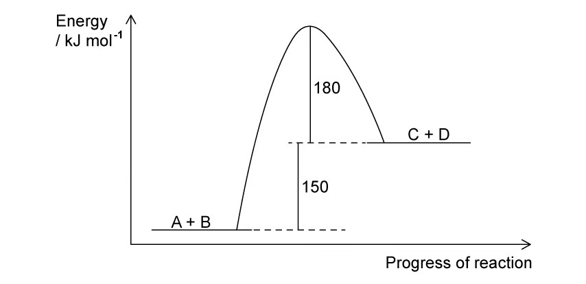
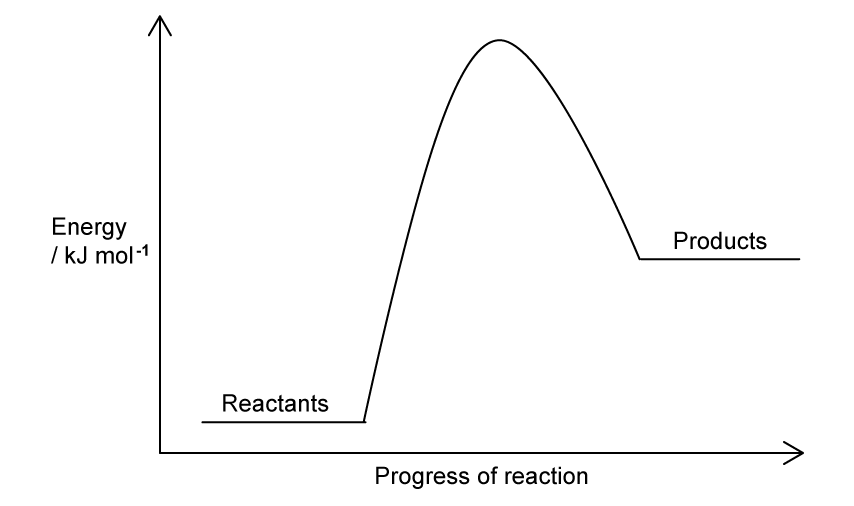
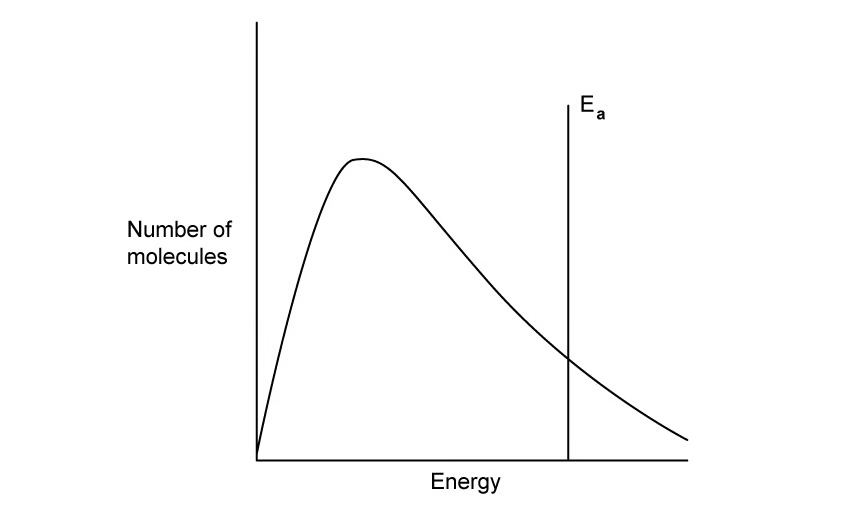
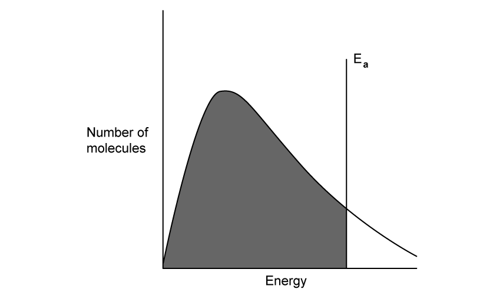
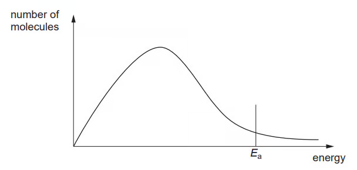
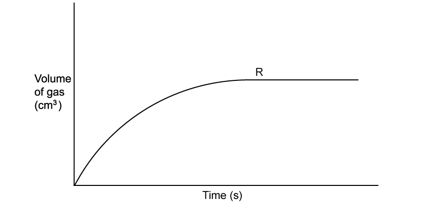
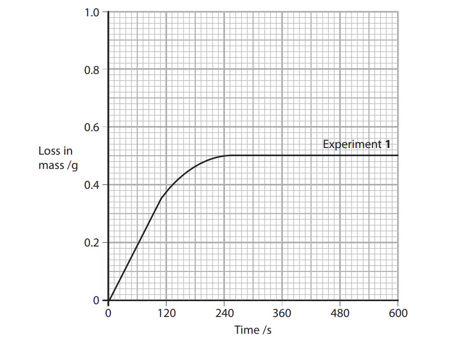
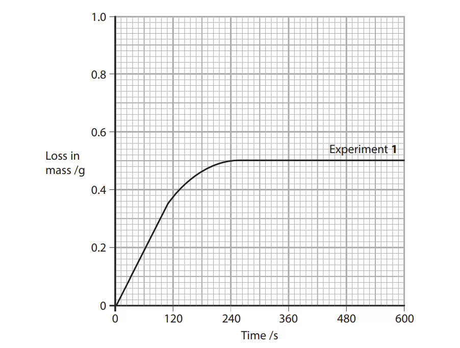
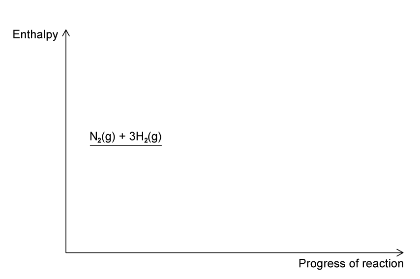
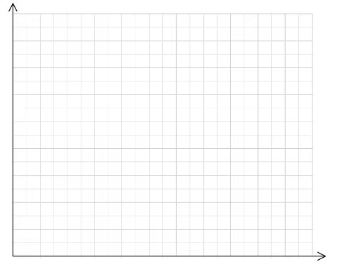

### 8 Reaction kinetics - Structured Questions: Easy

::: {.question-card}
### Example 1 · Collision theory and hydrogen peroxide · 1.8 SQ Easy Q1

**(a)** According to collision theory, state two conditions that particles need for an effective collision to occur. `[2 marks]`

**(b)** An increase in concentration means that there are more particles per unit volume. In terms of collisions, explain how this increases the rate of reaction. `[1 mark]`

**(c)** Aqueous hydrogen peroxide decomposes:

$$\ce{2H2O2(aq) -> 2H2O(l) + O2(g)}$$

A student adds 25.00 cm3 of H2O2(aq), a small spatula measure of MnO2, connects a gas syringe and measures the volume of oxygen every 100 s.

**(i)** State the role of MnO2. `[1 mark]`  
**(ii)** The oxygen volumes at 0 s and 100 s are 0.0 cm3 and 7.0 cm3. Calculate the average rate for the first 100 s. `[1 mark]`

Show mark scheme / model answer
<ul><li><strong>(a)</strong> Particles must collide with energy at least equal to the activation energy and with the correct orientation.</li><li><strong>(b)</strong> More frequent effective collisions occur per unit time.</li><li><strong>(c)</strong> MnO2 is a catalyst. Average rate $=(7.0-0.0)/100=0.070\ \mathrm{cm^3\ s^{-1}}$.</li></ul>

:::

::: {.question-card}
### Example 2 · Energy profile and activation energy · 1.8 SQ Easy Q2

For the general reaction $\ce{A+B -> C+D}$, Fig. 2.1 in the original question shows the reactants at the lower energy level, products 150 kJ mol−1 above the reactants, and the transition state a further 180 kJ mol−1 above the products.

{.question-figure fig-alt="Energy profile for A + B to C + D"}

**(a)** Explain whether the forward reaction is exothermic or endothermic. `[2 marks]`

**(b)** Define activation energy. `[1 mark]`

**(c)** Use Fig. 2.1 to calculate the activation energies for the forward and backward reactions. `[2 marks]`

**(d)** Explain, using Fig. 2.2, how adding a catalyst affects the rate. `[3 marks]`

{.question-figure fig-alt="Energy profile showing reactants and products"}

Show mark scheme / model answer
<ul><li><strong>(a)</strong> Endothermic: products are at higher energy than reactants and ΔH is positive.</li><li><strong>(b)</strong> The minimum energy that reacting particles must possess for a reaction to occur.</li><li><strong>(c)</strong> Forward Ea = 150 + 180 = 330 kJ mol−1; backward Ea = 180 kJ mol−1.</li><li><strong>(d)</strong> The catalysed pathway has a lower peak and lower Ea; a greater proportion of particles can make effective collisions, so the rate increases.</li></ul>

:::

::: {.question-card}
### Example 3 · Boltzmann distributions · 1.8 SQ Easy Q3

The original question gives a Boltzmann distribution of molecular energies for a reaction at a fixed temperature.

{.question-figure fig-alt="Boltzmann distribution for the reaction"}

**(a)** State what happens to the curve when temperature is decreased. `[2 marks]`

**(b)** Comment on how the total area under the curve changes with temperature. `[1 mark]`

**(c)** State what happens to the curve when a catalyst is added. `[2 marks]`

**(d)** In Fig. 3.2, state what the shaded area represents. `[1 mark]`

{.question-figure fig-alt="Boltzmann distribution with shaded area"}

Show mark scheme / model answer
<ul><li><strong>(a)</strong> The peak becomes higher and moves to the left; the curve becomes narrower.</li><li><strong>(b)</strong> The total area stays the same because the total number of molecules is unchanged.</li><li><strong>(c)</strong> The distribution curve is unchanged; the activation-energy marker moves to a lower energy.</li><li><strong>(d)</strong> Molecules with energy at least Ea, so the molecules able to make effective collisions.</li></ul>

:::

### 8 Reaction kinetics - Structured Questions: Medium

::: {.question-card}
### Example 4 · Boltzmann curves and heterogeneous catalysts · 1.8 SQ Medium Q1

Fig. 1.1 shows a Boltzmann distribution for a mixture of gases at temperature T, with Ea marked.

{.question-figure fig-alt="Boltzmann distribution at temperature T"}

**(a)(i)** Draw a new distribution curve, labelled T2, at a lower temperature, and mark the activation energy at T2. `[3 marks]`  
**(a)(ii)** On the same energy axis, mark the activation energy when a catalyst is used and explain how a catalyst gives a faster reaction. `[2 marks]`

**(b)** Two reactions involving aqueous NaOH are:

$$\ce{CH3CHBrCH3 + NaOH -> CH3CH(OH)CH3 + NaBr}$$
$$\ce{H2SO4 + 2NaOH -> Na2SO4 + 2H2O}$$

The first requires heating, whereas the second is almost instantaneous at room temperature. Suggest brief explanations for the different rates. `[4 marks]`

Show mark scheme / model answer
<ul><li><strong>(a)</strong> Lower temperature gives a higher, left-shifted peak; Ea does not change. A catalyst gives a lower Ea, so a larger proportion of molecules has sufficient energy.</li><li><strong>(b)</strong> Reaction 1 involves breaking covalent bonds and has a larger activation energy. Reaction 2 is an acid–base reaction between ions, so H+ and OH− react rapidly with little bond rearrangement.</li></ul>

:::

::: {.question-card}
### Example 5 · Heterogeneous catalyst and rate curve · 1.8 SQ Medium Q2

A platinum–rhodium catalyst is used in:

$$\ce{4NH3(g) + 5O2(g) -> 4NO(g) + 6H2O(g)}$$

**(a)(i)** State what is meant by a heterogeneous catalyst. `[1 mark]`  
**(a)(ii)** Explain why a catalyst has no effect on the product yield. `[2 marks]`

Students investigate $\ce{A(s)+B(aq)->C(g)}$ by collecting gas. Their graph rises and levels off at a point labelled R.

{.question-figure fig-alt="Gas volume against time graph"}

**(b)(i)** State and explain what R represents. `[1 mark]`  
**(b)(ii)** The original experiment uses 0.5 g A and 50 cm3 of 1.0 mol dm−3 B. Describe the curve expected when 50 cm3 of 2.0 mol dm−3 B is used instead. `[2 marks]`

**(c)** Explain why the gradient of the curve decreases as the reaction progresses. `[2 marks]`

Show mark scheme / model answer
<ul><li><strong>(a)</strong> The catalyst is in a different physical state from the reactants. It lowers Ea for both directions, so it changes rate but not the equilibrium position/yield.</li><li><strong>(b)</strong> R is the maximum volume of gas when the limiting reactant is used up. Doubling B makes the initial gradient steeper, but A is still limiting, so the final volume is unchanged.</li><li><strong>(c)</strong> Reactant concentration decreases, so collision frequency and the rate decrease.</li></ul>

:::

::: {.question-card}
### Example 6 · Effective collisions and pressure · 1.8 SQ Medium Q3

**(a)(i)** Explain what is meant by an effective collision. `[1 mark]`  
**(a)(ii)** State two factors that could cause an ineffective collision. `[2 marks]`

**(b)** A student says: “The rate of a reaction increases with temperature as there are more collisions.” Discuss why this is only true to an extent and what else must be considered. `[5 marks]`

**(c)** Hydrogen and oxygen form water:

$$\ce{2H2(g) + O2(g) -> 2H2O(g)}$$

Describe and explain the effect of increasing pressure on the rate. `[2 marks]`

Show mark scheme / model answer
<ul><li><strong>(a)</strong> Particles collide with sufficient energy and the correct orientation. Ineffective collisions have insufficient energy or an unsuitable orientation.</li><li><strong>(b)</strong> Temperature increases collision frequency, but the main effect is that the distribution shifts so more molecules have energy ≥ Ea; therefore the number of effective collisions increases.</li><li><strong>(c)</strong> Pressure increases concentration, causing more frequent collisions per unit time and a faster rate.</li></ul>

:::

::: {.question-card}
### Example 7 · Calcium carbonate rate experiment · 1.8 SQ Medium Q4

Calcium carbonate reacts with hydrochloric acid:

$$\ce{CaCO3(s) + 2HCl(aq) -> CaCl2(aq) + H2O(l) + CO2(g)}$$

50.0 cm3 HCl is added to excess small pieces of CaCO3. Experiment 1 uses 0.50 mol dm−3 HCl at 20 °C; Experiment 2 uses the same concentration at 60 °C; Experiment 3 uses 1.00 mol dm−3 HCl at 20 °C.

{.question-figure fig-alt="Calcium carbonate rate experiment graph"}

**(a)** On the original graph, sketch the curves expected for Experiments 2 and 3. `[2 marks]`  
**(b)** Determine the initial rate for Experiment 1 using a tangent. `[3 marks]`  
{.question-figure fig-alt="Calcium carbonate graph for drawing the initial tangent"}
**(c)** Calculate the average rate over the first 240 s if the mass loss at 240 s is 0.50 g. `[1 mark]`  
**(d)** State and explain the effect of using larger pieces of calcium carbonate. `[2 marks]`

Show mark scheme / model answer
<ul><li><strong>(a)</strong> Curve 2 is initially steeper but reaches the same final mass loss. Curve 3 is initially steeper and reaches a greater final mass loss because more acid is available.</li><li><strong>(b)</strong> Draw a tangent at t=0 and calculate gradient $\Delta m/\Delta t$; the value is approximately $3.0\times10^{-3}\ \mathrm{g\ s^{-1}}$ from the original graph.</li><li><strong>(c)</strong> $0.50/240=2.1\times10^{-3}\ \mathrm{g\ s^{-1}}$.</li><li><strong>(d)</strong> Rate decreases because larger pieces have a smaller total surface area, so fewer collisions occur at the solid surface.</li></ul>

:::

::: {.question-card}
### Example 8 · Ammonia energy profile and catalysts · 1.8 SQ Medium Q5

For the ammonia reaction:

$$\ce{N2(g) + 3H2(g) <=> 2NH3(g)}\qquad \Delta H=-92\ \mathrm{kJ\ mol^{-1}}$$

the catalysed activation energy is 109 kJ mol−1.

{.question-figure fig-alt="Ammonia reaction energy profile"}

**(a)** Complete the original energy profile for the uncatalysed and catalysed reactions, labelling products, ΔH, Ea for the uncatalysed reaction and Ea for the catalysed reaction. `[4 marks]`  
**(b)** Calculate the activation energy for the catalysed decomposition of ammonia into nitrogen and hydrogen. `[1 mark]`  
**(c)** Explain, using a labelled Boltzmann distribution, why an iron catalyst increases the rate. `[1 mark]`  
**(d)** Platinum in a catalytic converter removes nitrogen oxide:

$$\ce{2NO(g) + 2CO(g) -> N2(g) + 2CO2(g)}$$

State the type of catalyst and explain whether nitrogen is oxidised or reduced. `[3 marks]`

Show mark scheme / model answer
<ul><li><strong>(a)</strong> Products are 92 kJ mol−1 below reactants; the catalysed peak is lower than the uncatalysed peak.</li><li><strong>(b)</strong> Reverse Ea = 109 + 92 = 201 kJ mol−1.</li><li><strong>(c)</strong> The catalyst lowers Ea, so the area beyond Ea and the number of effective collisions increase.</li><li><strong>(d)</strong> Platinum is a heterogeneous catalyst. Nitrogen is reduced: +2 in NO changes to 0 in N2.</li></ul>

:::

### 8 Reaction kinetics - Structured Questions: Hard

::: {.question-card}
### Example 9 · Reaction profiles and heterogeneous catalysts · 1.8 SQ Hard Q1

Reaction rates can be affected by pressure and temperature.

{.question-figure fig-alt="Blank graph for Maxwell-Boltzmann distributions"}

**(a)** Sketch a Maxwell-Boltzmann distribution at T1 and a second distribution at higher T2. State how the mean molecular energy changes. `[4 marks]`

Hydrogen iodide decomposes:

$$\ce{2HI(g) -> H2(g) + I2(g)}\qquad \Delta H=-52\ \mathrm{kJ\ mol^{-1}}$$

The uncatalysed Ea is 183 kJ mol−1 and the gold-catalysed Ea is 105 kJ mol−1.

**(b)** Sketch the reaction profile with both activation-energy curves, calculate the reverse Ea values, and explain why increasing [HI] increases rate. `[6 marks]`

**(c)** Explain why a solid gold catalyst is likely to be used as a powder, distinguish homogeneous from heterogeneous catalysts, and state what happens to the area under a Maxwell-Boltzmann curve when a catalyst is introduced at constant temperature and molecule number. `[3 marks]`

**(d)** In the Contact process, write the balanced equation for sulfur dioxide oxidation using solid vanadium(V) oxide and explain why the catalyst reduces energy demand and benefits the environment. `[3 marks]`

Show mark scheme / model answer
<ul><li><strong>(a)</strong> The higher-temperature curve is lower, broader and shifted right; the mean energy is higher.</li><li><strong>(b)</strong> Reverse Ea values are 183−(−52)=235 kJ mol−1 uncatalysed and 105−(−52)=157 kJ mol−1 catalysed. Higher [HI] gives more frequent collisions.</li><li><strong>(c)</strong> Powder gives a larger surface area for reactants to adsorb. Homogeneous catalysts have the same state as reactants; heterogeneous catalysts have a different state. The area is unchanged because the number of molecules is unchanged.</li><li><strong>(d)</strong> $\ce{2SO2(g)+O2(g) <=> 2SO3(g)}$ with state symbols; V2O5 lowers Ea, allowing lower operating temperature and reducing energy use/emissions.</li></ul>

:::

::: {.question-card}
### Example 10 · Effective collisions and hydrogen chloride · 1.8 SQ Hard Q3

Hydrogen reacts with chlorine to form hydrogen chloride:

$$\ce{H2(g) + Cl2(g) -> 2HCl(g)}$$

**(a)** Give one reason why most collisions between hydrogen and chlorine molecules do not form hydrogen chloride. `[1 mark]`  
**(b)** Apart from changing temperature, state and explain two ways of speeding up the formation of hydrogen chloride. `[4 marks]`

Show mark scheme / model answer
<ul><li><strong>(a)</strong> Most collisions have insufficient energy or the molecules have an unsuitable orientation.</li><li><strong>(b)</strong> Increase pressure/concentration to increase collision frequency; add a catalyst to lower Ea and increase the proportion of effective collisions. Light can also initiate the reaction by providing energy.</li></ul>

:::
