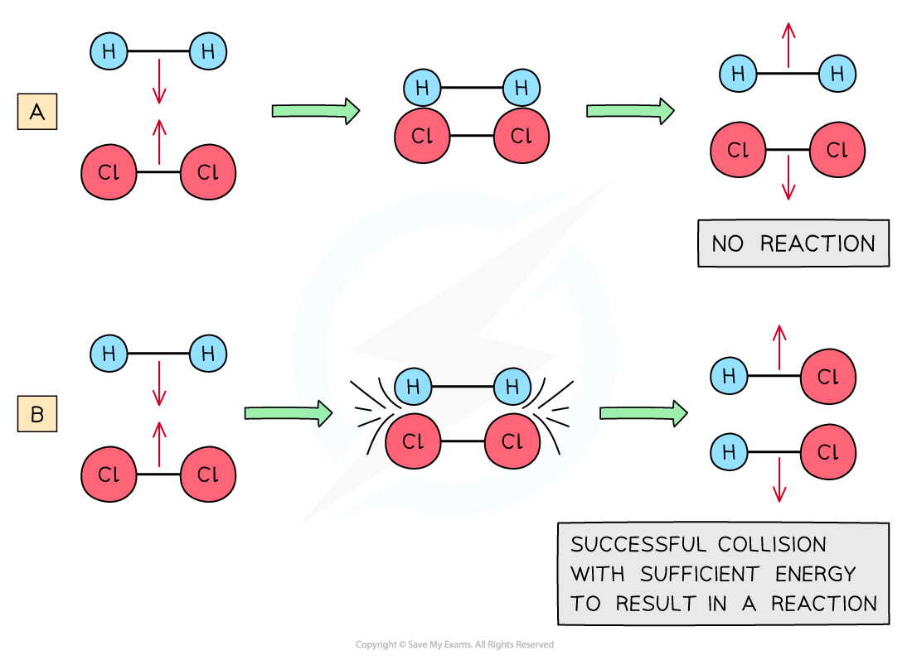
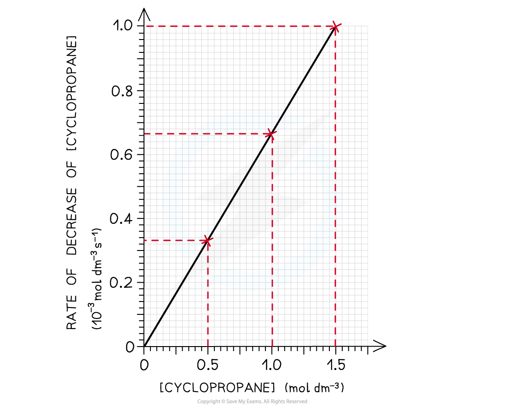
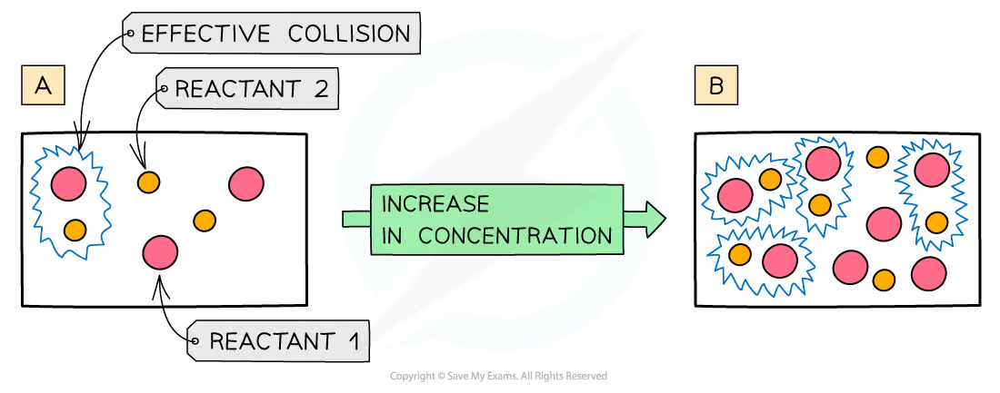
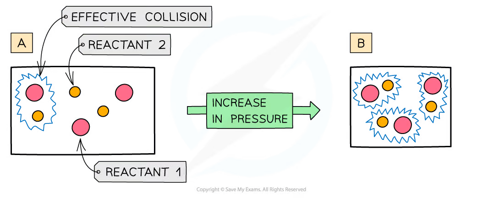
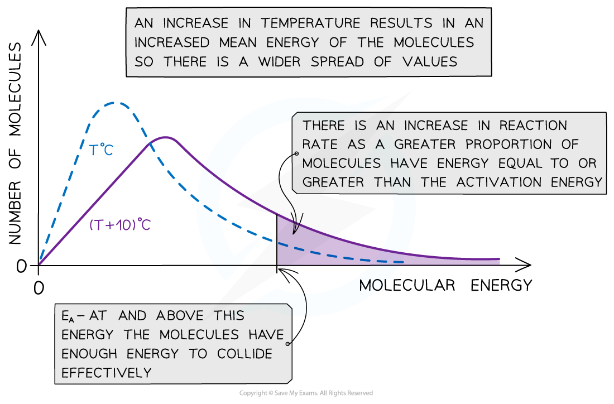
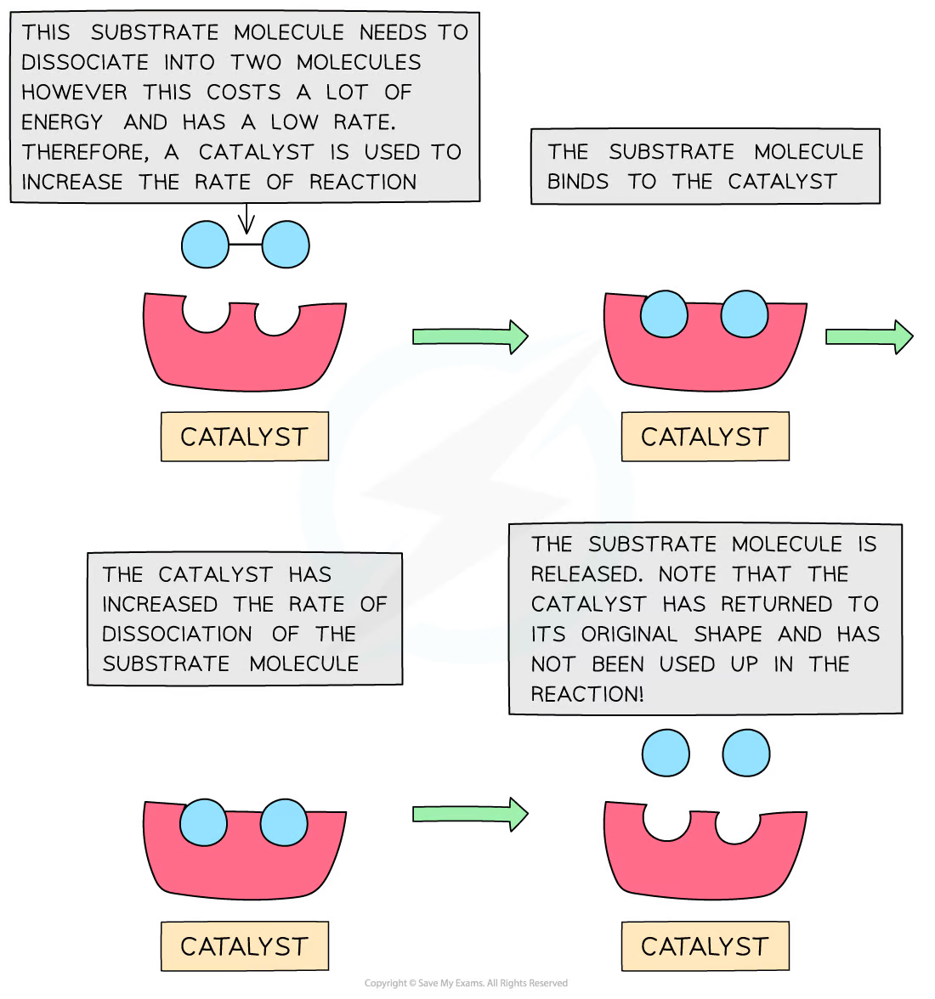
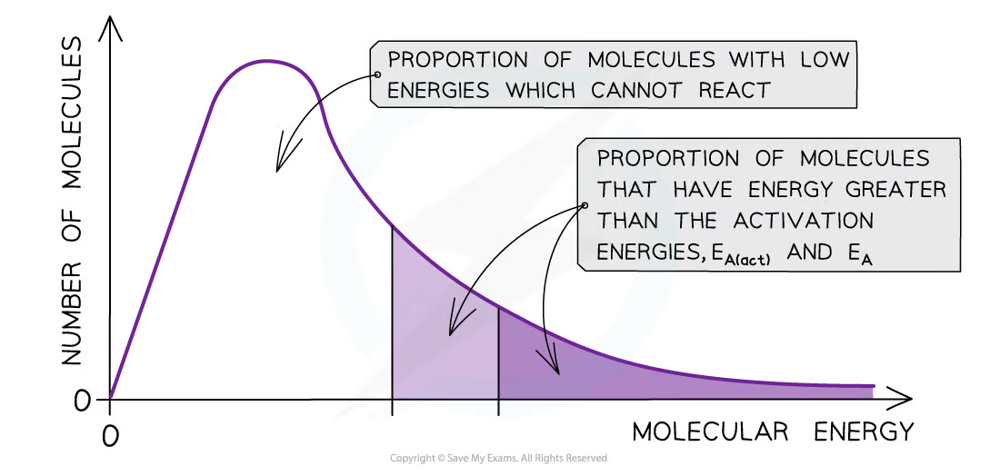
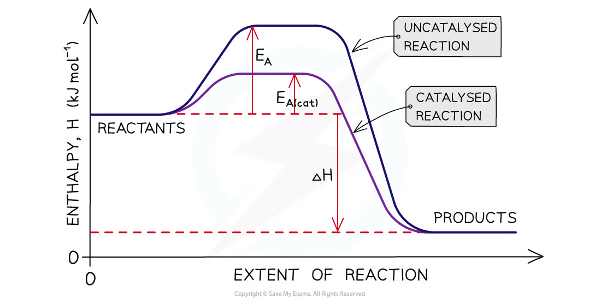

# 8 Reaction kinetics

本章对应 CIE 9701 AS Chemistry 的 **Reaction kinetics**，重点是定义和计算反应速率，用 collision theory 与 Maxwell-Boltzmann distribution 解释速率变化，并分析 catalysts 和 energy profile diagrams。

## Learning objectives

学完本章后，你应该能够：

- define and calculate average and instantaneous rates;
- explain effective collisions using energy and orientation;
- predict the effects of concentration, pressure, temperature and surface area;
- interpret Maxwell-Boltzmann distributions;
- use energy profiles to identify activation energy and enthalpy change;
- explain how homogeneous and heterogeneous catalysts change reaction rates.

## Key ideas

- Rate is a change in a measurable quantity per unit time; the gradient of a concentration/volume-time graph is the rate.
- A collision must have sufficient energy and suitable orientation to be successful.
- Temperature changes the energy distribution; concentration, pressure and surface area mainly change collision frequency.
- A catalyst gives an alternative pathway with a lower activation energy, but does not change ΔH or the equilibrium position.

## 8.1 Rate of Reaction

The rate of reaction is the change in amount or concentration of a reactant or product per unit time.

For a reactant being used up:

$$\text{rate}=\frac{-\Delta[\text{reactant}]}{\Delta t}$$

For a product being formed:

$$\text{rate}=\frac{\Delta[\text{product}]}{\Delta t}$$

Typical units are mol dm-3 s-1. If a gas volume or mass is measured, units such as cm3 s-1 or g s-1 may be used.

::: {.worked-example}
Worked example - average rate

If a reaction produces 7.0 cm3 gas in the first 100 s:

$$\text{average rate}=\frac{7.0}{100}=0.070\ \mathrm{cm^3\ s^{-1}}$$

The average rate uses two points. The instantaneous rate at a particular time is found from the gradient of a tangent to the curve at that time.
:::

On a product-volume versus time graph:

- a steep gradient means a fast reaction;
- a decreasing gradient means the reaction is slowing;
- a horizontal section means no further product is forming;
- the final height is the total amount of product, not the rate.

When comparing two curves, use the initial tangent for the initial rate. A curve can have a steeper initial gradient but the same final height if the starting amount of limiting reactant is unchanged. A larger final height means more product was made, not automatically a faster reaction.

{.note-figure fig-alt="Effective and ineffective collisions"}

{.note-figure fig-alt="Rate increases with concentration"}

### Collision theory

Particles must collide for a reaction to occur, but most collisions are ineffective. An **effective collision** requires:

1. energy equal to or greater than the activation energy, Ea;
2. the correct orientation for bonds to break and form.

The rate increases when the number of effective collisions per unit time increases.

Collision theory has two separate requirements. A collision can be energetic enough but incorrectly oriented, or correctly oriented but below Ea; either way, it is unsuccessful. Use both ideas when the question asks why a molecular reaction is slow.

::: {.study-card}
### Concentration and pressure

Increasing the concentration of a solution puts more particles in each unit volume, so collision frequency increases. For gases, increasing pressure at constant temperature also increases concentration and collision frequency. The energy distribution and Ea do not change.

{.note-figure fig-alt="Increasing concentration gives more effective collisions"}

{.note-figure fig-alt="Increasing pressure gives more frequent effective collisions"}
:::

::: {.study-card}
### Surface area

For a reaction involving a solid, smaller pieces or a powder expose a larger total surface area. More particles can collide at the surface per second, so the initial rate increases. Surface area does not change the total amount of solid available.
:::

## 8.2 Effect of Temperature on Reaction Rates - the Concept of Activation Energy

When temperature increases, particles have a greater mean kinetic energy. The Maxwell-Boltzmann distribution becomes broader, its peak becomes lower and the most probable energy moves to the right. The total area under the curve stays constant if the number of particles is unchanged.

The important rate effect is not simply “particles move faster”. The area to the right of Ea becomes larger, so the proportion of particles able to make effective collisions increases greatly.

When temperature decreases, the curve becomes taller and narrower, and the peak moves left. The area beyond Ea becomes smaller.

{.note-figure fig-alt="Maxwell-Boltzmann distributions and activation energy"}

If a catalyst is added at constant temperature, the Maxwell-Boltzmann distribution itself does not move. Instead, the Ea line moves left because the alternative pathway has a lower activation energy; the area to the right of Ea is then larger.

## 8.3 Homogeneous - Heterogeneous Catalysts

A catalyst provides an alternative reaction pathway with a lower activation energy. At the same temperature, a larger proportion of particles can react successfully, so the rate increases.

A catalyst:

- does not change ΔH or the energies of reactants and products;
- does not change the equilibrium position or final yield;
- is not used up overall;
- lowers the activation energy for both forward and reverse reactions.

A **homogeneous catalyst** is in the same physical state as the reactants. A **heterogeneous catalyst** is in a different physical state. A solid heterogeneous catalyst is often used as a powder to give a large surface area for adsorption and reaction.

For a heterogeneous catalyst, reactant molecules adsorb on active sites at the surface. Bonds can be weakened, the reactants are held close together in a favourable orientation, reaction occurs, and products desorb to free the site. Poisoning or blocking active sites lowers the rate.

{.note-figure fig-alt="Homogeneous catalyst pathway"}

{.note-figure fig-alt="Substrate adsorption and product release on a heterogeneous catalyst"}

### Energy profile diagrams

For an energy profile:

$$E_{a,\,forward}=E_{transition\ state}-E_{reactants}$$

$$E_{a,\,reverse}=E_{transition\ state}-E_{products}$$

The enthalpy change is:

$$\Delta H=E_{products}-E_{reactants}$$

Products below reactants indicate an exothermic reaction. Products above reactants indicate an endothermic reaction. A catalyst lowers the peak but leaves the reactant and product levels unchanged.

{.note-figure fig-alt="Catalysed and uncatalysed reaction pathways"}

::: {.worked-example}
Worked example - reverse activation energy

For an exothermic reaction with ΔH = -52 kJ mol-1, if the forward uncatalysed activation energy is 183 kJ mol-1:

$$E_{a,\,reverse}=183-(-52)=235\ \mathrm{kJ\ mol^{-1}}$$

For a catalysed forward activation energy of 105 kJ mol-1, the reverse value is $105-(-52)=157\ \mathrm{kJ\ mol^{-1}}$.
:::

### Planning rate experiments

Common measurements include gas volume, mass loss, concentration by titration, colour intensity and turbidity. Keep all other variables constant when investigating one factor.

For a gas-volume experiment, connect the flask to a gas syringe quickly, record volume at regular time intervals and plot volume against time. Use a tangent to determine an instantaneous rate. Repeat experiments and compare curves using both their initial gradients and final values.

Safety points include using eye protection, controlling exothermic reactions and avoiding a sealed system when gas pressure could rise dangerously.

### Common rate-experiment errors

- Start timing as the reactants are mixed; delay loses the fastest part of the reaction.
- A gas syringe must be connected before the reaction begins, and the apparatus must be airtight.
- Keep temperature, total volume, surface area and amount of limiting reagent constant unless one is the independent variable.
- Repeat readings and use a mean; identify anomalies rather than silently deleting them.
- State whether a method measures gas volume, mass loss, colour/turbidity or concentration, and choose units that match the measurement.

## Chapter checklist

- [ ] I can calculate average rate and obtain instantaneous rate from a tangent.
- [ ] I can explain effective collisions using energy and orientation.
- [ ] I can explain concentration, pressure, surface area and temperature effects.
- [ ] I can describe Maxwell-Boltzmann changes without changing the total area.
- [ ] I can calculate forward and reverse activation energies.
- [ ] I can explain homogeneous and heterogeneous catalysts.
- [ ] I can distinguish an initial-rate comparison from a comparison of final yield.
- [ ] I can explain the catalyst effect using a lower Ea, not a higher temperature or larger ΔH.

## Multiple choice questions



## Structured questions



## Original question PDFs

页面中的图表使用 PDF 内独立嵌入的图像对象提取，不使用整页截图；PDF 内为矢量绘制且没有独立图像对象的图形不强行转换。

- [1.8 Reaction Kinetics - Choice - Easy](../assets/questions/original-source/1.8_reaction_kinetics_choice_easy.pdf)
- [1.8 Reaction Kinetics - Choice - Medium](../assets/questions/original-source/1.8_reaction_kinetics_choice_medium.pdf)
- [1.8 Reaction Kinetics - Choice - Hard](../assets/questions/original-source/1.8_reaction_kinetics_choice_hard.pdf)
- [1.8 Reaction Kinetics - Structured Questions - Easy](../assets/questions/original-source/1.8_reaction_kinetics_sq_easy.pdf)
- [1.8 Reaction Kinetics - Structured Questions - Medium](../assets/questions/original-source/1.8_reaction_kinetics_sq_medium.pdf)
- [1.8 Reaction Kinetics - Structured Questions - Hard](../assets/questions/original-source/1.8_reaction_kinetics_sq_hard.pdf)

## Original note PDFs

- [8.1 Rate of Reaction](../assets/notes/kinetics-8-rebuilt/8.1_rate_of_reaction.pdf)
- [8.2 Effect of Temperature on Reaction Rates - the Concept of Activation Energy](../assets/notes/kinetics-8-rebuilt/8.2_temperature_activation_energy.pdf)
- [8.3 Homogeneous - Heterogeneous Catalysts](../assets/notes/kinetics-8-rebuilt/8.3_homogeneous_heterogeneous_catalysts.pdf)
