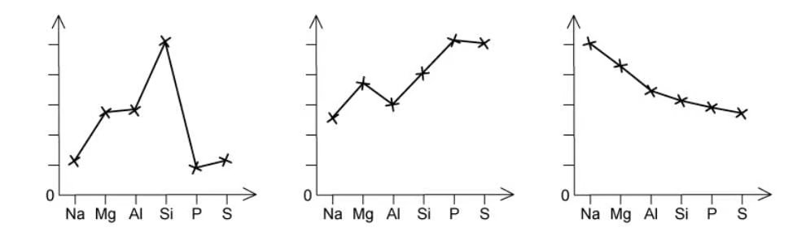
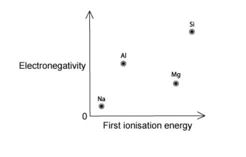
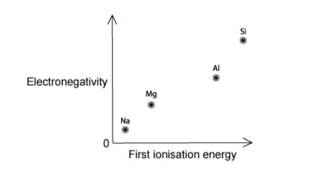
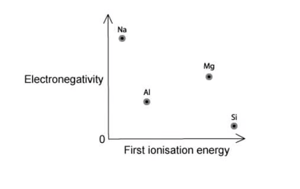
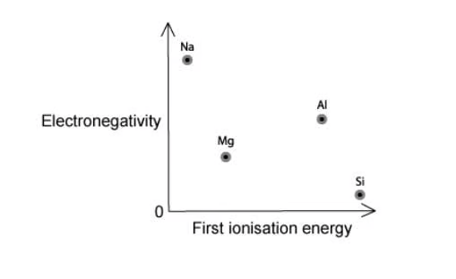
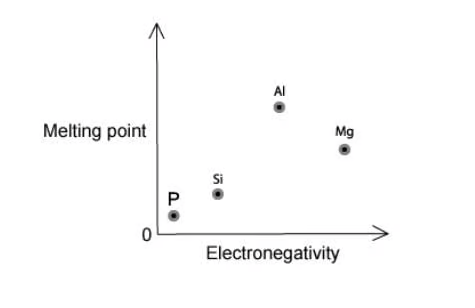
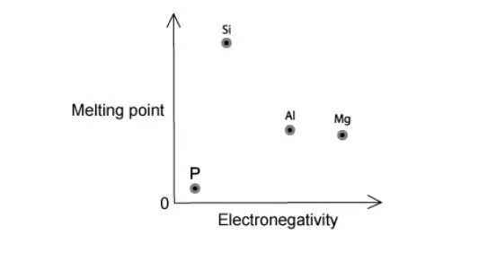
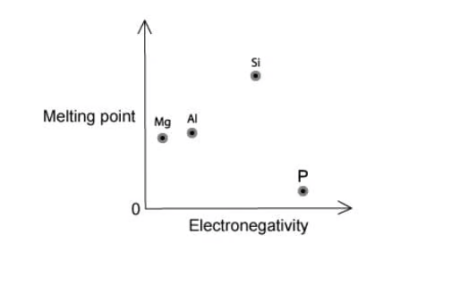
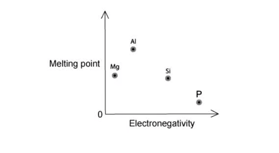
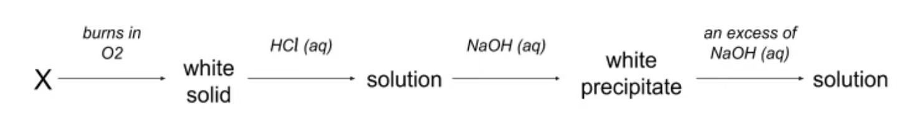

### 9 The Periodic Table: chemical periodicity — Multiple Choice: Easy

::: {.mc-question #periodicity-choice-easy-q1 data-answer="B"}
### Question 1 · Atomic radius · 2.1 Choice Easy Q1

Which statement correctly compares sodium and sulfur?

<button class="mc-choice" data-choice="A"><strong>A</strong>Sodium has the smaller atomic radius and the smaller ionic radius.</button><button class="mc-choice" data-choice="B"><strong>B</strong>Sodium has the larger atomic radius but sulfur has the larger ionic radius.</button><button class="mc-choice" data-choice="C"><strong>C</strong>Sulfur has the larger atomic radius but sodium has the larger ionic radius.</button><button class="mc-choice" data-choice="D"><strong>D</strong>Sulfur has both the larger atomic radius and the larger ionic radius.</button>

<button class="check-answer">Check answer</button>

Show explanation

<strong>B.</strong> Atomic radius decreases across Period 3. The common ions are Na+ and S2−; sulfur's ion has an extra electron shell compared with sodium's ion.

:::

::: {.mc-question #periodicity-choice-easy-q2 data-answer="C"}
### Question 2 · Basic oxide · 2.1 Choice Easy Q2

Magnesium oxide is added to water. Which statement describes the resulting solution?

<button class="mc-choice" data-choice="A"><strong>A</strong>It is acidic because magnesium oxide is covalent.</button><button class="mc-choice" data-choice="B"><strong>B</strong>It is neutral because magnesium oxide does not react with water.</button><button class="mc-choice" data-choice="C"><strong>C</strong>It is alkaline because magnesium oxide forms magnesium hydroxide.</button><button class="mc-choice" data-choice="D"><strong>D</strong>It is alkaline because magnesium oxide forms sulfuric acid.</button>

<button class="check-answer">Check answer</button>

Show explanation

<strong>C.</strong> Magnesium oxide is a basic oxide: MgO + H2O → Mg(OH)2, so the solution contains hydroxide ions.

:::

::: {.mc-question #periodicity-choice-easy-q3 data-answer="D"}
### Question 3 · Hydrolysis of phosphorus pentachloride · 2.1 Choice Easy Q3

Which observations are made when a sample of phosphorus chloride, \(\ce{PCl5}\), is added to a beaker of water?

<button class="mc-choice" data-choice="A"><strong>A</strong>No visible changes are observed.</button><button class="mc-choice" data-choice="B"><strong>B</strong>Steamy fumes are the only observation.</button><button class="mc-choice" data-choice="C"><strong>C</strong>A white precipitate is the only observation.</button><button class="mc-choice" data-choice="D"><strong>D</strong>Steamy fumes and a white precipitate are both observed.</button>

<button class="check-answer">Check answer</button>

Show explanation

<strong>D.</strong> \(\ce{PCl5 + 4H2O -> H3PO4 + 5HCl}\). Both products contribute to the acidic observation.

:::

::: {.mc-question #periodicity-choice-easy-q4 data-answer="C"}
### Question 4 · Outer-shell electrons · 2.1 Choice Easy Q4

Which substance contains an atom whose outer shell is incomplete in a simple covalent molecule?

<button class="mc-choice" data-choice="A"><strong>A</strong>\(\ce{H3O+}\)</button><button class="mc-choice" data-choice="B"><strong>B</strong>\(\ce{CH4}\)</button><button class="mc-choice" data-choice="C"><strong>C</strong>\(\ce{BF3}\)</button><button class="mc-choice" data-choice="D"><strong>D</strong>\(\ce{MgO}\)</button>

<button class="check-answer">Check answer</button>

Show explanation

<strong>C.</strong> Boron in BF3 forms three covalent bonds and has only six electrons around it.

:::

::: {.mc-question #periodicity-choice-easy-q5 data-answer="A"}
### Question 5 · Period 3 physical properties · 2.1 Choice Easy Q5

The three graphs show trends across Period 3. Which important physical property is not represented?

{.question-figure fig-alt="Three trend graphs for sodium to sulfur"}

<button class="mc-choice" data-choice="A"><strong>A</strong>Electrical conductivity</button><button class="mc-choice" data-choice="B"><strong>B</strong>Atomic radius</button><button class="mc-choice" data-choice="C"><strong>C</strong>Melting point</button><button class="mc-choice" data-choice="D"><strong>D</strong>First ionisation energy</button>

<button class="check-answer">Check answer</button>

Show explanation

<strong>A.</strong> The graphs show melting point, first ionisation energy and atomic radius. Conductivity is not shown.

:::

::: {.mc-question #periodicity-choice-easy-q6 data-answer="C"}
### Question 6 · Formula and mole ratio · 2.1 Choice Easy Q6

Silicon reacts with chlorine to produce silicon chloride. How many moles of chlorine are needed to react with 1 mole of silicon?

<button class="mc-choice" data-choice="A"><strong>A</strong>2</button><button class="mc-choice" data-choice="B"><strong>B</strong>3</button><button class="mc-choice" data-choice="C"><strong>C</strong>4</button><button class="mc-choice" data-choice="D"><strong>D</strong>5</button>

<button class="check-answer">Check answer</button>

Show explanation

<strong>C.</strong> The formula of the chloride is SiCl4, so one mole of silicon is combined with four moles of chlorine atoms.

:::

::: {.mc-question #periodicity-choice-easy-q7 data-answer="A"}
### Question 7 · Oxide stoichiometry · 2.1 Choice Easy Q7

During the manufacture of steel, the impurity \(\ce{P4O10}\) is removed by reacting it with calcium oxide. The only product is calcium phosphate, \(\ce{Ca3(PO4)2}\). How many moles of \(\ce{P4O10}\) react with three moles of calcium oxide?

<button class="mc-choice" data-choice="A"><strong>A</strong>0.5</button><button class="mc-choice" data-choice="B"><strong>B</strong>1.5</button><button class="mc-choice" data-choice="C"><strong>C</strong>3</button><button class="mc-choice" data-choice="D"><strong>D</strong>6</button>

<button class="check-answer">Check answer</button>

Show explanation

<strong>A.</strong> \(\ce{P4O10 + 6CaO -> 2Ca3(PO4)2}\), so three moles of CaO react with 0.5 mol of P4O10.

:::

::: {.mc-question #periodicity-choice-easy-q8 data-answer="B"}
### Question 8 · Acidic chlorides · 2.1 Choice Easy Q8

Which two chlorides give approximately neutral solutions when added to water?

1. \(\ce{MgCl2}\)  2. \(\ce{NaCl}\)  3. \(\ce{SiCl4}\)

<button class="mc-choice" data-choice="A"><strong>A</strong>1 and 3</button><button class="mc-choice" data-choice="B"><strong>B</strong>1 and 2</button><button class="mc-choice" data-choice="C"><strong>C</strong>2 and 3</button><button class="mc-choice" data-choice="D"><strong>D</strong>1, 2 and 3</button>

<button class="check-answer">Check answer</button>

Show explanation

<strong>B.</strong> The ionic chlorides MgCl2 and NaCl do not hydrolyse significantly. SiCl4 hydrolyses to give HCl.

:::

::: {.mc-question #periodicity-choice-easy-q9 data-answer="C"}
### Question 9 · Isoelectronic ions · 2.1 Choice Easy Q9

Which is the order of increasing radius for \(\ce{O^{2-}}\), Ne and \(\ce{Mg^{2+}}\)?

<button class="mc-choice" data-choice="A"><strong>A</strong>\(\ce{O^{2-} < Ne < Mg^{2+}}\)</button><button class="mc-choice" data-choice="B"><strong>B</strong>\(\ce{Ne < Mg^{2+} < O^{2-}}\)</button><button class="mc-choice" data-choice="C"><strong>C</strong>\(\ce{Mg^{2+} < Ne < O^{2-}}\)</button><button class="mc-choice" data-choice="D"><strong>D</strong>\(\ce{Mg^{2+} < O^{2-} < Ne}\)</button>

<button class="check-answer">Check answer</button>

Show explanation

<strong>C.</strong> These species each have ten electrons. More protons attract the same electron cloud more strongly, so Mg2+ is smallest and O2− is largest.

:::

::: {.mc-question #periodicity-choice-easy-q10 data-answer="A"}
### Question 10 · Electronegativity and first ionisation energy · 2.1 Choice Easy Q10

Which graph correctly shows the relative electronegativities and first ionisation energies of Na, Mg, Al and Si?

<button class="mc-choice" data-choice="A"><strong>A</strong>Graph A</button><button class="mc-choice" data-choice="B"><strong>B</strong>Graph B</button><button class="mc-choice" data-choice="C"><strong>C</strong>Graph C</button><button class="mc-choice" data-choice="D"><strong>D</strong>Graph D</button>

<button class="check-answer">Check answer</button>

Show explanation

<strong>A.</strong> Electronegativity increases steadily from Na to Si, while first ionisation energy has the Mg–Al dip because Al loses a 3p electron.

:::

### 9 The Periodic Table: chemical periodicity — Multiple Choice: Medium

::: {.mc-question #periodicity-choice-medium-q1 data-answer="D"}
### Question 11 · Hydrolysis of Period 3 chlorides · 2.1 Choice Medium Q1

Which Period 3 chloride does not produce hydrogen chloride fumes when added to water?

<button class="mc-choice" data-choice="A"><strong>A</strong>\(\ce{AlCl3}\)</button><button class="mc-choice" data-choice="B"><strong>B</strong>\(\ce{SiCl4}\)</button><button class="mc-choice" data-choice="C"><strong>C</strong>\(\ce{PCl5}\)</button><button class="mc-choice" data-choice="D"><strong>D</strong>\(\ce{MgCl2}\)</button>

<button class="check-answer">Check answer</button>

Show explanation

<strong>D.</strong> Magnesium chloride is an ionic chloride and dissolves without significant hydrolysis. The other three chlorides hydrolyse and produce HCl.

:::

::: {.mc-question #periodicity-choice-medium-q2 data-answer="C"}
### Question 12 · Melting points of chlorides · 2.1 Choice Medium Q2

Which order gives decreasing melting point for HCl, \(\ce{MgCl2}\), \(\ce{CCl4}\) and \(\ce{S2Cl2}\)?

<button class="mc-choice" data-choice="A"><strong>A</strong>\(\ce{HCl > CCl4 > S2Cl2 > MgCl2}\)</button><button class="mc-choice" data-choice="B"><strong>B</strong>\(\ce{MgCl2 > S2Cl2 > CCl4 > HCl}\)</button><button class="mc-choice" data-choice="C"><strong>C</strong>\(\ce{MgCl2 > CCl4 > S2Cl2 > HCl}\)</button><button class="mc-choice" data-choice="D"><strong>D</strong>\(\ce{CCl4 > MgCl2 > HCl > S2Cl2}\)</button>

<button class="check-answer">Check answer</button>

Show explanation

<strong>C.</strong> The ionic lattice in MgCl2 gives the highest melting point. Among simple molecular substances, larger molecules generally have stronger London forces.

:::

::: {.mc-question #periodicity-choice-medium-q3 data-answer="A"}
### Question 13 · Consecutive Period 3 elements · 2.1 Choice Medium Q3

X, Y and Z are consecutive Period 3 elements. Y has the highest first ionisation energy and the lowest melting point of the three. Which set is possible?

<button class="mc-choice" data-choice="A"><strong>A</strong>X = Si, Y = P, Z = S</button><button class="mc-choice" data-choice="B"><strong>B</strong>X = Na, Y = Mg, Z = Al</button><button class="mc-choice" data-choice="C"><strong>C</strong>X = P, Y = S, Z = Cl</button><button class="mc-choice" data-choice="D"><strong>D</strong>X = Mg, Y = Al, Z = Si</button>

<button class="check-answer">Check answer</button>

Show explanation

<strong>A.</strong> Phosphorus has a local maximum in first ionisation energy and is a simple molecular solid with a low melting point compared with silicon.

:::

::: {.mc-question #periodicity-choice-medium-q4 data-answer="C"}
### Question 14 · Period 4 oxides · 2.1 Choice Medium Q4

Which pair of Period 4 elements forms oxides that give acidic solutions in water?

<button class="mc-choice" data-choice="A"><strong>A</strong>Ga and Ge</button><button class="mc-choice" data-choice="B"><strong>B</strong>Ge and As</button><button class="mc-choice" data-choice="C"><strong>C</strong>As and Se</button><button class="mc-choice" data-choice="D"><strong>D</strong>Ga and Se</button>

<button class="check-answer">Check answer</button>

Show explanation

<strong>C.</strong> The oxides become more covalent and acidic across the period. Arsenic and selenium form acidic oxides; gallium oxide is amphoteric and germanium oxide is less strongly acidic.

:::

::: {.mc-question #periodicity-choice-medium-q5 data-answer="C"}
### Question 15 · Melting point and electronegativity · 2.1 Choice Medium Q5

Which graph correctly shows the relationship between melting point and electronegativity for Mg, Al, Si and P?

<button class="mc-choice" data-choice="A"><strong>A</strong>Graph A</button><button class="mc-choice" data-choice="B"><strong>B</strong>Graph B</button><button class="mc-choice" data-choice="C"><strong>C</strong>Graph C</button><button class="mc-choice" data-choice="D"><strong>D</strong>Graph D</button>

<button class="check-answer">Check answer</button>

Show explanation

<strong>C.</strong> Silicon has a giant covalent structure and the highest melting point; phosphorus is simple molecular and has the lowest. Electronegativity increases from Mg to P.

:::

::: {.mc-question #periodicity-choice-medium-q6 data-answer="A"}
### Question 16 · Structure and properties · 2.1 Choice Medium Q6

Which statement about silicon dioxide, sodium chloride and aluminium is correct?

<button class="mc-choice" data-choice="A"><strong>A</strong>Silicon dioxide has a giant covalent structure, sodium chloride has a giant ionic structure, and aluminium conducts electricity as a solid.</button><button class="mc-choice" data-choice="B"><strong>B</strong>All three substances contain simple covalent molecules.</button><button class="mc-choice" data-choice="C"><strong>C</strong>Sodium chloride conducts electricity as a solid because its ions are mobile.</button><button class="mc-choice" data-choice="D"><strong>D</strong>Silicon dioxide has a low melting point because it contains weak intermolecular forces.</button>

<button class="check-answer">Check answer</button>

Show explanation

<strong>A.</strong> The structures are giant covalent, giant ionic and metallic respectively. Delocalised electrons allow aluminium to conduct as a solid.

:::

::: {.mc-question #periodicity-choice-medium-q7 data-answer="A"}
### Question 17 · 3p electrons and acidic oxides · 2.1 Choice Medium Q7

Which combination is correct for sulfur and phosphorus?

<button class="mc-choice" data-choice="A"><strong>A</strong>Sulfur has an oxide that forms a strong acid in water; phosphorus has no paired 3p electrons and also forms an acidic oxide.</button><button class="mc-choice" data-choice="B"><strong>B</strong>Sulfur has no paired 3p electrons; phosphorus forms only a basic oxide.</button><button class="mc-choice" data-choice="C"><strong>C</strong>Neither element forms an acidic oxide.</button><button class="mc-choice" data-choice="D"><strong>D</strong>Only sulfur has no paired 3p electrons.</button>

<button class="check-answer">Check answer</button>

Show explanation

<strong>A.</strong> Sulfur has a paired 3p electron, whereas phosphorus has a 3p3 configuration. Both can form acidic oxides.

:::

### 9 The Periodic Table: chemical periodicity — Multiple Choice: Hard

::: {.mc-question #periodicity-choice-hard-q1 data-answer="A"}
### Question 18 · Aluminium chloride observations · 2.1 Choice Hard Q1

Which set of observations is inconsistent with aluminium chloride?

<button class="mc-choice" data-choice="A"><strong>A</strong>It gives a solution of pH 12 and has a melting point close to that of sodium chloride.</button><button class="mc-choice" data-choice="B"><strong>B</strong>It is a white crystalline solid and its solution is acidic.</button><button class="mc-choice" data-choice="C"><strong>C</strong>It has a lower melting point than expected for a purely ionic lattice.</button><button class="mc-choice" data-choice="D"><strong>D</strong>It hydrolyses in water and produces hydrogen ions.</button>

<button class="check-answer">Check answer</button>

Show explanation

<strong>A.</strong> Aluminium chloride hydrolyses to give an acidic solution, not pH 12. Its covalent character also gives it a much lower melting point than sodium chloride.

:::

::: {.mc-question #periodicity-choice-hard-q2 data-answer="C"}
### Question 19 · Amphoteric aluminium oxide · 2.1 Choice Hard Q2

The original scheme shows the reactions of an unknown element X.

{.question-figure fig-alt="Reaction sequence showing combustion, acid reaction and amphoteric hydroxide"}

Which element could be X?

<button class="mc-choice" data-choice="A"><strong>A</strong>Mg</button><button class="mc-choice" data-choice="B"><strong>B</strong>Si</button><button class="mc-choice" data-choice="C"><strong>C</strong>Al</button><button class="mc-choice" data-choice="D"><strong>D</strong>P</button>

<button class="check-answer">Check answer</button>

Show explanation

<strong>C.</strong> Aluminium burns to form amphoteric Al2O3. It reacts with acid, then gives Al(OH)3 which dissolves in excess sodium hydroxide.

:::

::: {.mc-question #periodicity-choice-hard-q3 data-answer="D"}
### Question 20 · Successive trends in Group 2 · 2.1 Choice Hard Q3

Four elements are Davy's elements: Mg, B, Na and Ca. Which element has the third-lowest first ionisation energy in its period and the third-smallest atomic radius in its group?

<button class="mc-choice" data-choice="A"><strong>A</strong>Mg</button><button class="mc-choice" data-choice="B"><strong>B</strong>B</button><button class="mc-choice" data-choice="C"><strong>C</strong>Na</button><button class="mc-choice" data-choice="D"><strong>D</strong>Ca</button>

<button class="check-answer">Check answer</button>

Show explanation

<strong>D.</strong> Group 2 elements have the third-lowest first ionisation energy in their periods because the Group 3 p electron is easier to remove. The third-smallest Group 2 radius is the Period 4 member, calcium.

:::
