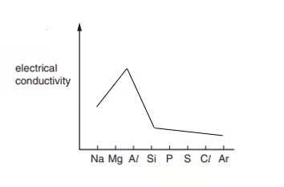
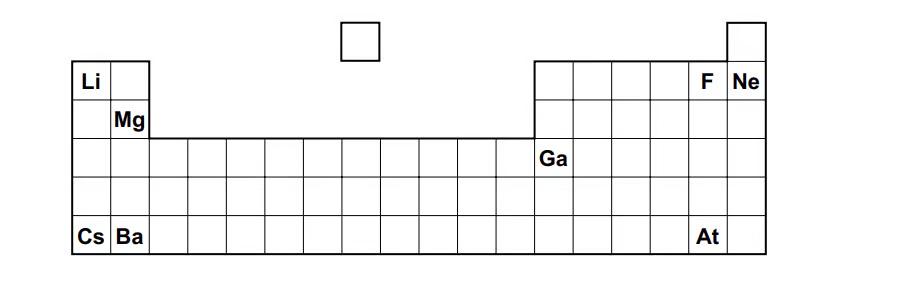
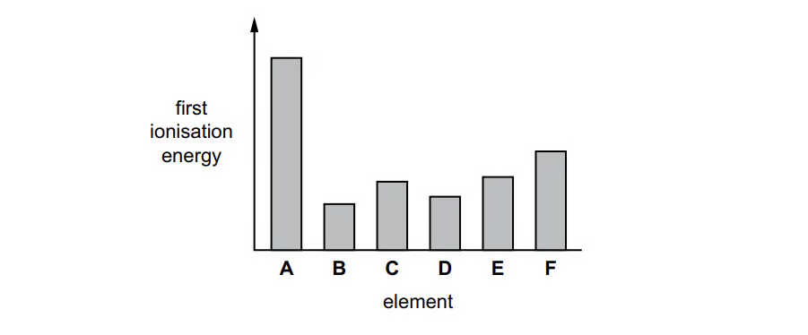
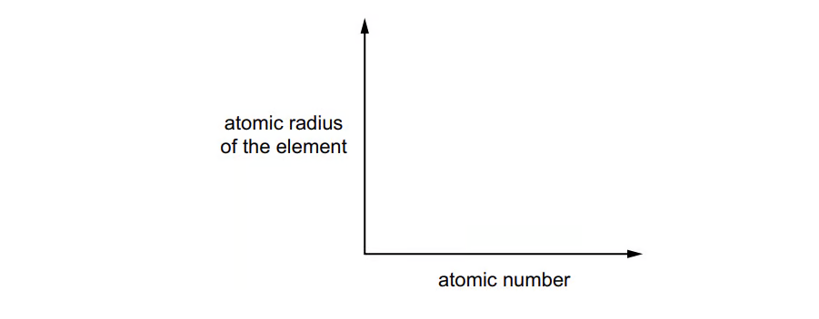
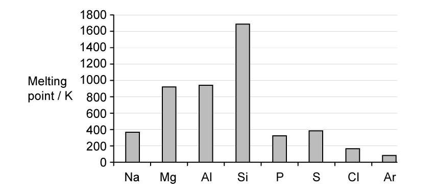
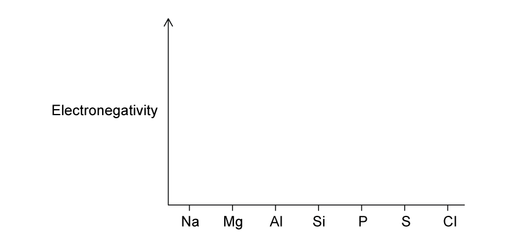

### 9 The Periodic Table: chemical periodicity — Structured Questions: Easy

::: {.question-card}
### Question 1 · Atomic radius and conductivity · 2.1 SQ Easy Q1

Fig. 1.1 shows the electrical conductivity trend across Period 3.

{.question-figure fig-alt="Electrical conductivity graph from sodium to argon"}

**(a)** State and explain the general trend in atomic radius across Period 3. `[3 marks]`

**(b)** Explain why aluminium has a much higher electrical conductivity than sulfur. Refer to the structure of both elements. `[2 marks]`  
**(c)** Explain why aluminium has a higher electrical conductivity than magnesium. `[2 marks]`

**(d)** The melting points of three successive elements in Period 3 are Al = 660 °C, Si = 1410 °C and P = 44 °C. Explain, referring to structure and bonding, why the melting point of silicon is high and phosphorus is low. `[6 marks]`

Show mark scheme / model answer
<ul><li><strong>(a)</strong> Atomic radius decreases from Na to Ar. Proton number/nuclear charge increases while electrons are added to the same shell; shielding is similar, so attraction to the outer electrons increases.</li><li><strong>(b)</strong> Aluminium has a metallic lattice with delocalised electrons. Sulfur is simple molecular and has no mobile charged particles.</li><li><strong>(c)</strong> Aluminium has more delocalised electrons and stronger metallic bonding than magnesium.</li><li><strong>(d)</strong> Silicon has a giant covalent lattice with many strong covalent bonds that must be broken. Phosphorus exists as simple molecular P4; only weak London forces between molecules need to be overcome.</li></ul>

:::

::: {.question-card}
### Question 2 · Period 3 oxides · 2.1 SQ Easy Q2

Consider the oxides \(\ce{Na2O, MgO, Al2O3, SiO2, P4O10}\) and \(\ce{SO2}\).

The melting points of some oxides from sodium to sulfur are: Na2O 1193 K, MgO 3173 K, Al2O3 2313 K, SiO2 1883 K, P4O10 613 K and SO2 198 K.

**(a)** State what is broken when Na2O, SiO2 and P4O10 are melted. `[3 marks]`  
**(b)** Give one oxide that reacts with water to produce a hydroxide, one that produces an acid, and one that has no reaction with water. `[3 marks]`  
**(c)** For MgO, Al2O3 and SO2, state whether a reaction occurs with aqueous HCl and with aqueous NaOH. `[3 marks]`

Show mark scheme / model answer
<ul><li><strong>(a)</strong> In Na2O, ionic attractions are broken; in SiO2, covalent bonds are broken; in P4O10, intermolecular forces are overcome.</li><li><strong>(b)</strong> Hydroxide: Na2O; acid: SO2; no reaction: SiO2.</li><li><strong>(c)</strong> MgO reacts with HCl but not NaOH; Al2O3 reacts with both; SO2 reacts with NaOH but not HCl.</li></ul>

:::

::: {.question-card}
### Question 3 · Period 3 chlorides · 2.1 SQ Easy Q3

**(a)** Write the balanced equation for aluminium reacting with chlorine. `[2 marks]`  
**(b)** Complete the oxidation numbers of the Period 3 elements in their chlorides: NaCl, MgCl2, AlCl3, SiCl4, PCl3 and SCl2. `[4 marks]`  
**(c)** Magnesium chloride is dissolved in water. State an observation and predict the pH. `[2 marks]`  
**(d)** Write the equation for the hydrolysis of phosphorus pentachloride. `[2 marks]`

Show mark scheme / model answer
<ul><li><strong>(a)</strong> \(\ce{2Al + 3Cl2 -> 2AlCl3}\).</li><li><strong>(b)</strong> Na +1, Mg +2, Al +3, Si +4, P +3 and S +2 for the formulas shown.</li><li><strong>(c)</strong> It dissolves to give a colourless solution with no fumes; pH is approximately 7.</li><li><strong>(d)</strong> \(\ce{PCl5 + 4H2O -> H3PO4 + 5HCl}\).</li></ul>

:::

### 9 The Periodic Table: chemical periodicity — Structured Questions: Medium

::: {.question-card}
### Question 4 · Periodic position and ionisation energy · 2.1 SQ Medium Q1

Fig. 1.1 shows part of the periodic table. Fig. 1.2 shows the first ionisation energies of six consecutive elements, A–F.

{.question-figure fig-alt="Partial periodic table with labelled elements"}
{.question-figure fig-alt="Bar chart of first ionisation energies for A to F"}

**(a)(i)** Identify the element whose atom forms a soluble hydroxide and an insoluble sulfate. `[1 mark]`  
**(a)(ii)** Identify the most volatile element in a group that contains elements in all three states of matter at room temperature and pressure. `[1 mark]`  
**(a)(iii)** Identify the element that forms the largest cation. `[1 mark]`  
**(b)** Define first ionisation energy. `[2 marks]`  
**(c)** Explain why the first ionisation energy of B is lower than that of A in Fig. 1.2. `[2 marks]`  
**(d)** Fig. 1.3 is a blank graph for the atomic-radius trend across a period. Sketch the trend and explain it. `[3 marks]`

{.question-figure fig-alt="Blank graph for atomic radius against atomic number"}

Show mark scheme / model answer
<ul><li><strong>(a)</strong> (i) Mg; (ii) F; (iii) Cs.</li><li><strong>(b)</strong> The energy required to remove one mole of electrons from one mole of gaseous atoms to form one mole of gaseous singly charged ions.</li><li><strong>(c)</strong> B is at the start of a new period/shell, so its outer electron is farther from the nucleus and more shielded.</li><li><strong>(d)</strong> The curve decreases across the period. Nuclear charge increases while electrons enter the same shell, so effective attraction increases.</li></ul>

:::

::: {.question-card}
### Question 5 · Classifying Period 3 oxides · 2.1 SQ Medium Q2

**(a)** Classify each of \(\ce{Na2O, MgO, Al2O3, SiO2, P4O10, SO2}\) as basic, amphoteric or acidic. `[3 marks]`  
**(b)** Write equations for sodium oxide and sulfur dioxide reacting with water, and state the approximate pH of each solution. `[4 marks]`  
**(c)** State the oxidation numbers of sodium in \(\ce{Na2O}\) and sulfur in \(\ce{SO2}\). `[2 marks]`  
**(d)** Explain why sodium oxide has a much higher melting point than sulfur dioxide. `[3 marks]`

Show mark scheme / model answer
<ul><li><strong>(a)</strong> Basic: Na2O, MgO; amphoteric: Al2O3; acidic: SiO2, P4O10, SO2.</li><li><strong>(b)</strong> \(\ce{Na2O + H2O -> 2NaOH}\), alkaline pH; \(\ce{SO2 + H2O <=> H2SO3}\), acidic pH.</li><li><strong>(c)</strong> Na is +1; S is +4.</li><li><strong>(d)</strong> Sodium oxide is giant ionic, with strong electrostatic attraction throughout the lattice. Sulfur dioxide is simple molecular, so only weak intermolecular forces are overcome.</li></ul>

:::

::: {.question-card}
### Question 6 · Melting point and electronegativity · 2.1 SQ Medium Q3

Fig. 3.1 shows Period 3 melting points. Fig. 3.2 is a blank graph for electronegativity.

{.question-figure fig-alt="Melting point bar chart for Period 3"}

**(a)** Explain the rise in melting point from sodium to aluminium. `[3 marks]`  
**(b)** Explain why silicon has a much higher melting point than the other Period 3 elements. `[2 marks]`  
**(c)** Explain the variation from phosphorus to argon. `[3 marks]`  
**(d)** Define electronegativity and sketch its trend on Fig. 3.2. `[3 marks]`

{.question-figure fig-alt="Blank graph for electronegativity across Period 3"}

Show mark scheme / model answer
<ul><li><strong>(a)</strong> Metallic bonding strengthens as the number of delocalised electrons and the charge density of the metal ions increase.</li><li><strong>(b)</strong> Silicon has a giant covalent structure; many strong covalent bonds must be broken.</li><li><strong>(c)</strong> P, S, Cl and Ar are simple molecular/atomic substances. Their melting points depend mainly on London forces; S8 is larger than P4, while chlorine and argon have weaker attractions.</li><li><strong>(d)</strong> Electronegativity is the attraction of an atom for the bonding electron pair. It increases from Na to Cl because nuclear charge increases and atomic radius decreases.</li></ul>

:::

::: {.question-card}
### Question 7 · Chloride structure and hydrolysis · 2.1 SQ Medium Q4

**(a)** Write the equation for phosphorus reacting with chlorine to form phosphorus pentachloride. `[2 marks]`  
**(b)** Explain the high melting point of sodium chloride. `[2 marks]`  
**(c)** Explain why silicon tetrachloride is a liquid with a low melting point. `[2 marks]`  
**(d)** Write an equation for the hydrolysis of silicon tetrachloride and state the pH of the final solution. `[3 marks]`

Show mark scheme / model answer
<ul><li><strong>(a)</strong> \(\ce{P4 + 10Cl2 -> 4PCl5}\).</li><li><strong>(b)</strong> Sodium chloride has a giant ionic lattice with strong attraction between oppositely charged ions.</li><li><strong>(c)</strong> Silicon tetrachloride is made of simple covalent molecules; only weak London forces act between molecules.</li><li><strong>(d)</strong> \(\ce{SiCl4 + 2H2O -> SiO2 + 4HCl}\). The solution is acidic.</li></ul>

:::

### 9 The Periodic Table: chemical periodicity — Structured Questions: Hard

::: {.question-card}
### Question 8 · Acid–base reactions of oxides · 2.1 SQ Hard Q1

**(a)** Write equations for sodium oxide and sulfur dioxide reacting with water, and state one observation for each. `[4 marks]`  
**(b)** Write the net ionic equation for sodium silicate reacting with nitric acid to form silicic acid. `[2 marks]`  
**(c)** Oxide A is amphoteric. Write equations for its reactions with potassium hydroxide and nitric acid. `[4 marks]`

Show mark scheme / model answer
<ul><li><strong>(a)</strong> \(\ce{Na2O + H2O -> 2NaOH}\), alkaline solution; \(\ce{SO2 + H2O <=> H2SO3}\), acidic solution.</li><li><strong>(b)</strong> \(\ce{SiO3^{2-} + 2H+ -> H2SiO3}\).</li><li><strong>(c)</strong> For Al2O3: \(\ce{Al2O3 + 2OH- + 3H2O -> 2[Al(OH)4]-}\); \(\ce{Al2O3 + 6HNO3 -> 2Al(NO3)3 + 3H2O}\).</li></ul>

:::

::: {.question-card}
### Question 9 · Phosphorus(V) oxide · 2.1 SQ Hard Q2

**(a)** Describe the change in acid–base character of the Period 3 oxides from sodium to chlorine and explain it using electronegativity. `[4 marks]`  
**(b)** Write the equation for phosphorus(V) oxide reacting with water and state the pH of the product. Explain why phosphorus(V) oxide has a low melting point. `[4 marks]`  
**(c)** Write the equation for phosphorus(V) oxide reacting with aqueous sodium hydroxide. State whether phosphorus is oxidised or reduced in this reaction. `[3 marks]`

Show mark scheme / model answer
<ul><li><strong>(a)</strong> The oxides change from basic through amphoteric to acidic. Electronegativity increases across the period, so bonding becomes more covalent and the oxides are less able to supply oxide ions; covalent oxides form acidic solutions.</li><li><strong>(b)</strong> \(\ce{P4O10 + 6H2O -> 4H3PO4}\); pH is below 7. It is simple molecular, so only weak intermolecular forces act between molecules.</li><li><strong>(c)</strong> \(\ce{P4O10 + 12NaOH -> 4Na3PO4 + 6H2O}\). Phosphorus remains at +5, so this is not a redox reaction.</li></ul>

:::

::: {.question-card}
### Question 10 · Silicon chloride and silicon dioxide · 2.1 SQ Hard Q3

**(a)** Silicon reacts with chlorine to form silicon tetrachloride. Describe the bonding and shape in a molecule of \(\ce{SiCl4}\). `[3 marks]`  
**(b)** Explain why \(\ce{SiCl4}\) hydrolyses but \(\ce{CCl4}\) does not hydrolyse appreciably. `[4 marks]`  
**(c)** Write an equation showing the acidic reaction of silicon dioxide with aqueous sodium hydroxide. Explain why silicon dioxide does not react with hydrochloric acid. `[4 marks]`

Show mark scheme / model answer
<ul><li><strong>(a)</strong> Four polar covalent Si–Cl bonds; tetrahedral shape with bond angle approximately 109.5°.</li><li><strong>(b)</strong> Silicon can accept electron density from water and can expand its valence shell in the hydrolysis process. Carbon is smaller and cannot expand its outer shell; the C–Cl bonds are not attacked appreciably by water.</li><li><strong>(c)</strong> \(\ce{SiO2 + 2OH- -> SiO3^{2-} + H2O}\) (or the molecular equation with sodium hydroxide). Silicon dioxide is an acidic covalent oxide and has no basic oxide ions/available basic sites to neutralise hydrochloric acid.</li></ul>

:::
