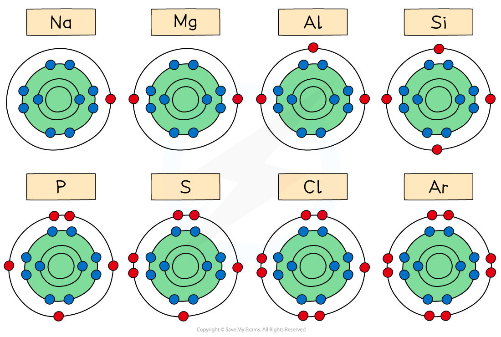
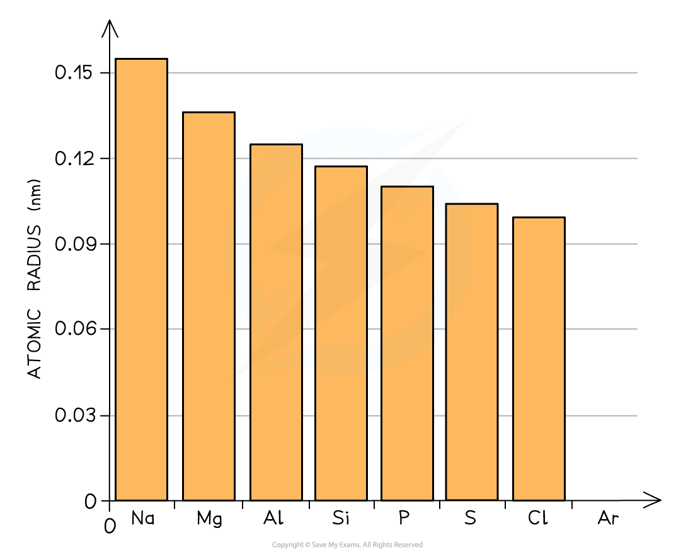
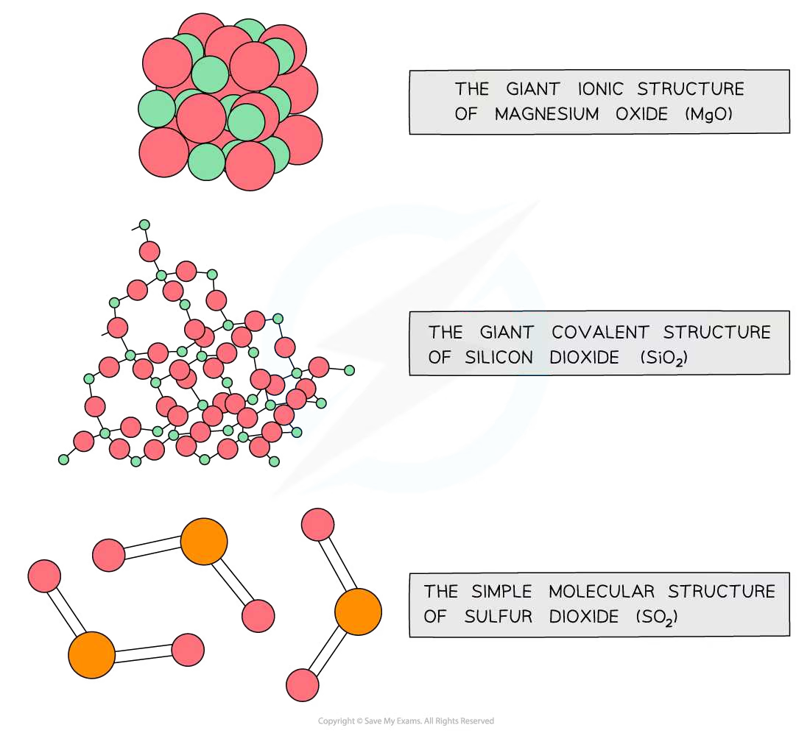
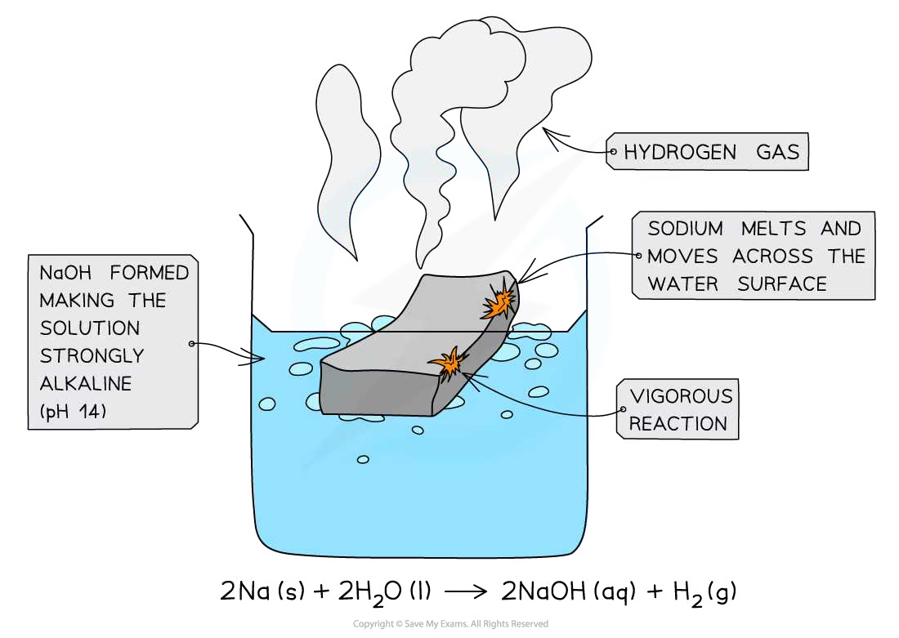

# 9 The Periodic Table: chemical periodicity

本章介绍元素在周期表中的位置与电子排布之间的关系，并用核电荷、电子层数、屏蔽效应和结构类型解释周期性。题目覆盖 Period 3 的物理性质、氧化物和氯化物，也延伸到相邻周期元素的比较。

## Learning objectives

学完本章后，你应该能够：

- explain how groups and periods relate to electron configurations;
- predict trends in atomic radius, ionic radius, first ionisation energy and electronegativity;
- explain the structures and physical properties of Period 3 elements;
- classify Period 3 oxides as basic, amphoteric or acidic;
- write equations for reactions of oxides and chlorides with water, acids and alkalis;
- use successive ionisation energies to identify groups and oxidation states.

## 9.1 Periodic table and electron structure

The **period number** is the number of occupied electron shells. For main-group elements, the **group number** is related to the number of electrons in the outer shell. Elements in the same group have similar chemical properties because they have similar outer-shell configurations.

Across a period, proton number increases while electrons are added to the same principal shell. The nuclear charge therefore increases, whereas shielding changes much less. Down a group, an extra occupied shell is added at each step, so shielding and the distance of the outer electron from the nucleus increase.

{.note-figure fig-alt="Electron-shell structures across Period 3"}

## 9.2 Atomic radius and ionic radius

Atomic radius generally **decreases across a period** because the increasing nuclear charge attracts the outer electrons more strongly while they remain in the same shell. It **increases down a group** because the outer electrons are in shells farther from the nucleus and are more shielded.

For isoelectronic ions, the species with more protons has the smaller radius. For example:

$$\ce{Mg^{2+} < Na+ < Ne < F- < O^{2-}}$$

All five species have ten electrons, but the nuclear charge increases from left to right in this comparison.

## 9.3 First ionisation energy

The first ionisation energy is the energy required to remove one mole of electrons from one mole of gaseous atoms to form one mole of gaseous singly charged ions:

$$\ce{X(g) -> X+(g) + e-}$$

It generally increases across a period because nuclear attraction increases and atomic radius decreases. It decreases down a group because the outer electron is farther from the nucleus and more shielded.

There are two important Period 3 exceptions. Aluminium has a lower first ionisation energy than magnesium because the electron removed from Al is in a higher-energy 3p orbital. Sulfur has a lower value than phosphorus because sulfur has a paired 3p electron, so electron–electron repulsion makes removal easier.

Successive ionisation energies show the group number from the position of the large jump. A large jump after the second electron, for example, indicates two outer-shell electrons and therefore Group 2.

## 9.4 Electronegativity

Electronegativity is the ability of an atom to attract the bonding pair of electrons in a covalent bond. It generally increases across a period and decreases down a group. A smaller atom with a greater effective nuclear charge attracts bonding electrons more strongly.

Electronegativity helps explain the change from ionic bonding at the left of Period 3 to more covalent bonding at the right. It also helps predict the polarity and hydrolysis of covalent chlorides.

## 9.5 Physical properties across Period 3

The melting points of Period 3 elements rise from sodium to magnesium and aluminium because metallic bonding becomes stronger as the number of delocalised electrons and the positive charge of the ions increase. Silicon has a very high melting point because it has a giant covalent structure.

Phosphorus, sulfur, chlorine and argon are simple molecular or atomic substances. Their melting points are much lower than silicon's. Sulfur has a higher melting point than phosphorus and chlorine because it exists as larger \(\ce{S8}\) molecules with stronger London forces.

{.note-figure fig-alt="Melting-point trend across Period 3"}

Electrical conductivity also follows structure. Sodium, magnesium and aluminium conduct as metals, silicon is a semiconductor, and the simple molecular substances do not conduct electricity in the solid state.

## 9.6 Oxides across Period 3

The oxides become less ionic and more covalent from left to right:

| Oxide | Structure / bonding | Acid–base character |
|---|---|---|
| \(\ce{Na2O}\), \(\ce{MgO}\) | giant ionic | basic |
| \(\ce{Al2O3}\) | giant lattice with significant covalent character | amphoteric |
| \(\ce{SiO2}\) | giant covalent | acidic oxide |
| \(\ce{P4O10}\), \(\ce{SO2}\), \(\ce{Cl2O7}\) | simple covalent molecules | acidic |

Basic oxides react with water to form hydroxides, while acidic oxides react with water to form acids:

$$\ce{Na2O(s) + H2O(l) -> 2NaOH(aq)}$$
$$\ce{SO2(g) + H2O(l) <=> H2SO3(aq)}$$

Aluminium oxide is amphoteric:

$$\ce{Al2O3(s) + 6HCl(aq) -> 2AlCl3(aq) + 3H2O(l)}$$
$$\ce{Al2O3(s) + 2OH-(aq) + 3H2O(l) -> 2[Al(OH)4]-(aq)}$$

{.note-figure fig-alt="Giant ionic, giant covalent and simple molecular oxide structures"}

## 9.7 Chlorides across Period 3

Sodium chloride and magnesium chloride are predominantly ionic. Their aqueous solutions are approximately neutral because the ions do not hydrolyse significantly. Aluminium chloride has covalent character and hydrolyses to give an acidic solution. Silicon tetrachloride and phosphorus pentachloride are simple covalent chlorides that react vigorously with water and produce hydrogen chloride.

Examples:

$$\ce{SiCl4(l) + 2H2O(l) -> SiO2(s) + 4HCl(aq)}$$
$$\ce{PCl5(s) + 4H2O(l) -> H3PO4(aq) + 5HCl(aq)}$$

The hydrolysis of \(\ce{SiCl4}\) is possible because silicon can accept electron density from water and the Si–Cl bonds are polar. Carbon tetrachloride does not hydrolyse appreciably: carbon cannot expand its outer shell in the same way and the C–Cl bonds are less susceptible to attack by water.

{.note-figure fig-alt="Sodium reacting with water"}

## 9.8 Using periodicity in unfamiliar elements

The same reasoning can be applied below Period 3. For example, oxides of Group 13 elements become more basic down the group, while oxides of Group 16 elements become more acidic across a period. Always identify the structure first, then relate the physical or chemical property to:

1. nuclear charge and electron configuration;
2. shell number and shielding;
3. ionic, giant covalent or simple molecular structure;
4. the polarity and hydrolysis of covalent bonds.

## Chapter checklist

- [ ] I can explain atomic-radius and first-ionisation-energy trends.
- [ ] I can explain the Mg/Al and P/S first-ionisation-energy exceptions.
- [ ] I can rank isoelectronic ions by radius.
- [ ] I can relate Period 3 melting points and conductivity to structure.
- [ ] I can classify Period 3 oxides and write their acid–base reactions.
- [ ] I can explain why silicon and phosphorus chlorides hydrolyse.
- [ ] I can use successive ionisation energies to identify a group.

## Multiple choice questions



## Structured questions



## Original question PDFs

页面中的图表使用 PDF 内独立嵌入的图像对象提取，不使用整页截图；PDF 内为矢量绘制且没有独立图像对象的图形不强行转换。

- [2.1 The Periodic Table: Chemical Periodicity - Choice - Easy](https://raw.githubusercontent.com/nanoxsj/CIE-Chemistry-Study/main/resources/original-papers/periodicity/2-1-periodic-table-chemical-periodicity-choice-easy.pdf)
- [2.1 The Periodic Table: Chemical Periodicity - Choice - Medium](https://raw.githubusercontent.com/nanoxsj/CIE-Chemistry-Study/main/resources/original-papers/periodicity/2-1-periodic-table-chemical-periodicity-choice-medium.pdf)
- [2.1 The Periodic Table: Chemical Periodicity - Choice - Hard](https://raw.githubusercontent.com/nanoxsj/CIE-Chemistry-Study/main/resources/original-papers/periodicity/2-1-periodic-table-chemical-periodicity-choice-hard.pdf)
- [2.1 The Periodic Table: Chemical Periodicity - Structured Questions - Easy](https://raw.githubusercontent.com/nanoxsj/CIE-Chemistry-Study/main/resources/original-papers/periodicity/2-1-periodic-table-chemical-periodicity-sq-easy.pdf)
- [2.1 The Periodic Table: Chemical Periodicity - Structured Questions - Medium](https://raw.githubusercontent.com/nanoxsj/CIE-Chemistry-Study/main/resources/original-papers/periodicity/2-1-periodic-table-chemical-periodicity-sq-medium.pdf)
- [2.1 The Periodic Table: Chemical Periodicity - Structured Questions - Hard](https://raw.githubusercontent.com/nanoxsj/CIE-Chemistry-Study/main/resources/original-papers/periodicity/2-1-periodic-table-chemical-periodicity-sq-hard.pdf)
